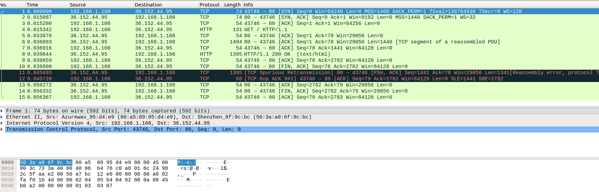
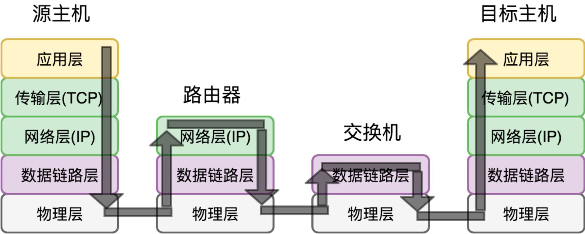
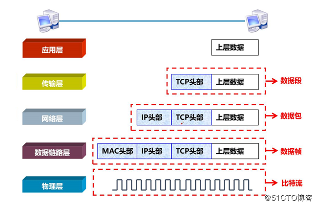
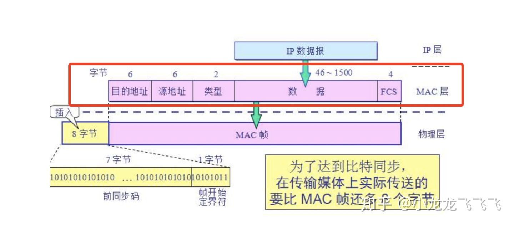
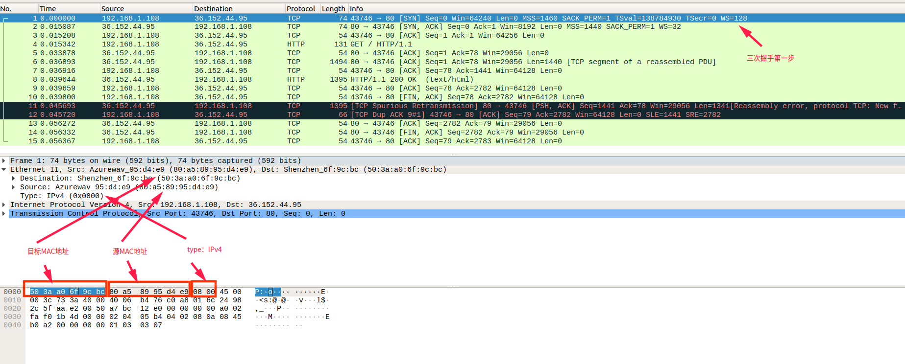
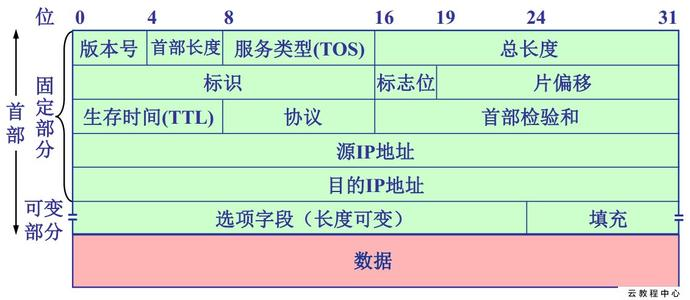
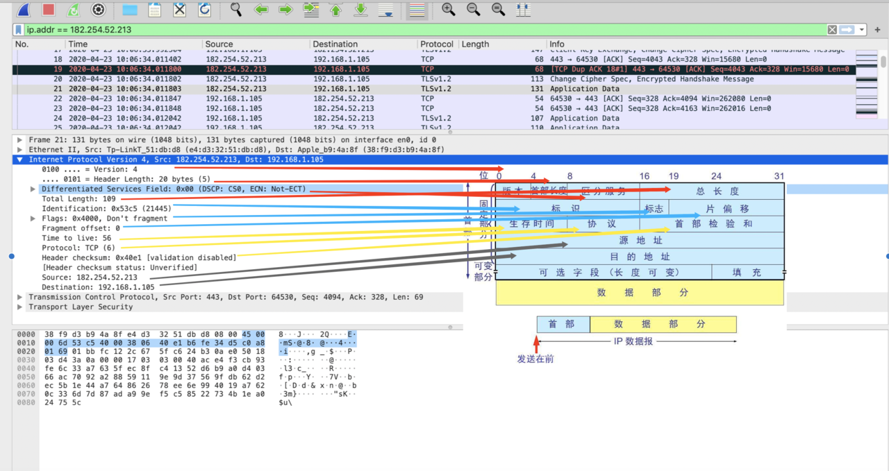
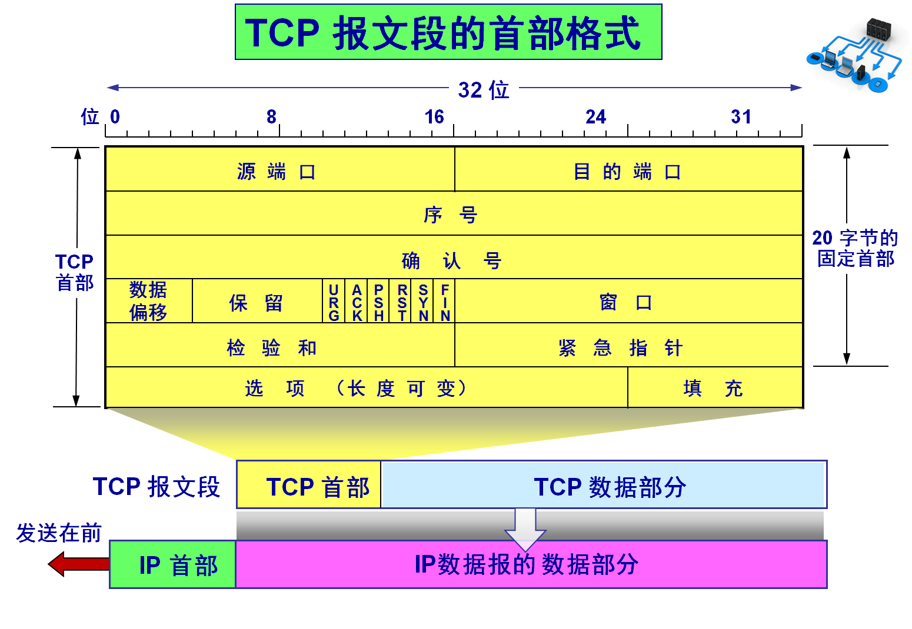
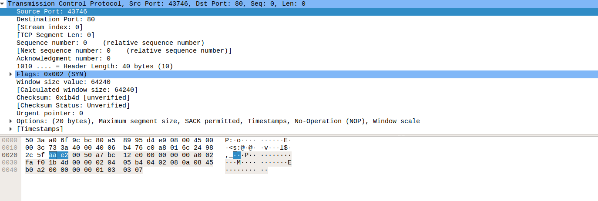

[toc]

## 0. 前言

因为原生套接字编程，需要了解<font color=red>数据传输过程中的MAC帧首部，IP数据包首部，TCP首部</font>。了解结构是基本，为了直观显示，本文<font color=blue>采用抓包的方式逐层验证这些首部结构</font>。同时，列出这些首部结构在<font color=blue>系统中C语言结构体的实现</font>。

抓包工具采用：`tcpdump` + `wireshark`

工具使用方法：[超详细的网络抓包神器 tcpdump 使用指南](https://juejin.im/post/5e64571bf265da57104393a1) 、[实战！我用 Wireshark 让你“看见“ TCP](https://zhuanlan.zhihu.com/p/142665708)

（“实战！我用 Wireshark 让你“看见TCP” 是一篇很好的文章，介绍了TCP的三次握手;握手过程中包丢失的几种情况等）

1. 使用tcpdump抓取数据包

    ```shell
    # 数据准备
    sudo tcpdump -nn tcp and host www.baidu.com -w http.pcap
    curl www.baidu.com
    ```

2. 使用wireshark展示数据包内容

   

<br>

## 1. 背景介绍

了解主机之间的**数据传输过程**。




了解**数据封装和解封装过程**，下面图片传输层使用TCP进行举例。



**这里值得特别注意的是，在每一层，有不同的英文术语来对应包的概念，比如在 TCP 层的包叫做 Segment，在 IP 层的叫做 Packet，在链路层的叫做 Frame，另外和 TCP 位于同一层的 UDP 包我们一般叫做 Datagram**。


<br>

## 3. MAC首部

[以太帧有很多种类型](https://zh.wikipedia.org/wiki/%E4%BB%A5%E5%A4%AA%E7%BD%91%E5%B8%A7%E6%A0%BC%E5%BC%8F)。不同类型的帧具有不同的格式和MTU值。

如何选择使用哪种格式的帧我不知道。下面仅仅看**Ethernet_II 帧格式**。



| 字段           |                             含义                             |
| -------------- | :----------------------------------------------------------: |
| 目的地址       | 接收帧的网络适配器的物理地址（MAC 地址），为 6 个字节（48 比特）。作用是当网卡接收到一个数据帧时，首先会检查该帧的目的地址，是否与当前适配器的物理地址相同，如果相同，就会进一步处理；如果不同，则直接丢弃。 |
| 源地址         | 发送帧的网络适配器的物理地址（MAC 地址），为 6 个字节（48 比特）。 |
| 类型           | [上层协议的类型](https://zh.wikipedia.org/wiki/%E4%BB%A5%E5%A4%AA%E7%B1%BB%E5%9E%8B)。由于上层协议众多，所以在处理数据的时候必须设置该字段，标识数据交付哪个协议处理。例如，字段为 0x0800 时，表示将数据交付给 IP 协议。 |
| 数据           | 也称为效载荷，表示交付给上层的数据。以太网帧数据长度最小为 46 字节，最大为 1500 字节。如果不足 46 字节时，会填充到最小长度。最大值也叫最大传输单元（MTU）。    在 Linux 中，使用 ifconfig 命令可以查看该值，通常为 1500。 |
| 帧检验序列 FCS | 检测该帧是否出现差错，占 4 个字节（32 比特）。发送方计算帧的循环冗余码校验（CRC）值，把这个值写到帧里。接收方计算机重新计算 CRC，与 FCS 字段的值进行比较。如果两个值不相同，则表示传输过程中发生了数据丢失或改变。这时，就需要重新传输这一帧。 |



```c
// 结构体位置：/usr/include/net/ethernet.h
struct ether_header
{
  uint8_t  ether_dhost[ETH_ALEN];	/* destination eth addr	*/
  uint8_t  ether_shost[ETH_ALEN];	/* source ether addr	*/
  uint16_t ether_type;		        /* packet type ID field	*/
} __attribute__ ((__packed__));
```

<br>


## 4. IP首部

IP首部分为[IPv4](https://zh.wikipedia.org/wiki/IPv4)首部和[IPv6](https://zh.wikipedia.org/wiki/IPv6)首部，下面仅仅列出IPv4首部。

IPv4 数据报头字段如图所示。




IP 报头的最小长度为 20 字节，上图中每个字段的含义如下：

**1) 版本（version）**

占 4 位，表示 IP 协议的版本。通信双方使用的 IP 协议版本必须一致。

**2) 首部长度（网际报头长度IHL）**

占 4 位，可表示的最大十进制数值是 15。这个字段所**表示数的单位是 32 位字长**（1 个 32 位字长是 4 字节）。因此，当 IP  的首部长度为 1111 时（即十进制的 15），首部长度就达到 60 字节。当 IP 分组的首部长度不是 4  字节的整数倍时，必须利用最后的填充字段加以填充。

 数据部分永远在 4 字节的整数倍开始，这样在实现 IP 协议时较为方便。首部长度限制为 60 字节的缺点是，长度有时可能不够用，之所以限制长度为 60 字节，是希望用户尽量减少开销。最常用的首部长度就是 20 字节（即首部长度为 0101），这时不使用任何选项。

**3) 区分服务（tos）**

也被称为服务类型，占 8 位，用来获得更好的服务。这个字段在旧标准中叫做服务类型，但实际上一直没有被使用过。1998 年 IETF 把这个字段改名为区分服务（Differentiated Services，DS）。只有在使用区分服务时，这个字段才起作用。

**4) 总长度（totlen）**

首部和数据之和，单位为字节。总长度字段为 16 位，因此数据报的最大长度为 2^16-1=65535 字节。

**5) 标识（identification）**

用来标识数据报，占 16 位。IP 协议在存储器中维持一个计数器。每产生一个数据，计数器就加  1，并将此值赋给标识字段。当数据报的长度超过网络的  MTU，而必须分片时，这个标识字段的值就被复制到所有的数据报的标识字段中。**具有相同的标识字段值的分片报文会被重组成原来的数据报**。

**6) 标志（flag）**

占 3 位。第一位未使用，其值为 0。第二位称为 DF（不分片），表示是否允许分片。取值为 0 时，表示允许分片；取值为 1  时，表示不允许分片。第三位称为 MF（更多分片），表示是否还有分片正在传输，设置为 0 时，表示没有更多分片需要发送，或数据报没有分片。

**7) 片偏移（offsetfrag）**

占 13 位。**当报文被分片后，该字段标记该分片在原报文中的相对位置。**片偏移以 8 个字节为偏移单位。所以，除了最后一个分片，其他分片的偏移值都是 8 字节（64 位）的整数倍。

**8) 生存时间（TTL）**

表示数据报在网络中的寿命，占 8 位。该字段由发出数据报的源主机设置。其目的是防止无法交付的数据报无限制地在网络中传输，从而消耗网络资源。

路由器在转发数据报之前，先把 TTL 值减 1。若 TTL 值减少到 0，则丢弃这个数据报，不再转发。因此，TTL  指明数据报在网络中最多可经过多少个路由器。TTL 的最大数值为 255。若把 TTL 的初始值设为 1，则表示这个数据报只能在本局域网中传送。 

**9) 协议**

表示该数据报文所携带的数据所使用的协议类型，占 8 位。该字段可以方便目的主机的 IP 层知道按照什么协议来处理数据部分。不同的协议有专门不同的协议号。

 例如，TCP 的协议号为 6，UDP 的协议号为 17，ICMP 的协议号为 1。

**10) 首部检验和（checksum）**

用于校验数据报的首部，占 16 位。数据报每经过一个路由器，首部的字段都可能发生变化（如TTL），所以需要重新校验。而数据部分不发生变化，所以不用重新生成校验值。

**11) 源地址**

表示数据报的源 IP 地址，占 32 位。

**12) 目的地址**

表示数据报的目的 IP 地址，占 32 位。该字段用于校验发送是否正确。

**13) 可选字段**

该字段用于一些可选的报头设置，主要用于测试、调试和安全的目的。这些选项包括严格源路由（数据报必须经过指定的路由）、网际时间戳（经过每个路由器时的时间戳记录）和安全限制。

**14) 填充**

由于可选字段中的长度不是固定的，使用若干个 0 填充该字段，可以保证整个报头的长度是 32 位的整数倍。

**15) 数据部分**

表示传输层的数据，如保存 TCP、UDP、ICMP 或 IGMP 的数据。数据部分的长度不固定。

我不进行标注了，标注比较麻烦，可自行对比数据，我从网上找了张图。




IP头部结构体实现有两种定义方式，如下所示。这两种有什么区别？分别在什么场合下使用？

我目前仅仅看到这一篇:[Difference between struct ip and struct iphdr](https://stackoverflow.com/questions/42840636/difference-between-struct-ip-and-struct-iphdr) 

> `struct ip` and `struct iphdr` are two different definitions of the same underlying structure, brought in from different places.
>
> `struct ip` is defined in `<netinet/ip.h>`, which is a reasonably standard header on UNIX systems.
>
> `struct iphdr` is defined in `<linux/ip.h>`. This header (and structure) are Linux-specific, and will not be present in other operating systems.
>
> If you're not sure which one to use, use `struct ip`; code which uses this structure is more likely to be portable to non-Linux systems.

```c
// 结构体位置 /usr/include/netinet/ip.h
struct iphdr
  {
#if __BYTE_ORDER == __LITTLE_ENDIAN
    unsigned int ihl:4;
    unsigned int version:4;
#elif __BYTE_ORDER == __BIG_ENDIAN
    unsigned int version:4;
    unsigned int ihl:4;
#else
# error	"Please fix <bits/endian.h>"
#endif
    uint8_t tos;
    uint16_t tot_len;
    uint16_t id;
    uint16_t frag_off;
    uint8_t ttl;
    uint8_t protocol;
    uint16_t check;
    uint32_t saddr;
    uint32_t daddr;
    /*The options start here. */
  };

struct ip
  {
#if __BYTE_ORDER == __LITTLE_ENDIAN
    unsigned int ip_hl:4;		/* header length */
    unsigned int ip_v:4;		/* version */
#endif
#if __BYTE_ORDER == __BIG_ENDIAN
    unsigned int ip_v:4;		/* version */
    unsigned int ip_hl:4;		/* header length */
#endif
    uint8_t ip_tos;			/* type of service */
    unsigned short ip_len;		/* total length */
    unsigned short ip_id;		/* identification */
    unsigned short ip_off;		/* fragment offset field */
#define	IP_RF 0x8000			/* reserved fragment flag */
#define	IP_DF 0x4000			/* dont fragment flag */
#define	IP_MF 0x2000			/* more fragments flag */
#define	IP_OFFMASK 0x1fff		/* mask for fragmenting bits */
    uint8_t ip_ttl;			/* time to live */
    uint8_t ip_p;			/* protocol */
    unsigned short ip_sum;		/* checksum */
    struct in_addr ip_src, ip_dst;	/* source and dest address */
  };
```

<br>

## 5. TCP首部



1. **源端口和目的端口**：各占2个字节.端口是传输层和应用层的服务接口。传输层的复用和分用功能都有要通过端口才能实现。

2. **序号**：占4个字节，序号范围是（0，2^32 -  1），共2^32 （即4294967296）个序号。序号增加到2^32-1后，下一个序号就又回到0。也就是说，序号使用mod  2^32运算。TCP是面向字节流的。在一个TCP连接中传送的字节流中的每一个字节都按顺序编号。整个要传送的字节流的起始序号必须在连接建立时设置。首部中的序号字段值则是指的是本报文段所发送的数据的第一个字节的序号。例如，一报文段的序号是301，而接待的数据共有100字节。这就表明：本报文段的数据的第一个字节的序号是301，最后一个字节的序号是400。显然，下一个报文段（如果还有的话）的数据序号应当从401开始，即下一个报文段的序号字段值应为401。这个字段的序号也叫“报文段序号”。

3. **确认号**：占4字节，**是期望收到对方下一个报文段的第一个数据字节的序号**。例如，B正确收到了A发送过来的一个报文段，其序号字段值是501，而数据长度是200字节（序号501~700），这表明B正确收到了A发送的到序号700为止的数据。因此，B期望收到A的下一个数据序号是701，于是B在发送给A的确认报文段中把确认号置为701。注意，现在确认号不是501，也不是700，而是701。

   若确认号为N，则表明，起始序号到序号N-1为止的所有数据都已正确收到，期望的序号是N。

4. **数据偏移**（即首部长度）：占4位，它指出TCP报文段的数据起始处距离TCP报文段的起始处有多远。这个字段实际上是指出**TCP报文段的首部长度**。由于首部中还有长度不确定的选项字段，因此数据偏移字段是必要的，但应注意，“数据偏移”的单位是32位字（即**以4字节的字为计算单位**）。由于4位二进制数能表示的最大十进制数字是15，因此数据偏移的最大值是60字节，这也是TCP首部的最大字节（即选项长度不能超过40字节）。

5. **保留**：占6位，保留为今后使用，但目前应置为0。

6. **紧急URG**（URGent）：占1位，  当URG=1时，表明紧急指针字段有效。它告诉系统此报文段中有紧急数据，应尽快发送（相当于高优先级的数据），而不要按原来的排队顺序来传送。例如，已经发送了很长的一个程序要在远地的主机上运行。但后来发现了一些问题，需要取消该程序的运行，因此用户从键盘发出中断命令。如果不使用紧急数据，那么这两个字符将存储在接收TCP的缓存末尾。只有在所有的数据被处理完毕后这两个字符才被交付接收方的应用进程。这样做就浪费了很多时间。当URG置为1时，发送应用进程就告诉发送方的TCP有紧急数据要传送。于是发送方TCP就把紧急数据插入到本报文段数据的最前面，而在紧急数据后面的数据仍然是普通数据。这时要与首部中紧急指针（Urgent Pointer）字段配合使用。

7. **确认ACK**（ACKnowledgment）：占1位， 仅当ACK = 1时确认号字段才有效，当ACK = 0时确认号无效。TCP规定，在连接建立后所有的传送的报文段都必须把ACK置为1。

8. **推送PSH**（Push）：占1位，当两个应用进程进行交互式的通信时，有时在一端的应用进程希望在键入一个命令后立即就能收到对方的响应。在这种情况下，TCP就可以使用推送（push）操作。这时，发送方TCP把PSH置为1，并**立即创建一个报文段发送出去。接收方TCP收到PSH=1的报文段，就尽快地（即“推送”向前）交付接收应用进程**。而不用再等到整个缓存都填满了后再向上交付。

9. **复位RST**（ReSet）：占1位，当RST=1时，表名TCP连接中出现了严重错误（如由于主机崩溃或其他原因），必须释放连接，然后再重新建立传输连接。RST置为1还用来拒绝一个非法的报文段或拒绝打开一个连接。

10. **同步SYN**（SYNchronization）：占1位，在连接建立时用来同步序号。当SYN=1而ACK=0时，表明这是一个连接请求报文段。对方若同意建立连接，则应在响应的报文段中使SYN=1和ACK=1，因此SYN置为1就表示这是一个连接请求或连接接受报文。

11. **终止FIN**（FINish）：占1位，用来释放一个连接。当FIN=1时，表明此报文段的发送发的数据已发送完毕，并要求释放运输连接。

12. **窗口**：占2个字节，窗口值是（0，2^16-1）之间的整数。窗口指的是发送本报文段的一方的接受窗口（而不是自己的发送窗口）。窗口值告诉对方：从本报文段首部中的确认号算起，接收方目前允许对方发送的数据量（以字节为单位）。之所以要有这个限制，是因为接收方的数据缓存空间是有限的。总之，窗口值作为接收方让发送方设置其发送窗口的依据。

    例如，发送了一个报文段，其确认号是701，窗口字段是1000.这就是告诉对方：“从701算起，我（即发送方报文段的一方）的接收缓存空间还可接受1000个字节数据（字节序号是701~1700），你在给我发数据时，必须考虑到这一点。”

    窗口字段明确指出了现在允许对方发送的数据量。窗口值经常在动态变化。

13. **检验和**：占2个字节，**检验和字段检验的范围包括首部和数据这两部分**。和UDP用户数据报一样，在计算检验和时，要在TCP报文段的前面加上12字节的伪首部。伪首部的格式和UDP用户数据报的伪首部一样。但应把伪首部第4个字段中的17改为6（TCP的协议号是6）；把第5字段中的UDP中的长度改为TCP长度。接收方收到此报文段后，仍要加上这个伪首部来计算检验和。若使用TPv6,则相应的伪首部也要改变。

14. **紧急指针**：占2个字节，紧急指针仅在URG=1时才有意义，它指出本报文段中的紧急数据的字节数（紧急数据结束后就是普通数据）  。因此，在**紧急指针指出了紧急数据的末尾在报文段中的位置**。当所有紧急数据都处理完时，TCP就告诉应用程序恢复到正常操作。值得注意的是，即使窗口为0时也可以发送紧急数据。

15. **选项**：长度可变，最长可达40字节。当没有使用“选项”时，TCP的首部长度是20字节。其最大长度可根据TCP首部长度进行推算。TCP首部长度用4位表示，那么选项部分最长为：(2^4-1)*4-20=40字节。

- - **MSS最大报文段长度**(Maxium Segment  Size)：TCP最初只规定了一种选项，即最大报文段长度MSS（Maximum Segment  Szie）。注意MSS这个名词含义。MSS是每一个TCP报文段中的数据字段的最大长度。数据字段加上TCP首部才等于整个的TCP报文段。所以MSS并不是整个TCP报文段的最大长度，而是“TCP报文段长度减去TCP首部长度”。
  - 为什么要规定一个最大报文长度MSS呢？
    - 这并不是考虑接受方的接收缓存可能存放不下TCP报文段中的数据。实际上，MSS与接收窗口值没有关系。我们知道，TCP报文段的数据部分，至少要加上40字节的首部（TCP首部20字节和IP首部20字节，这里还没有考虑首部中的可选部分）才能组装成一个IP数据报。若选择较小的MSS长度，网络的利用率就降低。设想在极端情况下，当TCP报文段只含有1字节的数据时，在IP层传输的数据报的开销至少有40字节（包括TCP报文段的首部和IP数据报的首部）。这样，对网络的利用率就不会超过1/41。到了数据链路层还要加上一些开销。但反过来，若TCP报文段非常长，那么在IP层传输时就有可能要分解成多个短数据报片。在终点要把收到的各个短数据报片组成成原来的TCP报文段，当传输出错时还要进行重传，这些也都会使开销增大。
    - 因此，MSS应尽可能大些，只要在IP层传输时不需要分片就行。由于IP数据报所经历的路径是动态变化的，因此在这条路径上确定的不需要的分片的MSS，如果改走另一条路径就可能需要进行分片。因此最佳的MSS是很难确定的。在连接过程中，双方都把自己能够支持的MSS写入这一字段，以后就按照这个数值传输数据，两个传送方向可以有不同的MSS值。若主机未填写这一项，则MSS的默认值是536字节长。因此，所有在互联网上的主机都应该接受的报文段长度是536+20（固定首部长度）=556字节。
  - 其他选项：

  - - 窗口扩大选项

      （Windows Scaling）：是为了扩大窗口。我们知道，TCP首部中窗口字段长度是16位，因此最大的窗口大小为64K字节。虽然这对早期的网络是足够用的，但对于包含卫星信道的网络，传播时延和宽带都很大，要获得高吞吐量需要更大的窗口大小。

      - 窗口扩大选项占3字节，其中有一个字节表示移位值S。新的窗口值等于TCP首部中的窗口位数从16增大到（16+S）。移位值允许使用的最大值是14，相当于窗口最大值增大到2^（16+14）-1=2^30-1。
      - 窗口扩大选项可以在双方初始建立TCP连接时进行协商。如果连接的某一端实现了窗口扩大，当它不再需要扩大其窗口时，可发送S=0选项，使窗口大小回到16。

    - **时间戳选项**（Timestamps）：占10字节，其中最主要的字段是时间戳字段（4字节）和时间戳回送回答字段（4字节）。时间戳选项有以下两个概念：  

    - - 用来计算往返时间RTT。发送方在发送报文段时把当前时钟的时间值放入时间戳字段，接收方在确认该报文段时把时间戳字段复制到时间戳回送回答字段。因此，发送方在收到确认报文后，可以准确地计算出RTT来。
      - 用于处理TCP序号超过2^32的情况，这又称为防止序号绕回PAWS。我们知道，TCP报文段的序号只有32位，而每增加2^32个序号就会重复使用原来用过的序号。当使用高速网络时，在一次TCP连接的数据传送中序号很可能被重复使用。例如，当使用1.5Mbit/s的速度发送报文段时，序号重复要6小时以上。但若用2.5Gbit/s的速率发送报文段，则不到14秒钟序号就会重复。为了使接收方能够把新的报文段和迟到很久的报文段区分开，则可以在报文段中加上这种时间戳。
    - **SACK选择确认项**（Selective  Acknowledgements）：用来确保只重传缺少的报文段，而不是重传所有报文段。比如主机A发送报文段1、2、3，而主机B仅收到报文段1、3。那么此时就需要使用SACK选项来告诉发送方只发送丢失的数据。那么又如何指明丢失了哪些报文段呢？使用SACK需要两个功能字节。一个表示要使用SACK选项，另一个指明这个选项占用多少字节。描述丢失的报文段2，是通过描述它的左右边界报文段1、3来完成的。而这个1、3实际上是表示序列号，所以描述一个丢失的报文段需要64位即8个字节的空间。那么可以推算整个选项字段最多描述(40-2)/8=4个丢失的报文段。
    - **NOP**(NO-Operation)：它要求选项部分中的每种选项长度必须是4字节的倍数，不足的则用NOP填充。同时也可以用来分割不同的选项字段。如窗口扩大选项和SACK之间用NOP隔开。

16. **填充**：为了使整个首部长度是4字节的整数倍。



```c
// 结构体位置：/usr/include/netinet/tcp.h
// union中有两个结构体，给目标赋值的时候，可以采用两种方式
// tcph->dest = htons (80); or tcph->th_dest = htons (80);
// 这两个变量在同一位置
// 应为过程中会有类型强制转换，便于取内容；所以对字节序用# if
struct tcphdr
  {
    __extension__ union
    {
      struct
      {
	uint16_t th_sport;	/* source port */
	uint16_t th_dport;	/* destination port */
	tcp_seq th_seq;		/* sequence number */
	tcp_seq th_ack;		/* acknowledgement number */
# if __BYTE_ORDER == __LITTLE_ENDIAN
	uint8_t th_x2:4;	/* (unused) */
	uint8_t th_off:4;	/* data offset */
# endif
# if __BYTE_ORDER == __BIG_ENDIAN
	uint8_t th_off:4;	/* data offset */
	uint8_t th_x2:4;	/* (unused) */
# endif
	uint8_t th_flags;
# define TH_FIN	0x01
# define TH_SYN	0x02
# define TH_RST	0x04
# define TH_PUSH	0x08
# define TH_ACK	0x10
# define TH_URG	0x20
	uint16_t th_win;	/* window */
	uint16_t th_sum;	/* checksum */
	uint16_t th_urp;	/* urgent pointer */
      };
      struct
      {
	uint16_t source;
	uint16_t dest;
	uint32_t seq;
	uint32_t ack_seq;
# if __BYTE_ORDER == __LITTLE_ENDIAN
	uint16_t res1:4;
	uint16_t doff:4;
	uint16_t fin:1;
	uint16_t syn:1;
	uint16_t rst:1;
	uint16_t psh:1;
	uint16_t ack:1;
	uint16_t urg:1;
	uint16_t res2:2;
# elif __BYTE_ORDER == __BIG_ENDIAN
	uint16_t doff:4;
	uint16_t res1:4;
	uint16_t res2:2;
	uint16_t urg:1;
	uint16_t ack:1;
	uint16_t psh:1;
	uint16_t rst:1;
	uint16_t syn:1;
	uint16_t fin:1;
# else
#  error "Adjust your <bits/endian.h> defines"
# endif
	uint16_t window;
	uint16_t check;
	uint16_t urg_ptr;
      };
    };
};
```

<br>

## 附录

### 涉及但未介绍内容

* 从网上拼凑而来，皆是二手来源。

* 所有的代码/文档见：[github](https://github.com/da1234cao/computer_security)

* 这些首部的应用，因为还需要更多的背景支持，这里暂不介绍。
* 暂不介绍循环冗余码校验，首部校验和，字节序。

## 参考文章

[超详细的网络抓包神器 tcpdump 使用指南](https://juejin.im/post/5e64571bf265da57104393a1) 

[实战！我用 Wireshark 让你“看见“ TCP](https://zhuanlan.zhihu.com/p/142665708)