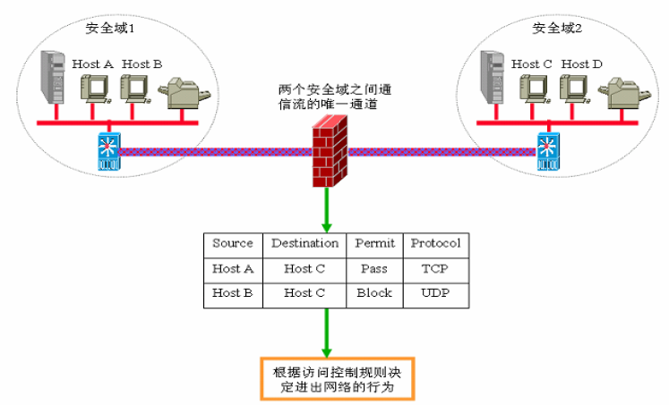
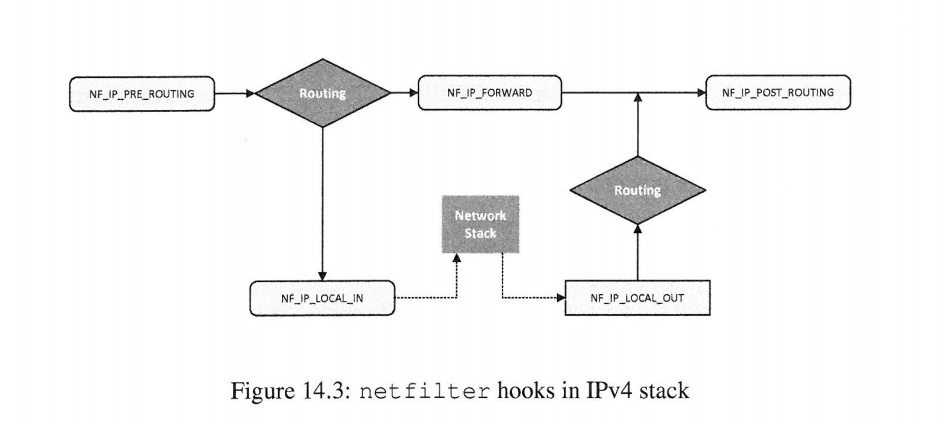
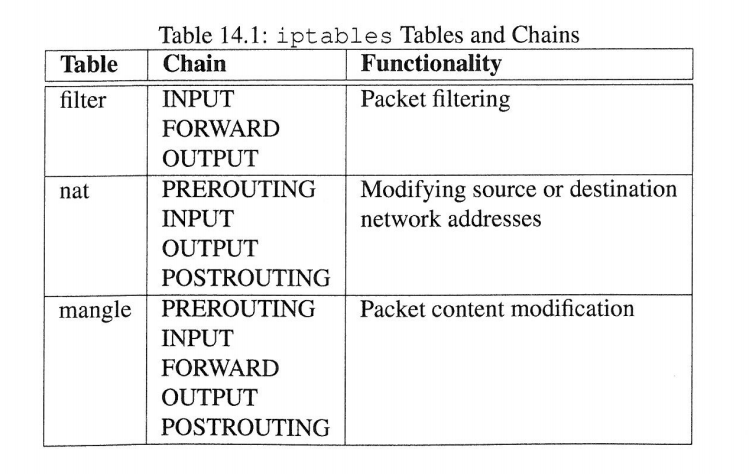
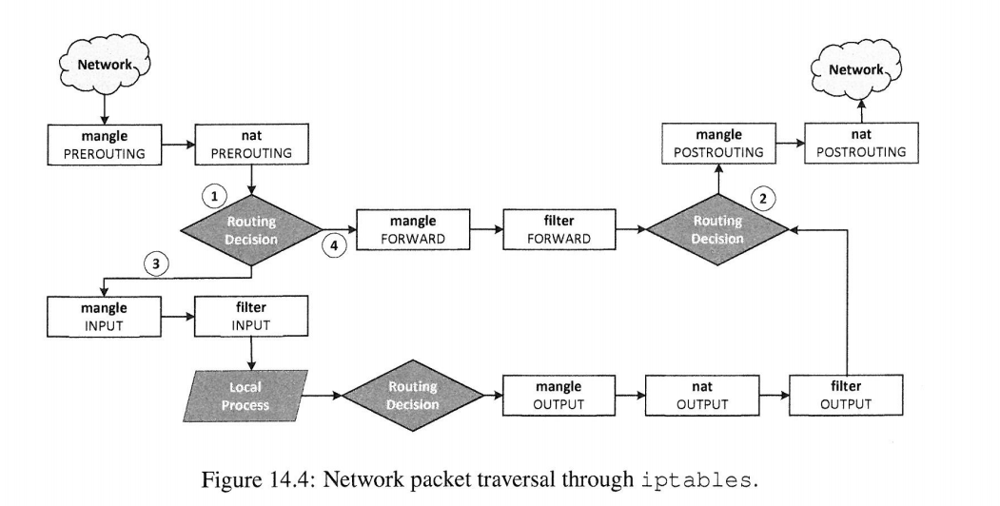
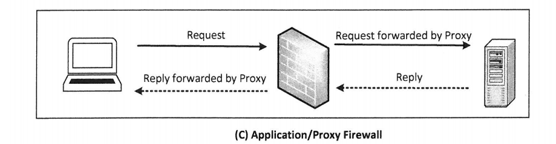
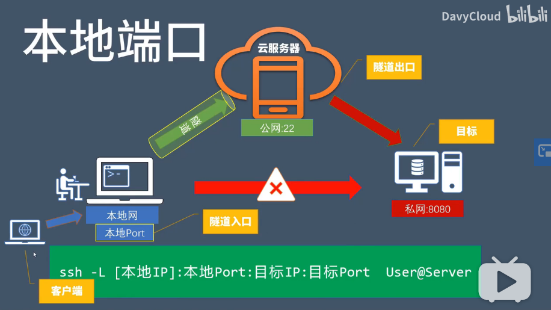
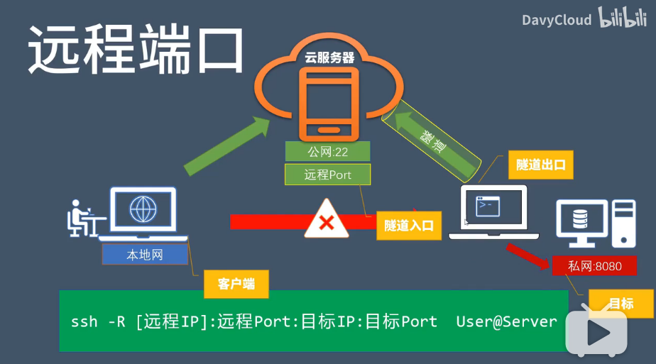

[toc]

## 0. 前言

来源：[Linux Firewall Exploration Lab](http://www.cis.syr.edu/~wedu/seed/Labs_16.04/Networking/Firewall/)

代码/文档见：[github](https://github.com/da1234cao/computer_security)

这章就书上的内容而言，并不难。但是，让我布置防火墙，我基本不会。

如果这个防火墙是保护一个局域网内的机器，这里面防火墙，跳板服务器之类的，我不会配置。

如果仅仅给一个主机配置防火墙，我大概知道点。

相较于实际操作，本章的概念可能更多些，距离实际生产环境，还有距离。

<br>

## 1. 总结与摘要

首先对防火墙进行介绍；然后自行实现一个简单的防火墙，以形成直观的印象；接着介绍了防火墙的三种分类：包过滤(非状态感知)防火墙、状态感知防火墙、应用/代理防火墙。最后介绍使用ssh隧道绕过防火墙。

<br>

## 2. 防火墙的介绍

参考：[到底什么是防火墙?? --bilibili](https://www.bilibili.com/video/BV1TJ411C7VH?from=search&seid=5133036211215919516) 、[防火墙 --wiki](https://zh.wikipedia.org/wiki/%E9%98%B2%E7%81%AB%E5%A2%99)

**防火墙**（英语：**Firewall**）在计算机科学领域中是一个架设在互联网与企业内网之间的信息安全系统，根据企业预定的策略来监控往来的传输。防火墙可能是一台专属的网络设备或是运行于主机上来检查各个网络接口上的网络传输。它是目前最重要的一种网络防护设备，从专业角度来说，**防火墙是位于两个(或多个)网络间，实行网络间访问或控制的一组组件集合之硬件或软件。**

防火墙最基本的功能就是隔离网络，通过将网络划分成不同的区域（通常情况下称为ZONE），制定出不同区域之间的访问控制策略来控制不同信任程度区域间传送的数据流。例如互联网是不可信任的区域，而内部网络是高度信任的区域。

**我对防火墙的理解**(大概率不对，仅从软件角度)：这个墙是一台主机，主机上进行相应的安全软件(eg:iptables)配置，对进出口的数据进行限制，只有符合规则的数据才能经过作为防火墙的主机。防火墙主机与内部主机，通过映射传递数据，从而保护局域网内主机的安全。比如上一章节中的[`syn flooding`](https://blog.csdn.net/sinat_38816924/article/details/107570864)攻击，简单的可以通过iptables禁止特征明显的恶意source ip，起到一定的保护作用。



<br>

## 3. 使用netfilter自行构建一个简单的防火墙

构建目标：禁止目标是23号端口的TCP数据，发出。

`netfilter`是Linux内核中的一个软件框架，它提供了一系列的钩子（Hook）供其他模块控制包的流动。由于我们需要进行包过滤，所以我们的代码要在内核运行，这意味着我们将修改内核。

所以本节主要分为三部分：可加载内核模块(Loadable Kernel Modules, LKM)、netfilter、两者结合构建一个简单的防火墙。

### 3.1 可加载内核模块

参考文章：[Linux Capabilities 入门教程：概念篇](https://fuckcloudnative.io/posts/linux-capabilities-why-they-exist-and-how-they-work/) 、[Linux Kernel 实践(一)：Hello LKM](https://limxw.com/posts/linux-kernel-practice-hello/)

Loadable Kernel Modules（LKM）即可加载内核模块，LKM可以动态地加载到内存中，无须重新编译内核。所以它经常被用于一些设备的驱动程序，例如声卡，网卡等等。

**内核模块和一般的 C 语言程序不同，它不使用 `main()` 函数作为入口**，并且有如下区别：

- 非顺序执行：内核模块使用初始化函数来进行注册，并处理请求，初始化函数运行后就结束了。 它可以处理的请求类型在模块代码中定义。
- 没有自动清理：内核模块申请的所有内存，必须要在模块卸载时手动释放，否则这些内存会无法使用，直到重启，也就是说我们需要在模块的卸载函数（也就是下文写到的退出函数）中，将使用的内存逐一释放。
- 会被中断：内核模块可能会同时被多个程序/进程使用，构建内核模块时要确保发生中断时行为一致和正确。想了解更多请看：[Linux 内核的中断机制](https://www.cnblogs.com/linfeng-learning/p/9512866.html)
- 更高级的执行特权：通常分配给内核模块的CPU周期比分配给用户空间程序的要多。编写内核模块时要小心，以免模块对系统的整体性能产生负面影响。
- 不支持浮点：在Linux内核里无法直接进行浮点计算，因为这样做可以省去在用户态与内核态之间进行切换时保存/恢复浮点寄存器 FPU的操作。

**一个程序需要root特权或者`CAP_SYS_MODULE` capabilitie才能插入和移出内核模块。**

`Capabilities` 机制是在 Linux 内核 `2.2` 之后引入的，原理很简单，就是将之前与超级用户 root（UID=0）关联的特权细分为不同的功能组。这样一来，权限检查的过程就变成了：在执行特权操作时，如果线程的有效身份不是 root，就去检查其是否具有该特权操作所对应的 capabilities，并以此为依据，决定是否可以执行特权操作。

**安装 Linux 内核头文件；写一个加载内核模块的小程序；**

```shell
# 构建前的准备
$ sudo apt update
$ apt-cache search linux-headers-$(uname -r)
$ apt install linux-headers-$(uname -r)
```

```c
// 一个加载内核模块的小程序
#include <linux/module.h> //加载内核模块到内核使用的核心头文件
#include <linux/kernel.h> // 包含内核使用的类型、宏和函数
#include <linux/init.h>  // 这些定义在，见makefile

// 初始化函数
static int kmodule_init(void){
    printk(KERN_INFO "Initializing this module!\n");
    return 0;
}

// 退出函数
static void kmodule_exit(void){
    printk(KERN_INFO "cleanup this module!\n");
}

// 经过编译，生成可以用来出插入/删除的内核模块
module_init(kmodule_init);
module_exit(kmodule_exit);

// 定义模块信息
MODULE_LICENSE("GPL");
```

```makefile
obj-m+=kmodule.o
KDIR = /lib/modules/$(shell uname -r)/build

all:
	make -C $(KDIR) M=$(PWD) modules
clean:
	make -C $(KDIR) M=$(PWD) clean
```

进行编译/安装/查看/卸载模块

```shell
# 编译
make
make -C /lib/modules/5.3.0-62-generic/build M=/home/dacao/exercise/computer_security/src/Chapter14_Firewall/LKM modules
make[1]: 进入目录“/usr/src/linux-headers-5.3.0-62-generic”
  CC [M]  /home/dacao/exercise/computer_security/src/Chapter14_Firewall/LKM/kmodule.o
  Building modules, stage 2.
  MODPOST 1 modules
  CC      /home/dacao/exercise/computer_security/src/Chapter14_Firewall/LKM/kmodule.mod.o
  LD [M]  /home/dacao/exercise/computer_security/src/Chapter14_Firewall/LKM/kmodule.ko
make[1]: 离开目录“/usr/src/linux-headers-5.3.0-62-generic”

# 安装
sudo insmod kmodule.ko

# 查看
lsmod| grep kmodule

# 卸载
sudo rmmod kmodule

# 查看模块的输出信息
dmesg | tail
[605704.593115] Initializing this module!
[605775.292755] cleanup this module!
```

<br>

### 3.2 Netfilter

netfilter比较复杂。下面的返回值和IPv4的hook定义位置是书中的内容。还有其中使用的数据结构，我基本不会操作。

**Linux内核使用netfilter钩子(hook)，提供了丰富的数据包处理和过滤框架**。在Linux中，每个协议堆栈都沿该堆栈中的数据包**遍历路径定义了一系列钩子**。 开发人员可以**使用内核模块将回调函数注册到这些挂钩**。当数据包到达这些钩子中的每个钩子时，协议栈将调用具有该数据包和钩子编号的netfilter框架。 netfilter检查是否有任何内核模块已在此挂钩上注册了回调函数。 每个注册的模块都会被调用，它们可以自由分析或操作数据包； 最后，他们可以对数据包返回其结论。 有五个可能的返回值，它们的说明在下面列出。

| 返回值    | 含义                                                         |
| --------- | ------------------------------------------------------------ |
| NE_ACCEPT | 让数据包流过堆栈                                             |
| NE_DROP   | 丢弃数据包，因此将不允许该数据包继续其行程                   |
| NE_QUEUE  | 通过nf_queue机制将数据包传递到用户空间。 <br/>这可以用来在用户空间中执行数据包处理，并且是异步操作。 |
| NF_STOLEN | 通知netfilter框架忽略此数据包。 <br/>这个操作基本上将数据包的责任传递给来自netfilter到模块。<br/>该数据包在内核内部仍然存在并有效表。 <br/>通常用于存储分段的数据包，以便它们都可以在单一背景下进行分析。 |
| NE_REPEAT | 请求netfilter框架再次调用此模块                              |

IPv4的`netfilter hook` 

| hook               | hook位置                                                     |
| ------------------ | ------------------------------------------------------------ |
| NE_IP_PRE_ROUTING  | 所有传入的数据包，除了那些由混杂模式引起的数据包外，都命中此钩子。 在执行任何路由决策之前，将调用此钩子 |
| NE_IP_LOCAL_IN     | 传入的数据包将随后通过路由，路由将决定该数据包是用于其他计算机还是用于主机本身。 本机的数据包，将调用此钩子 |
| NE_IP_FORWARD      | 转发到其他主机的数据包到达此挂钩。 该挂钩对于实现防火墙非常有 |
| NF_IP_LOCAL_OUT    | 本地主机生成的数据包到达此挂钩。 这是数据包**离开主机**时的第一个钩子 |
| NE_IP_POST ROUTING | 当转发或生成的数据包离开主机时，它将通过NF_IP_POST_ROUTING钩子在此钩子上实现源网络地址转换（SNAT） |

	

<br>

### 3.3 构建一个简单的防火墙

使用netfilter构建的防火墙代码如下。之后使用”3.1中的模块加载方式“，即可将自行实现的防火墙加载进入内核。

```c
/**
 * 文件名：简单使用netfilter，构建一个包过滤防火墙
 * 作用：阻止TCP协议&&23号端口，数据包流出
 * telnet [IP],被阻止
 * 相关命令：insmod,lsmod,dmsg,rmmod
*/
#include <linux/kernel.h>
#include <linux/module.h>
#include <linux/netfilter.h>
#include <linux/netfilter_ipv4.h>
#include <linux/ip.h>
#include <linux/tcp.h>


// 存储勾子的数据结构
// 成员hook即用户定义的勾子函数
// struct nf_hook_ops {
// 	struct list_head list;
// 	/* User fills in from here down. */
// 	nf_hookfn *hook;
// 	struct module *owner;
// 	u_int8_t pf;
// 	unsigned int hooknum;
// 	/* Hooks are ordered in ascending priority. */
// 	int priority;
// };
static struct nf_hook_ops telnetFilterHook;

unsigned int telnetFilter(void *priv, struct sk_buff * skb, const struct nf_hook_state *state){

            // 注意下 sk_buff的数据结构，直接取不出来的
            // https://blog.csdn.net/hzj_001/article/details/100621914
            // struct iphdr *iph = (struct iphdr *)skb;
            // struct tcphdr *tcph = (struct tcphdr *)(iph+iph->ihl*4);

            struct iphdr *iph;
            struct tcphdr *tcph;
            iph = ip_hdr(skb);
            tcph = (void *)iph+iph->ihl*4;

            if(iph->protocol == IPPROTO_TCP && tcph->dest == htons(23)){
                printk(KERN_INFO "Dropping telent packdt to %d.%d.%d.%d\n",
                ((unsigned char *)&iph->daddr)[0],
                ((unsigned char *)&iph->daddr)[1],
                ((unsigned char *)&iph->daddr)[2],
                ((unsigned char *)&iph->daddr)[3]);
                return NF_DROP;
            }else{
                return NF_ACCEPT;
            }
            
        }


void removeFilter(void){
    printk(KERN_INFO "Telnet filter has been removed.\n");
    nf_unregister_net_hook(&init_net,&telnetFilterHook);
}

int setUpFilter(void){
    
    telnetFilterHook.hook = telnetFilter;
    telnetFilterHook.hooknum = NF_INET_POST_ROUTING;
    telnetFilterHook.pf = PF_INET;
    telnetFilterHook.priority = NF_IP_PRI_FILTER;

    if(nf_register_net_hook(&init_net,&telnetFilterHook)!=0){
        printk(KERN_WARNING "register Telnet filter hook error!\n");
        goto err;
    }
    printk(KERN_INFO "Registering a Telnet filter");
    return 0;

err:
    removeFilter();
    return -1;
}

module_init(setUpFilter);
module_exit(removeFilter);

MODULE_LICENSE("GPL");

```

```shell
# 验证该防火墙--》结果
➜  telnetFilter git:(master) ✗ dmesg | tail  
[592368.908962] ath: Country alpha2 being used: CN
[592368.908962] ath: Regpair used: 0x52
[592368.908964] ath: regdomain 0x809c dynamically updated by country element
[605704.593115] Initializing this module!
[605775.292755] cleanup this module!
[609475.291493] Registering a Telnet filter
[609511.304844] Dropping telent packdt to 192.168.1.108
[609512.317907] Dropping telent packdt to 192.168.1.108
[609514.333919] Dropping telent packdt to 192.168.1.108
[609525.583206] Telnet filter has been removed.
```

<br>

## 4. 防火墙的分类

根据不同的操作方式，防火墙的种类可以分为：包过滤(非状态感知)防火墙、状态感知防火墙、应用/代理防火墙。

### 4.1 包过滤防火墙

参考文章：[netfilter及iptables基本概念 --bilibili](https://www.bilibili.com/video/BV1b54y197zn?t=749)、[iptables操作](https://wangchujiang.com/linux-command/c/iptables.html) 

上面实现的防火墙即是一个包过滤防火墙。根据allowed和denied策略，检查数据包的包头，决定是否放行。由于它逐个对包进行判断，没有上下文关系，所以也被成为非状态感知防火墙。

**iptables命令** 是Linux上常用的防火墙软件，是netfilter项目的一部分。**著名的四表五链便来自它**。我也不咋会用这个软件。需要什么规则，再去查参数。





```shell
# 我随意从上面的链接中复制一个非状态规则
iptables -A INPUT -s 192.168.1.0/24 -p tcp --dport 22 -j ACCEPT
# 22为你的ssh端口， -s 192.168.1.0/24表示允许这个网段的机器来连接，其它网段的ip地址是登陆不了你的机器的。 -j ACCEPT表示接受这样的请求
```

<br>

### 4.2 状态感知防火墙

参考文章：[Simple stateful firewall (简体中文)](https://wiki.archlinux.org/index.php/Simple_stateful_firewall_(%E7%AE%80%E4%BD%93%E4%B8%AD%E6%96%87)) | [iptables常用扩展模块](https://www.zsythink.net/archives/1564) | [Iptables之nf_conntrack模块](https://clodfisher.github.io/2018/09/nf_conntrack/)

**如果一个防火墙维护每一个连接的状态，它便是状态感知防火墙**。

:point_right: [状态感知防火墙 --youtubu](https://www.youtube.com/watch?v=mxrgv1hIe6Y) (这是一个youtube的状态感知防火墙的简单介绍。讲的很好。)

TCP连接：TCP本质上是一种面向连接的协议。要使用TCP，通信的两端都需要先使用三向握手协议来建立连接。完成后，他们需要使用其他协议来终止连接。状态防火墙可以监视这些协议，并记录连接。

UDP连接UDP不是面向连接的协议，因此没有连接建立或终止步骤，因此很难维持连接状态。但是，当UDP客户端和服务器开始在它们自己之间交换数据包时，有状态防火墙将认为已建立连接。如果在一定时间内没有与连接相关的流量，则认为连接已终止。

ICMP连接：ICMP也不建立连接。但是，几种类型的ICMP消息具有请求和响应模式。这被视为连接。例如，ICMP Echo请求和答复具有这种模式。当有状态防火墙看到请求消息时，会将其视为新连接。当看到响应时，便认为已建立连接。由于ICMP消息仅涉及一轮请求/响应通信，因此在看到响应消息后，认为连接1已建立但同时已终止。

复杂协议的连接：某些防火墙还跟踪比传输层和网络层更高的层的连接，例如HTTP，FTP和IRC连接是应用程序级协议，但是由于它们的普及，许多防火墙都提供了跟踪这些连接的支持。

**nf_conntrack(在老版本的 Linux 内核中叫 ip_conntrack)是一个内核模块,用于跟踪一个连接的状态的。连接状态跟踪可以供其他模块使用,最常见的两个使用场景是 iptables 的 nat 的 state 模块**。

**在iptables中有四种状态：`NEW，ESTABLISHED，RELATED，INVALID。`**

**NEW**，表示这个分组需要发起一个连接，或者说，分组对应的连接在两个方向上都没有进行过分组传输。NEW说明  这个包是我们看到的第一个包。意思就是，这是conntrack模块看到的某个连接第一个包，它即将被匹配了。比如，我们看到一个SYN包，是我们所留意 的连接的第一个包，就要匹配它。第一个包也可能不是SYN包，但它仍会被认为是NEW状态。比如一个特意发出的探测包，可能只有RST位，但仍然是  NEW。

**ESTABLISHED**，表示分组对应的连接已经进行了双向的分组传输，也就是说连接已经建立，而且会继续匹配  这个连接的包。处于ESTABLISHED状态的连接是非常容易理解的。只要发送并接到应答，连接就是ESTABLISHED的了。一个连接要从NEW变 为ESTABLISHED，只需要接到应答包即可，不管这个包是发往防火墙的，还是要由防火墙转发的。ICMP的错误和重定向等信息包也被看作是  ESTABLISHED，只要它们是我们所发出的信息的应答。

**RELATED**，表示分组要发起一个新的连接，但是这个连接和一个现有的连接有关，例如：FTP的数据传输连接  和控制连接之间就是RELATED关系。RELATED是个比较麻烦的状态。当一个连接和某个已处于ESTABLISHED状态的连接有关系时，就被认为  是RELATED的了。换句话说，一个连接要想是RELATED的，首先要有一个ESTABLISHED的连接。这个ESTABLISHED连接再产生一 个主连接之外的连接，这个新的连接就是RELATED的了，当然前提是conntrack模块要能理解RELATED。ftp是个很好的例子，FTP- data连接就是和FTP-control有RELATED的。还有其他的例子，

**INVAILD**，表示分组对应的连接是未知的，说明数据包不能被识别属于哪个连接或没有任何状态。有几个原因可以产生这种情况，比如，内存溢出，收到不知属于哪个连接的ICMP错误信息。一般地，我们DROP这个状态的任何东西。

```shell
#查看已有规则，-n不解析域名 --line-number以序号标记
sudo iptables -L OUTPUT -n --line-numbers
sudo iptables -A OUTPUT -p tcp -m state --state ESTABLISHED,RELATED -j ACCEPT
# 这样写，state 模块则是直接使用 nf_conntrack 里记录的连接的状态来匹配用户定义的相关规则。
```

<br>

### 4.3 代理防火墙

参考文章：[第16章 使用Squid部署代理缓存服务](https://www.linuxprobe.com/chapter-16.html) --》我刷过它对应的视频，但是没操作过。

我用代理是为了使用google，开始没有明白这个防火墙有什么关系。代理防火墙站在应用层，所以可以对应用数据进行过滤，如下所示。即是防火墙了。其中关于[SOCKS5](https://zh.wikipedia.org/wiki/SOCKS)代理，我不明白。

上面的链接中便有这些限制举例：

* 禁止所有客户端访问网址中包含linux关键词的网站
* 禁止所有客户端访问某个特定的网站
* 禁止员工在企业网内部下载带有某些后缀的文件
* etc



<br>

## 5. 绕过防火墙

参考视频： [【秒懂】5分钟学会SSH端口转发，远程工作用得着 | 如何充分利用云](https://www.bilibili.com/video/BV1C7411P7Er?p=2) 

防火墙会允许22号ssh端口，80web端口的TCP开放，其他端口关闭。如果想访问防火墙内部的其他端口，不妨使用”隧道“。VPN我目前不知道。但是ssh端口映射，我知道点。周围的人用过三次类似技术，我还无缘一用。

第一次：内网穿透，他使用的是[frp](https://github.com/fatedier/frp)。

第二次：腾讯云服务器的一个外出端口没有开放。不知道他是咋样实现端口映射的。

第三次：她在一个本地的机器上搭建环境，通过阿里云进行转发。

我没用过:smile:,一些问题也不知道。比如：维持稳定的SSH隧道，断开之后自动重建；系统重启之后如何保持SSH隧道开机启动；用的时候再说呗～

正向代理



反向代理



<br>

## 参考文章

[Linux Firewall Exploration Lab](http://www.cis.syr.edu/~wedu/seed/Labs_16.04/Networking/Firewall/)

[到底什么是防火墙?? --bilibili](https://www.bilibili.com/video/BV1TJ411C7VH?from=search&seid=5133036211215919516)

[Linux Capabilities 入门教程：概念篇](https://fuckcloudnative.io/posts/linux-capabilities-why-they-exist-and-how-they-work/) 

[Linux Kernel 实践(一)：Hello LKM](https://limxw.com/posts/linux-kernel-practice-hello/)

[netfilter及iptables基本概念 --bilibili](https://www.bilibili.com/video/BV1b54y197zn?t=749)

[iptables操作](https://wangchujiang.com/linux-command/c/iptables.html) 

[状态感知防火墙 --youtubu](https://www.youtube.com/watch?v=mxrgv1hIe6Y)

[Simple stateful firewall (简体中文)](https://wiki.archlinux.org/index.php/Simple_stateful_firewall_(%E7%AE%80%E4%BD%93%E4%B8%AD%E6%96%87))  -->一点都没看

[iptables常用扩展模块](https://www.zsythink.net/archives/1564) 

[Iptables之nf_conntrack模块](https://clodfisher.github.io/2018/09/nf_conntrack/)

[第16章 使用Squid部署代理缓存服务](https://www.linuxprobe.com/chapter-16.html)

[【秒懂】5分钟学会SSH端口转发，远程工作用得着 | 如何充分利用云](https://www.bilibili.com/video/BV1C7411P7Er?p=2) 