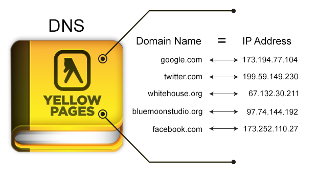
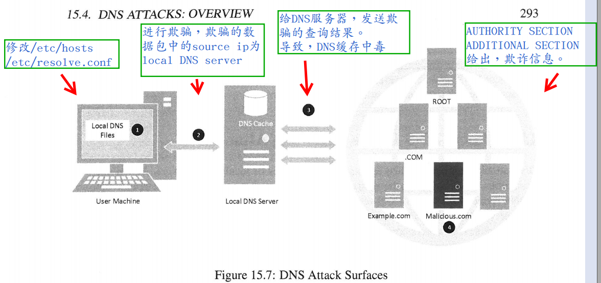
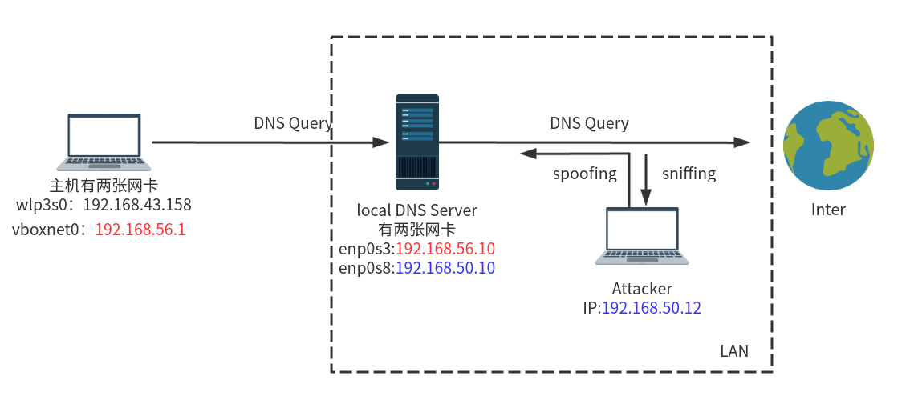
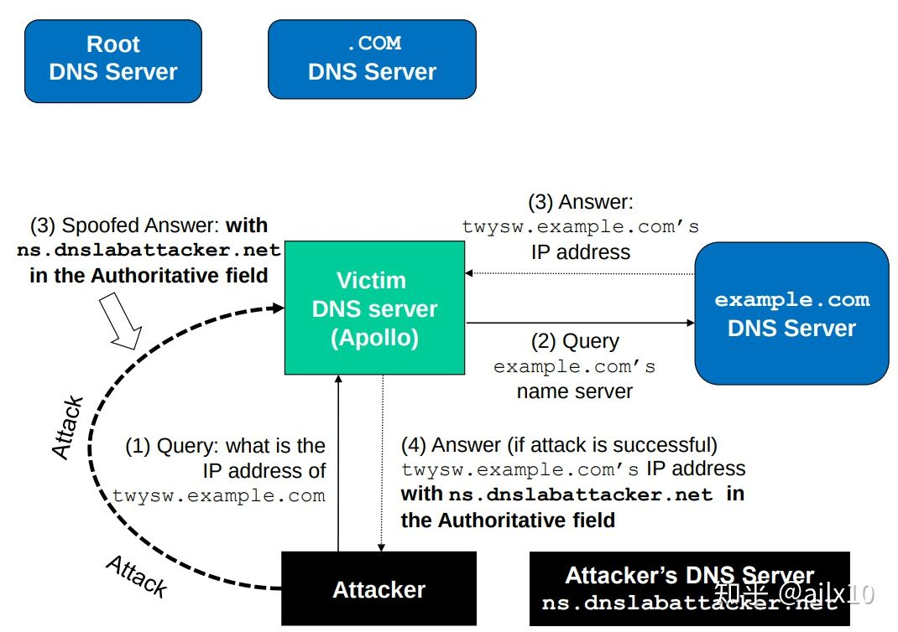

[toc]

## 0. 前言

来源：[Local DNS Attack Lab](https://seedsecuritylabs.org/Labs_16.04/Networking/DNS_Local/)

代码/文档见：[github](https://github.com/da1234cao/computer_security)

:dog2:最近看那垃圾小说，挺长时间没有学习，学习最快乐:dog2:

**摘要**忘写了，这里补充个。

先介绍DNS的原理，之后我们自行搭建的DNS服务器。

DNS的攻击面不同，我们根据不同的攻击面，给出不同攻击策略以及防御。

其中的重点是Kaminsky DNS远程攻击，攻击利用的是DNS没有验证机制。DNSSEC扩展则提供了安全验证机制。

<br>

## 1. 背景知识

### 1.1 理解DNS原理

参见：[域名解析详解](https://cloud.tencent.com/developer/article/1365761?from=10680) | [DNS 原理入门](https://www.ruanyifeng.com/blog/2016/06/dns.html)

图片来源：[Pi-Hole: DNS For Dummies](https://medium.com/@atippy83/pi-hole-dns-for-dummies-5763b65ee527)



<br>

### 1.2 DNS服务搭建

参见：[DNS 服务器 -- 鸟哥](http://linux.vbird.org/linux_server/0350dns.php) | [DNS 服务器 --redhat](https://access.redhat.com/documentation/zh-cn/red_hat_enterprise_linux/7/html/networking_guide/ch-dns_servers) (未看) | [VirtualBox虚拟机双网卡配置](https://blog.csdn.net/sinat_38816924/article/details/107831886)

<br>

## 2. DNS攻击

### 2.1 攻击面介绍

DNS的攻击面，有四个，也很容易理解。

1. 第一个攻击面：沦陷的主机

   假如我们已经获得了一个victim的主机root权限。可以修改其`/etc/hosts` 、`/etc/resolv.conf`,从而控制主机的DNS解析。

   顺便说一句，临时修改主机使用的DNS服务器，修改resolv.conf阔以。如果是长期修改，不妨修改[/etc/systemd/resolved.conf](https://www.timelate.com/archives/modify-the-dns-of-ubuntu-18-04.html) ,或者使用[Netplan 管理](https://blog.csdn.net/sinat_38816924/article/details/107831886#t4) 。

2. 第二个攻击面：主机的局域网中

   由于和主机在同一个局域网，可以进行数据包的嗅探和欺骗。当主机发送DNS请求的时候，局域网中的Attacker嗅探该数据包，并根据其中内容，给User Machine发送一个spoofing DNS query answer。

   如果这个主机是个本地的DNS服务器，即与DNS服务器在同一个局域网中，同样使用嗅探/欺骗，使得本地的DNS服务器缓冲区中毒。如果该DNS服务器开启了DNSSEC，这种方法就无法毒害DNS服务器的缓冲区了。

3. 第三个攻击面：本地DNS服务器

   Attacker可以触发local DNS Server 向外发起域名查询。这时候，Attacker可以发送spoofing DNS query answer给local DNS Server。但是由于远程无法嗅探到数据包，所以得猜测查询数据包中的部分内容。

   如果该DNS服务器开启了DNSSEC，这种方法就无法毒害DNS服务器的缓冲区了。

4. 第四个攻击面：恶意的DNS服务器

   世界上有好蛋，也有坏蛋。服务器如是。恶意的服务器表面光鲜亮丽，其实暗藏坏水。它可以在AUTHORITY SECTION,ADDITIONAL SECTION中给出欺诈信息。但是它的ANSWER SECTION是确确实实的正确。否则，是给自己的zone提供拒绝服务。没有人这么sha吧，没有吧，没有吧。



<br>

### 2.2 从局域网中发起DNS攻击

工具的使用：[Netwox](http://www.cis.syr.edu/~wedu/Teaching/cis758/netw522/netwox-doc_html/html/examples.html)



```shell
# 192.168.50.10 is the local DNS Server IP
# attacker in the same LAN of DNS Server; 
# client向DNS Server发送dns query；DNS向权威服务器发送dns query；
# attacker嗅探DNS服务器的数据包，发送欺骗应答给DNS服务器，造成DNS服务器缓冲区中毒

# DNS，清除缓存
sudo rndc flush

# attacker:192.168.50.12
sudo netwox 105 --hostname "www.baidu.com" --hostnameip "1.2.3.4" --authns "ns1.baidu.com" --authnsip "1.2.3.5" --ttl 300 --filter "src host 192.168.50.10" --spoofip raw

# DNS 抓包监听
sudo tcpdump -nn  src 192.168.50.12 and dst 192.168.50.10

# client:192.168.56.1
dig www.baidu.com @192.168.56.10
```

```shell
# 将DNS缓冲区中的数据保存到文件中
sudo rndc dumpdb -cache
cat /var/cache/bind/dump.db | grep www.baidu.com

www.baidu.com.		291	A	1.2.3.4
```

<br>

### 2.3 远程向DNS服务器发起攻击

参考：[DNS投毒攻击--Kaminsky--原理](https://zhuanlan.zhihu.com/p/92899876) | [DNS投毒攻击--Kaminsky--代码](https://zhuanlan.zhihu.com/p/37306980)
]

1. 在示例中，攻击者向DNS服务器Apollo查询一个`example.com`域的名称(host + domian)，例如 `twysw.example.com.`

2. 由于答案不在Apollo的DNS缓存中，因此Apollo将DNS查询发送到 `example.com`域的名称服务器。最初，Apollo可能不知道 `example.com`域的名称服务器在哪。所以它先去查询Root 和 `.com`，并将结果放在cache中。
3. 在Apollo等待答复时，攻击者向Apollo注入了一系列伪造的DNS答复，每个答复都尝试使用不同的transaction ID和 UDP destination port number，希望一个答复是正确的。在答复中，攻击者不仅为`twysw.example.com`提供了IP解析，而且攻击者还提供了一条NS记录，显示`ns.attacker32.com`作为`example.com`域的名称服务器。如果其中一个欺骗答复恰好具有有效的事务ID和UDP端口号，并且比合法答复早到达Apollo，它将被接受并缓存，从而使Apollo的DNS缓存中毒。

4. 如果欺骗的DNS响应失败，则攻击者将返回到第一步，并重复整个过程，但是在查询中使用不同的主机名（这就是为什么在第一步中，主机名必须是随机的的原因）。 由于Apollo的缓存不包含此新主机名的IP地址，因此它必须发出另一个查询，从而使攻击者有机会进行欺骗攻击。 这有效地消除了缓存效果。

5. 如果攻击成功，Apollo的DNS缓存中`example.com`的名称服务器将改变成`ns.attacker32.com`

实施起来并不简单，需要构建`[IP包头[UDP报头[DNS数据报文]]]`数据包。

这种攻击能实现在于，DNS协议没有提供认证机制，所以才可以有数据包进行假冒。下文的DNSSEC提供认证，将避免这种攻击的。

<br>

### 2.4 恶意的DNS服务器

> DNS投毒（或者说缓存污染）并不是新鲜事，bailiwick检查被设计出来专门防范缓存污染，主要原则是：如果检查发现附加区(或权威区)中的记录和问题区中的问题不在同一个域管辖之下，就会格外谨慎而不会采信（更不会记入缓存）此记录，这可以防范恶意权威DNS发出虚假的记录以污染缓存。

```shell
# eg
# 阔以
问题区：1.foo.com  A  
应答区：（空）
权威区：foo.com NS www.foo.com
附加区：www.foo.com  A   6.6.6.6

# 不阔以
问题区：1.foo.com  A  
应答区：（空）
权威区：foo.com NS www.foo.com
附加区：www.eoo.com  A   6.6.6.6
```

所以恶意的DNS服务器在bailiwick检查面前，没啥作用。

<br>

## 3. DNS防御

参考：[DNSSEC 简介，签名的工作原理](https://guozeyu.com/2018/03/dnssec/) | [SSL/TLS协议运行机制的概述](https://www.ruanyifeng.com/blog/2014/02/ssl_tls.html) + [五分钟了解TLS/SSL协议流程](https://www.bilibili.com/video/BV1xc411h796?from=search&seid=12791390616687837554)

> DNSSEC 这一个扩展可以为 DNS 记录添加验证信息，于是缓存服务器和客户端上的软件能够验证所获得的数据，可以得到 DNS  结果是真是假的结论。上一篇文章讲到过 DNS 解析是从根域名服务器开始，再一级一级向下解析，这与 DNSSEC 的信任链完全相同。