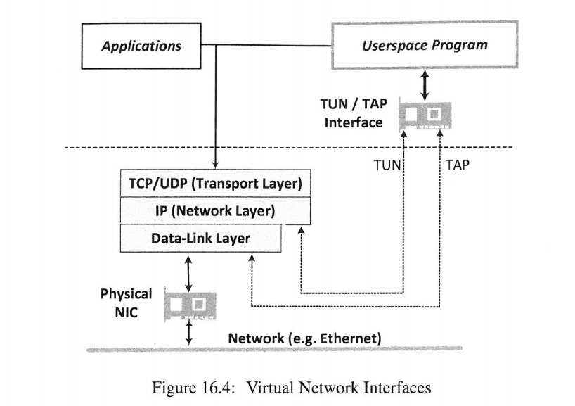

[toc]

## 0. 前言

实验来源：[VPN Tunneling Lab](https://seedsecuritylabs.org/Labs_16.04/Networking/VPN_Tunnel/)

<font color=red>实验没做成功，由于网络编程知识的匮乏，未来的后半年，我计划补充些网络编程的背景知识。</font>我暂时还不知道错在哪？文中，也列出错误的表现。

大概两年前接触点`代理上网`和`《计算机网络》（谢希仁）4.8.1节VPN的概念`。

这两者的区别，可以简单看下这个视频：[VPN才是主流？比Shadowsocks和v2ray好在哪里？ --YouTube](https://www.youtube.com/watch?v=wAxOjL_gDzk&list=PLqybz7NWybwUgR-S6m78tfd-lV4sBvGFG&index=7) 


我们先看下《计算机网络》对VPN的介绍（这是一本挺不错的书，当我回头翻看其中的某些章节的时候）。

图4-59以两个场所为例说明如何使用P隧道技术实现虚拟专用网。

假定某个机构在两个相隔较远的场所建立了专用网A和B,其网络地址分别为专用地址10.1.0.0和10.2.0.0。现在这两个场所需要通过公用的互联网构成一个VPN。显然,每一个场所至少要有一个路由器具有合法的全球IP地址,如图4-59(a)中的路由器R1和R2。这两个路由器和互联网的接口地址必须是合法的全球P地址。路由器R1和R3在专用网内部网络的接口地址则是专用网的本地地址


在每一个场所A或B内部的通信量都不经过互联网。但如果场所A的主机X要和另一个场所B的主机Y通信,那么就必须经过路由器R1和R2。主机X向主机Y发送的IP数据报的源地址是10.1.0.1,而目的地址是10.2.0.3。这个数据报先作为本机构的内部数据报从X发送到与互联网连接的路由器R1。路由器R1收到内部数据报后,发现其目的网络必须通过
互联网才能到达,就**把整个的内部数据报进行加密(这样就保证了内部数据报的安全)**,**然后重新加上数据报的首部,封装成为在互联网上发送的外部数据报**,其源地址是路由器R1的全球地址125.1.2.3,而目的地址是路由器R2的全球地址194.4.5.6。路由器R2收到数据报后将**其数据部分取出进行解密,恢复出原来的内部数据报**(目的地址是10.2.0.3),交付主机Y。可见,虽然X向Y发送的数据报是通过了公用的互联网,但在**效果上就好像是在本部门的专用网上传送一样**。如果主机Y要向X发送数据报,那么所进行的步骤也是类似的。

请注意,数据报从R1传送到R2可能要经过互联网中的很多个网络和路由器。但从逻辑上看，在R1和R2之间好像是一条直通的点对点的链路。

sock5代理是什么情况，我目前不清楚。[sock --wiki](https://zh.wikipedia.org/wiki/SOCKS)

本文的重点是VPN。通过上面的文字，我们大概知道VPN是个什么东西。但将内部数据取出，再加密是什么过程？如果你对五层模型，[数据的传输过程](https://blog.csdn.net/sinat_38816924/article/details/107558223) 有些了解的话，肯定会更好奇，<font color=red>VPN是如何将位于内核中IP数据包进行加密作为数据，添加新的数据包头部，并传送的</font>。

本文专注于TLS/SSL隧道技术实现VPN。其中的TLS/SSL加密过程暂时不谈，只看数据的传送过程。如果你想看TLS/SSL的相关内容，可以参考：[SSL/TLS协议运行机制的概述](https://www.ruanyifeng.com/blog/2014/02/ssl_tls.html) + [五分钟了解TLS/SSL协议流程](https://www.bilibili.com/video/BV1xc411h796?from=search&seid=12791390616687837554)

<br>

## 1. 摘要与总结

本文先对VPN的概念进行介绍。为了更详细的了解的VPN背后的数据传输过程，介绍了TLS/SSL VPN的数据传输。为了获得一手的操作经验，本文创建虚拟网卡，隧道，网卡和隧道之间数据的接收和发送。

最后没有成功，由于网络编程知识的匮乏，我暂时不知道问题在哪。错误的表现也放在最后。

<br>

## 2. VPN介绍

书中介绍的很好，我翻译下书中的内容。这本书的中文版，亚马逊上还没有电子版的。等有了，我来买一本。

### 2.1 VPN的用户需求

**在家连接公司内部的网络**；大公司地理位置上的分离，需要在一个局域网内工作。

因为某些资源只有内部私有IP认证授权才可以获取，从而保证有更低的安全风险。

为了支持从外面连接，需要放松防火墙的规则。需要更多的端口转发。同时从外面链接，传输在公共网络上，数据包可能被抓取，修改，欺骗。这样攻击面增加。

专线比较贵。在公有网络的基础上搭建隧道，**使得两边就像在一个局域网内一样**。

(注：如果这些需求比较少，使用[SSH端口转发](https://www.bilibili.com/video/BV1C7411P7Er?p=2)也挺好?)

<br>

### 2.2 VPN的总体设计

**为了让合法的用户，从外面连接到内部的网路，并保证专用网络的安全特性不变**。我们将专用网络安全保证分为下面三个属性。只要从外面连接任然满足这三个属性，则认为策略合理。

* 用户认证：由于组织和家庭使用密码登录这样类似的安全防护装置。 可以使用<font color=red>专用网络(私有网络，private network)</font>的用户已获得授权，并且其身份已得到验证。

* 内容受保护：专用网络内部通信的内容无法从外部看到。 只要物理上固定电缆/加密WI-FI，就可以实现此目的。

* 保持完整性：任何外部人士都不能将伪造的数据插入专用网络或更改专用网络内部的现有数据

在不依赖机器物理上位于专用网络内部的的情况下，如果我们可以实现相同的属性，则VPN设计满足要求。我们可以像对待内部机器一样对待这些机器。也就是说，如果我们可以**创建一个由内部和外部的计算机组成的专用网络，我们将该网络称为虚拟专用网络**（Virtual Private Network, VPN），因为该网络不是物理专用的；它实际上是虚拟专用的。**虚拟专用网络是一种解决方案，旨在通过公共基础结构来提供专用网络服务**。

VPN允许用户通过公共网络（例如Internet）创建安全的私有网络。它通过公共网络创建安全链接。使用VPN，任何计算机都可以成为网络的虚拟成员并可以访问数据。这可以通过在网络上拥有指定的主机(VPN Server)来实现，防火墙可以允许该主机发送和接收流量。该称为VPN Server的主机暴露在外部，但是专用网络上的所有其他主机仍受防火墙或保留IP地址（在Internet中不可路由）的保护。外部计算机必须通过VPN Server才能到达专用网络内部的主机，**但首先必须由VPN Server进行身份验证**。基本上，VPN Server充当“安全防护或锁”，仅允许来自授权用户的网络数据包进入。**一旦对用户进行身份验证，VPN Server与用户之间便建立了安全通道，因此对数据包进行了加密并保持其完整性**。


<br>

### 2.3 VPN的详细设计

除了上述安全属性外，VPN的一个非常重要的标准是透明性，即，无论运行在远程主机上的应用程序是否支持安全通信，其与专用网络上主机的通信将始终保持透明，被保护。**实现此透明目标的最佳方法是在IP数据包级别进行**。因此，VPN的实现方式归结为以下问题：如何安全地从A向B发送IP数据包(.esaihenticated, encrypted, and integrity preserve)，其中A和B属于，通过互联网连接在一起的虚拟专用网络。如果目标是从A到B保护应用程序数据而不是保护IP数据包，则解决此问题非常容易，**因为IP数据包只能在内核内部的IP层访问，而应用程序则无法访问**。


我们有一个难题：要解决上述问题，IP数据包的所有部分（包括所有标头字段和数据）都需要受到保护和加密。这样的加密数据包将无法通过Internet到达目的地，因为路由器无法读取数据包的标头，路由器也无法更改数据包标头（路由器确实需要保留生存时间字段和校验和）。解决此难题的一种方法是**将受保护的IP数据包放在另一个IP数据包中作为有效载荷（带有未加密的新IP头）**。这个新的IP数据包的工作是在A和B之间携带受保护的IP数据包，一旦到达A或B，新的报头就被丢弃，受保护的有效载荷被解密，因此原始IP数据包被提取并释放到专用网络。 它最终可以到达专用网络内的预期最终目的地。这种技术称为**IP隧道**。它的工作原理类似于隧道：数据包被送入隧道的一端，并出现在另一端；当数据包在隧道内时，它们受到保护。

有几种实现IP隧道的方法。两种最具代表性的解决方案是“ IPSec隧道”和“ TLS / SSL隧道”。 **IPSec隧道**利用Internet协议，在IP层运行的安全（IPSec）协议。 IPSec具有一种称为“隧道模式”的模式，该模式将整个原始IP数据包封装到一个新的IP数据包中，并添加一个新的标头。这是在**IP层内部完成的**。图16. 2（a）说明了原始数据包的封装方式。显然，此隧道模式旨在实现IP隧道。它已用于实现VPN。

**一种替代方法是在应用程序中在内核外部实现隧道**。该想法是将每个VPN绑定的**IP数据包交给一个专用应用程序**，该应用程序将该数据包放入TCP或UDP数据包中（因此使用不同的IP数据包），并将新的IP数据包发送到隧道另一端的应用程序对应对象，在该应用程序的对方处，将从TCP或UDP有效负载中提取原始数据包，并将其释放到专用网络。图16.2（b）显示了原始数据包如何封装在TCP或UDP数据包中。为**了保护封装的数据包，隧道的两端使用TCP/UDP之上的TLS/SSL协议**。因此，该技术通常称为**TLS/SSL隧道**。有时将其称为传输层隧道，因为它是建立在传输层协议TCP或UDP之上的。

TLS / SSL隧道技术比IPSec隧道技术变得越来越流行，主要是因为它是在应用程序内部实现的，而不是在内核的IP层内部实现的。应用程序级解决方案使复杂性摆脱了内核，并且更加容易更新而不是更新操作系统。在本章中，我们重点介绍TLS / SSL隧道。我们将展示如何实现这种类型的隧道。


<br>

## 3. TLS/SSL VPN的介绍


整体思路是这样。

* VPN Client 从主机U网络层提取数据包，并传送给Tunnel application。
* Tunnel application 将数据包作为负载，加密，并添加新的首部，作为新的数据包，发送给Tunnel另一端。
* Tunnel application 收到新的数据包，取出数据部分(即，旧的数据包)，解密，传递给VPN Server。
* VPN Server将数据放在网络层。根据当前数据包的dest IP(主机V)，发送到主机V。
* 至此，主机U的内容，通过VPN发送到主机V。
* 主机V回复主机U的过程，亦是如此。

<br>

### 3.1 提取网络层数据包

[TUN/TAP](https://zh.wikipedia.org/wiki/TUN%E4%B8%8ETAP)是操作系统内核中的虚拟网络设备。不同于普通靠硬件网络适配器网络适配器实现的设备，这些虚拟的网络设备全部用软件实现，并向运行于操作系统上的软件提供与硬件的网络设备完全相同的功能。

**TAP**等同于一个以太网设备，它操作第二层数据包如以太网数据帧。**TUN**模拟了网络层设备，操作第三层数据包比如IP数据封包。

<font color=red>操作系统通过TUN/TAP设备向绑定该设备的用户空间的程序发送数据，反之，用户空间的程序也可以像操作硬件网络设备那样，通过TUN/TAP设备发送数据。在后种情况下，TUN/TAP设备向操作系统的网络栈投递（或“注入”）数据包，从而模拟从外部接受数据的过程</font>。



使用[`tunctl`创建虚拟网卡](https://www.cnblogs.com/embedded-linux/p/10714088.html)

书中使用代码创建，并配置。

```c
int createTunDevice(){
    int tunfd;
    struct ifreq ifr;
    bzero(&ifr,sizeof(ifr));

    ifr.ifr_flags = IFF_TUN | IFF_NO_PI;

    tunfd = open("/dev/net/tun",O_RDWR);
    ioctl(tunfd,TUNSETIFF,&ifr);

    return tunfd;
}
```

此时，可以通过`ifconfig -a`查看到这个虚拟网卡。可以配置其IP细信息。为了使得指定流量通过虚拟网卡，我们可以配置相应的路由信息。

<br>

### 3.2 建立隧道

关于加密/解密的内容，书中放在最后一个章节。这里仅仅建立一个可以相同通信的管道，不考虑加密。

我目前，没有网络编程的基础支持。尴尬哈。

```c
int connectToServer(){
    int sockfd;
    char *hello = "Hello";
    struct sockaddr_in clientAddr;

    bzero(&clientAddr,sizeof(struct sockaddr_in));
    clientAddr.sin_family = AF_INET;
    clientAddr.sin_port = htons(PORT_NUMBER);
    clientAddr.sin_addr.s_addr = inet_addr(SERVER_IP);

    sockfd = socket(AF_INET,SOCK_DGRAM,0);

    sendto(sockfd,hello,strlen(hello),0,(struct sockaddr *)&clientAddr,sizeof(struct sockaddr_in));

    printf("Connected with the server : %s\n",hello);
    return sockfd;
}

int initUDPServer(){
    int sockfd;
    struct sockaddr_in server;
    char buff[100];

    bzero(&server,sizeof(server));
    server.sin_family = AF_INET;
    server.sin_addr.s_addr = htonl(INADDR_ANY);
    server.sin_port = htons(PORT_NUMBER);

    sockfd = socket(AF_INET,SOCK_DGRAM,0);
    bind(sockfd,(struct sockaddr *)&server,sizeof(server));

    bzero(buff,sizeof(buff));
    int peerAddrLen = sizeof(struct sockaddr_in);
    int len = recvfrom(sockfd,buff,sizeof(buff)-1,0,(struct sockaddr *)&peerAddr,&peerAddrLen);
    
    printf("Connected with the client : %s\n",buff);
    return sockfd;
}
```

<br>

### 3.3 虚拟网卡和管道之间数据的发送与接收

通过VPN向其他主机发送数据，数据先经过虚拟网卡，再到隧道。

通过VPN接收其他主机数据，数据先经过隧道，再到虚拟网卡。


```c
fd_set readFDset;

FD_ZERO(&readFDset);
FD_SET(tunfd,&readFDset);
FD_SET(sockfd,&readFDset);
select(FD_SETSIZE,&readFDset,NULL,NULL,NULL);

if(FD_ISSET(tunfd,&readFDset))
	tunSelected(tunfd,sockfd);
if(FD_ISSET(sockfd,&readFDset))
	socketSelected(tunfd,sockfd);

void tunSelected(int tunfd,int sockfd){
    int len;
    char buff[BUFF_SIZE];

    printf("Got a packet from TUN\n");

    bzero(buff,BUFF_SIZE);
    len = read(tunfd,buff,BUFF_SIZE);

    sendto(sockfd,buff,len,0,(struct sockaddr *)&peerAddr,sizeof(peerAddr));
}

void socketSelected(int tunfd,int sockfd){
    int len;
    char buff[BUFF_SIZE];

    printf("Got a packet from the tunnel\n");

    bzero(buff,BUFF_SIZE);
    len = recvfrom(sockfd,buff,BUFF_SIZE,0,NULL,NULL);
    write(tunfd,buff,len);
}
```

<br>

## 4. 具体实现

我的网络拓扑图如下所示。关于网卡的配置，可以参考：[VirtualBox虚拟机双网卡配置](https://blog.csdn.net/sinat_38816924/article/details/107831886)


```c
// vpn.h 文件
#ifndef _VPN_H_

#include <stdio.h>
#include <string.h>
#include <fcntl.h>
#include <arpa/inet.h>
#include <linux/if_tun.h>
#include <linux/if.h>
#include <sys/ioctl.h>
#include <unistd.h>
#include <sys/select.h>

#define PORT_NUMBER 55555
#define SERVER_IP "192.168.56.10"
struct sockaddr_in peerAddr;

#define BUFF_SIZE 1024

int createTunDevice(){
    int tunfd;
    struct ifreq ifr;
    bzero(&ifr,sizeof(ifr));

    ifr.ifr_flags = IFF_TUN | IFF_NO_PI;

    tunfd = open("/dev/net/tun",O_RDWR);
    ioctl(tunfd,TUNSETIFF,&ifr);

    return tunfd;
}

int connectToServer(){
    int sockfd;
    char *hello = "Hello";
    struct sockaddr_in clientAddr;

    bzero(&clientAddr,sizeof(struct sockaddr_in));
    clientAddr.sin_family = AF_INET;
    clientAddr.sin_port = htons(PORT_NUMBER);
    clientAddr.sin_addr.s_addr = inet_addr(SERVER_IP);

    sockfd = socket(AF_INET,SOCK_DGRAM,0);

    sendto(sockfd,hello,strlen(hello),0,(struct sockaddr *)&clientAddr,sizeof(struct sockaddr_in));

    printf("Connected with the server : %s\n",hello);
    return sockfd;
}

int initUDPServer(){
    int sockfd;
    struct sockaddr_in server;
    char buff[100];

    bzero(&server,sizeof(server));
    server.sin_family = AF_INET;
    server.sin_addr.s_addr = htonl(INADDR_ANY);
    server.sin_port = htons(PORT_NUMBER);

    sockfd = socket(AF_INET,SOCK_DGRAM,0);
    bind(sockfd,(struct sockaddr *)&server,sizeof(server));

    bzero(buff,sizeof(buff));
    int peerAddrLen = sizeof(struct sockaddr_in);
    int len = recvfrom(sockfd,buff,sizeof(buff)-1,0,(struct sockaddr *)&peerAddr,&peerAddrLen);
    
    printf("Connected with the client : %s\n",buff);
    return sockfd;
}

void tunSelected(int tunfd,int sockfd){
    int len;
    char buff[BUFF_SIZE];

    printf("Got a packet from TUN\n");

    bzero(buff,BUFF_SIZE);
    len = read(tunfd,buff,BUFF_SIZE);

    sendto(sockfd,buff,len,0,(struct sockaddr *)&peerAddr,sizeof(peerAddr));
}

void socketSelected(int tunfd,int sockfd){
    int len;
    char buff[BUFF_SIZE];

    printf("Got a packet from the tunnel\n");

    bzero(buff,BUFF_SIZE);
    len = recvfrom(sockfd,buff,BUFF_SIZE,0,NULL,NULL);
    write(tunfd,buff,len);
}

#endif
```

```c
// 文件：vpn_server.c
#include <stdio.h>
#include <string.h>
#include <fcntl.h>
#include <arpa/inet.h>
#include <linux/if_tun.h>
#include <linux/if.h>
#include <sys/ioctl.h>
#include <unistd.h>
#include <sys/select.h>

#include "vpn.h"

int main(int argc, char *argv[]){
    int tunfd = createTunDevice();
    int sockfd = initUDPServer();

    while (1){
        fd_set readFDset;

        FD_ZERO(&readFDset);
        FD_SET(tunfd,&readFDset);
        FD_SET(sockfd,&readFDset);
        select(FD_SETSIZE,&readFDset,NULL,NULL,NULL);

        if(FD_ISSET(tunfd,&readFDset))
            tunSelected(tunfd,sockfd);
        if(FD_ISSET(sockfd,&readFDset))
            socketSelected(tunfd,sockfd);
    }
    
}
```

```c
// 文件：vpn_client.c
#include <stdio.h>
#include <string.h>
#include <fcntl.h>
#include <arpa/inet.h>
#include <linux/if_tun.h>
#include <linux/if.h>
#include <sys/ioctl.h>
#include <unistd.h>
#include <sys/select.h>

#include "vpn.h"

int main(int argc, char *argv[]){
    int tunfd = createTunDevice();
    int sockfd = connectToServer();

    while (1){
        fd_set readFDset;

        FD_ZERO(&readFDset);
        FD_SET(tunfd,&readFDset);
        FD_SET(sockfd,&readFDset);
        select(FD_SETSIZE,&readFDset,NULL,NULL,NULL);

        if(FD_ISSET(tunfd,&readFDset))
            tunSelected(tunfd,sockfd);
        if(FD_ISSET(sockfd,&readFDset))
            socketSelected(tunfd,sockfd);
    }
    
}
```

```shell
# 路由配置
# vpn server 配置
sudo sysctl -w net.ipv4.ip_forward=1
sudo ifconfig tun0 10.4.2.5/24 up
sudo route add -net 10.4.2.0/24 tun0

# vpn client 配置
sudo ifconfig tun0 10.4.2.99/24 up
sudo route add -net 10.4.2.0/24 tun0
sudo route add -net 192.168.50.0/24 tun0
```

<br>

## 5. 测试--未成功

我目前不知道原因。不过不着急。当我网络编程的大法练成之后，这些问题，应当会迎刃而解。

```shell
# 主机U：192.168.56.9 ---》VPN ---》 主机V:192.168.50.11
(192.168.56.9):~ ping 192.168.50.11
```

