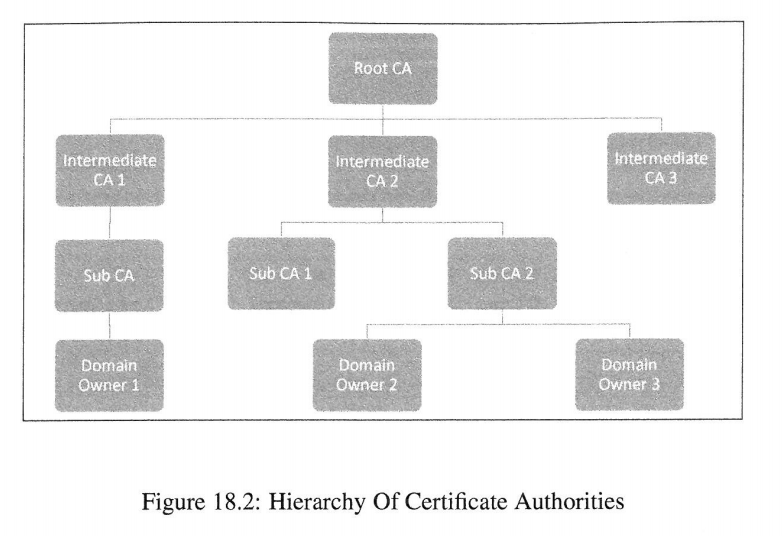

[toc]

## 0. 前言

来源：[PKI Lab](https://seedsecuritylabs.org/Labs_16.04/Crypto/Crypto_PKI/)

代码/文档见：[github](https://github.com/da1234cao/computer_security)

**不想写，胡乱整点**？

在开始本章之前，不妨先刷下这个视频：[PKI技术实现网络安全视频课程](https://www.bilibili.com/video/BV1wE411p7He?p=12)

我不会耍，有点复杂：[命令行神器之 openssl 篇](http://www.4e00.com/blog/linux/2018/04/28/the-best-commands-openssl.html) | [OpenSSL Command-Line HOWTO](https://www.madboa.com/geek/openssl/)

关键字：对称加密，非对称加密，公钥密码学，PKI，openssl，x509	

<br>

## 1. 摘要

使用对称加密，秘钥在网上传输是个问题。

使用非对称加密。

* 数字签名：计算哈希值。哈希值用私钥加密。将文件，加密内容，公钥发送给对方。
* 非对称加密：索要对方的公钥；使用对方的公钥加密内容；将加密内容发送给对方。

公钥密码学，可能面临这中间人的攻击。因为公钥没有身份证明。PKI解决了这个问题，**PKI对公钥进行身份验证**。

PKI可以认为有两部分组成：证书颁发机构(Certificate Authority，CA)，数字证书

我们需要大概知道数字证书：[X.509](https://zh.wikipedia.org/wiki/X.509) | [安全网站证书-火狐](https://support.mozilla.org/zh-CN/kb/secure-website-certificate)

证书颁发机构需要验证申请者的身份，确认无误后，颁发证书(使用私钥签名)。

<br>

## 2. 实现

2.1 创建一个CA；创建一个applicant；applicant 想CA 请求证书。

```shell
------------------------------------------------------------------------
# 获取paypal.com的证书
openssl s_client -connect paypal.com:443 </dev/null 2>/dev/null | sed -ne '/-----BEGIN CERTIFICATE-----/,/-----END CERTIFICATE-----/p' > paypal.com.pem

# 解码证书
openssl x509 -in paypal.com.pem -text [-noout]
------------------------------------------------------------------------

------------------------------------------------------------------------
# demoCA目录
mkdir demoCA
cd demoCA
mkdir newcerts crl
touch index.txt serial
echo 1000 > serial
# CA生成密钥对，和自签名证书
openssl req -x509 -newkey rsa:4096 -sha256 -days 3650 -keyout modelCA_key.pem -out modelCA_cert.pem
-------------------------------------------------------------------------

-------------------------------------------------------------------------
# demoAPP目录
mkdir demoAPP
# applicant 生成密钥对
openssl genrsa -aes128 -out bank_key.pem 2048

# 查看秘钥对
openssl rsa -noout -text -in bank_key.pem

# 申请证书请求
req -new -key bank_key.pem -out bank.csr -sha256
openssl req -in bank.csr -text -noout

# 请求签名，获得公钥证书
cd ..
openssl ca -in ./demoApp/bank.csr -out ./demoApp/bank_cert.pem -md sha256 -cert ./demoCA/modelCA_cert.pem -keyfile ./demoCA/modelCA_key.pem

# 检查请求的时候，可能不匹配，修改下openssl.conf
sudo vim /usr/lib/ssl/openssl.cnf
#policy         = policy_match
policy        = policy_anything
-------------------------------------------------------------------------

-------------------------------------------------------------------------
# 将公钥证书应用到网站
# 使用openssl内置的server，将秘钥和证书放在一个文件中
cp -a bank_key.pem bank.pem
cat bank_cert.pem >> bank.pem
openssl s_server -cert bank.pem -accept 4433 -www

# 在浏览器中访问
# 如果打不开，在浏览器中，导入demoCA/modelCA_cert.pem的证书文件。
# 此证书已在此前安装为一个证书颁发机构
https://www.example.com:4433/

# 使用s_client访问
openssl s_client -connect www.example.com:4433 -CAfile ./demoCA/modelCA_cert.pem

# 配置Appach站点
# 修改配置文件，将秘钥和证书放入ssl目录下。
-------------------------------------------------------------------------
```

2.2 CA的信任链



系统或浏览器内置 root CA。因为CA是自签名的，没法通过其他CA验证。我们信任操作系统与浏览器，所以我们信任内置的 root CA。


2.3 数字证书的类型。

* DV SSL证书（域名验证型）：只需验证域名所有权，无需人工验证申请单位真实身份。

* DV SSL证书（域名验证型）：只需验证域名所有权，无需人工验证申请单位真实身份。
* 　EV SSL证书（扩展验证型）：除了需要验证域名所有权以及企业身份信息之外，还需要提交一下扩展型验证。
* 可以简单看下这篇：[SSL数字证书类型与区别 -- 知乎](https://zhuanlan.zhihu.com/p/67403148)