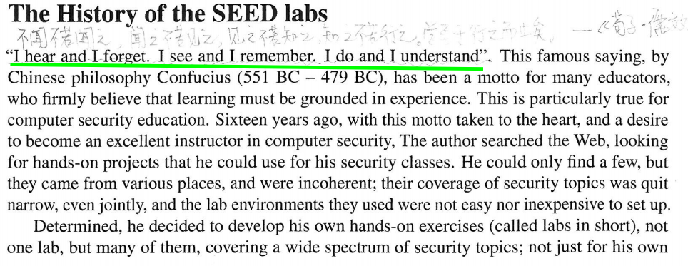
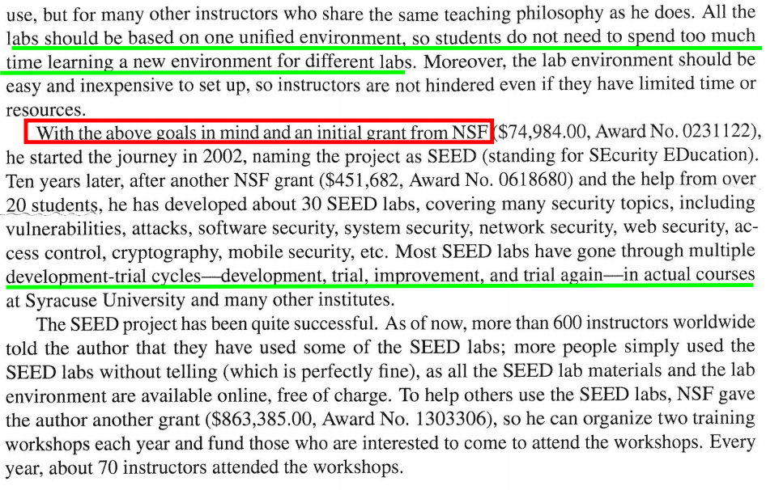
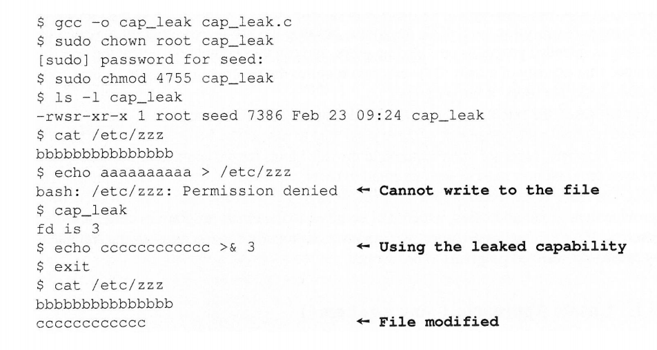
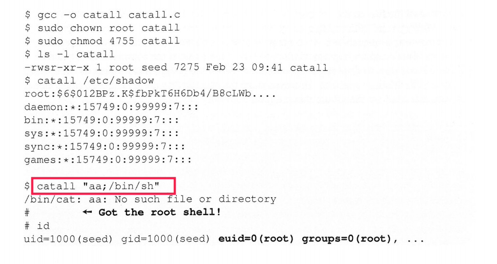
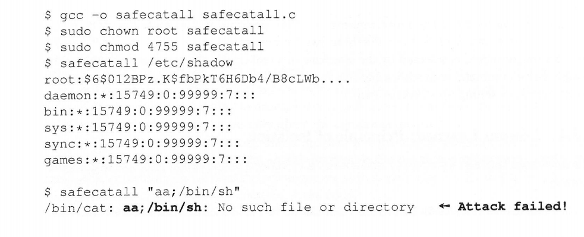

来源：《Computer Security》A Hands-on Approach   --- Wenliang Du

**Chapter01 SetUID Programs**

书上的内容是很好的。这里仅仅做个学习笔记。

我的文笔似乎弱的有点出奇。不流畅，像说明书一样:slightly_smiling_face:

题目标题：进一步理解特权程序 （我不敢命名叫深入理解特权程序:smile:）

有点像：一些水水的内容，总是命名为”基于....."的很很高大上的名字。而里面就用了个很浅浅的内容。

---

[toc]

# 前言

一本书适合的阅读人群，书中涵盖的内容一般会在书的前言部分展现。这本书也是如此。

阅读这本书，我们希望：

* 理解多种攻击和防御是如何工作的
* 对抗攻击，评估系统所面临的风险

这本书的三个主要点：软件安全、web安全、网络安全

这本书的作者：[Wenliang(Kevin) Du](http://www.cis.syr.edu/~wedu/). 所展现的是一个很有想法的人。





> I hear and I forget. I see and I remember. I do and I understand

**荀子曰:不闻不若闻之,闻之不若见之,见之不若知之,知之不若行之。学至于行而止矣。行之,明也。**

所学的东西，用于实践是快乐的事情。

但是我的本科阶段有所欠缺。

**课外阅读与实验是书本内容必不可少的补充。**

但是这些我明白的晚了些。比较头疼的是，我还喜欢偷懒。

江山易改，本性难移。所以还是找个好些的环境，对于我而言是比较好的方式。


# 摘要&&总结

特权程序，虽然给我们带来了便利，但是要注意它的安全性问题。

而关于setuid，如何写出安全的代码。我还不晓得。

但是目前，我们要注意能力泄露，”中间商sh“，不要使用system()等。

**下面思路：特权程序的介绍 + 特权程序产生的原因 + 理解特权程序 + 编写特权程序的注意事项**


# 特权程序

笔记，必然是建立在我的背景知识之上的。

在这之前，我先回忆下。

我的linux入门书籍是《鸟哥私房菜》。当然目前我感觉《linux就该这么学》比较好入门些。

有节讨论课的有关内容是：SUID/SGID/SBIT. 

当时我是挺懵的。在之后的时间，渐渐对linux比较熟悉，大体知道怎么回事。

**后面的内容，建立在我们已经理解`SUID`的基础之上。**

可以参考：[Linux 特殊权限 SUID,SGID,SBIT](https://www.cnblogs.com/sparkdev/p/9651622.html)


## 特权程序的产生

上面链接的`passwd`命令我们称为特权程序。

**首先，我还是赘述下，为什么需要特权程序。**

我们的密码保存在`/etc/shadow` 文件中。shadow的权限如下

```shell
dacao@dacao-X555LJ:~$ ls -alh /etc/shadow
-rw-r----- 1 root shadow 1.4K 3月  12 18:21 /etc/shadow
```

除了root用户,其他用户都没有修改shadow的权限。

**但是每个用户都应该有修改自身密码的权限。否则总是得麻烦root用户总是很不好的。**

* 第一个方法，是写一个更细粒度的程序，使得，每一个用户只能修改shadow中自己对应的密码。但是这个机制的程序会比较复杂

* 第二种方法，是提供服务。每次修改密码的时候，需要后台守护进程的帮助。（这个概念，我不清楚。）

* 第三种方法，是我们这里的特权程序。`Set-UID`的特权程序，执行过程中获得root用户权限，从而可以修改shadow文件。

~~书中是用超人的故事来比喻的，挺有意思的。~~

**不得不说，特权程序在获得到特权，过大。比如说修改密码passwd的过程中，它暂时得到了所有的root权限。所以我们必须慎重的创建特权程序的代码，使其仅仅能执行我们指定的行为。**


## 理解特权程序

也许，在前面的链接中，我们已经基本上理解了SUID的基本用法。但是我们这里还是得补充。

~~（或许这篇文章，可以换个方向：eg，你真的理解了SUID吗？三分钟真正理解SUID。:smile:）~~

**补充三个概念：真实uid(*real user id*), 有效uid(*effective user id*), 被保存的uid(*saved user id*)**

参考：[setuid和seteuid](https://www.zybuluo.com/zwh8800/note/816659)

> real uid表示进程的实际执行者, **只有root才能更改real uid**, effective uid用于检测进程在执行时所获得的访问文件的权限(既 但进程访问文件时, 检测effective uid有没有权限访问这个文件), saved uid用于保存effective uid, **以便当effective uid设置成其他id时可以再设置回来**
>
> 一般情况下, 当一个程序执行时(既调用exec), **进程的effective uid会和real uid一致**, 但是可执行文件有一个set-user-ID位, 如果这个set-user-ID位被设置了, 那么执行exec后, **进程的effective uid会设置成可执行文件的属主uid, 同时saved uid也会被设置成effective uid**.
>
> 举例说明: 用户zzz执行了文件a.out, a.out的属主为hzzz且设置了set-user-ID位. 现在本进程的real uid为zzz, effective uid = saved uid = hzzz.


### 一个例子帮助理解set-uid

```shell
#当前目录：/tmp
$ cp /bin/cat ./mycat
#从某种角度来说，特权程序的所属是root用户（组），特权程序才有意义。
$ sudo chown root mycat 

$ ls -alh mycat
-rwxr-xr-x 1 root seed 50K Apr  4 22:41 mycat

$ ./mycat /etc/shadow
./mycat: /etc/shadow: Permission denied

$ sudo chmod 4755 mycat 
$ ls -alh mycat 
-rwsr-xr-x 1 root seed 50K Apr  4 22:41 mycat

#虚拟机中
$ ./mycat /etc/shadow
root:$6$NrF46O1p$.vDnKEtVFC2bXslxkRuT4FcBqPpxLqW05IoECr0XKzEEO5wj8aU3GRHW2BaodUn4K3vgyEjwPspr/kqzAqtcu.

```


## 编写特权程序的注意事项

首先，我们简单思考下。像`/bin/sh` 、`vi` 这样的程序，从安全的角度来考虑，是不应当被设置成特权程序。

否则，普通的用户可能会获得具有root权限的sh和vi。

我们应当：

* 避免Capability Leaking
* 使用 execve() 代替 system() 
* 代码和数据分离等 

下面会用具体的示例暂时。

这些展示网上很多，我偷懒在简单写写。详细内容见书上。

[SEED实验——Environment Variable and Set-UID Program实验描述与实验任务](https://www.cnblogs.com/xlwang1995/p/7156252.html)

[SET-UID 程序漏洞实验 ](https://www.shiyanlou.com/courses/227)


### Capability Leaking

在特权程序降级之前，`/etc/zzz` 的文件描述符没有释放。导致降级之后/特权程序结束之前，任然可以修改`/etc/zzz`文件。

这里稍微难点是：`setuid(getuid())` .参考：[setuid和seteuid](https://www.zybuluo.com/zwh8800/note/816659)

```c
//文件名：cap_leak.c
#include <stdio.h>
#include <stdlib.h>
#include <fcntl.h>
#include <unistd.h>

void main(void){
        int fd;
        char *v[2];

        fd = open("/etc/zzz",O_RDWR|O_APPEND);
        if(fd == -1){
                printf("Cannot open /etc/zzz\n");
                exit(0);
        }

        printf("fd is %d\n",fd);

        //disable privilege
        setuid(getuid());

        v[0] = "/bin/sh";v[1]=0;
        execve(v[0],v,0);
}
```




### Unsafe Approach: Using system()

一方面，system()会系统PATH来查找命令，这是不安全的。

另一方面，数据和命令放在一个字符串中。虽然简单些，但却带来了安全性问题。

```c
//文件名：cat_all.c
#include <string.h>
#include <stdio.h>
#include <stdlib.h>

int main(int argc,char *argv[]){
    char *cat = "/bin/cat";

    if(argc < 2){
        printf("Please type a file name \n");
        return 1;
    }

    char *command = malloc(strlen(cat) + strlen(argv[1]) +2);
    sprintf(command,"%s %s",cat,argv[1]);
    system(command);
    free(command);
    return 0;
}
```



### Safe Approach: Using execve()

我们使用execve(),代替system() ,将数据和命令分离。

```c
//文件名（not good）：safecatall.c
#include <string.h>
#include <stdio.h>
#include <unistd.h>

int main(int agrc, char *argv[]){
    char *v[3];

    if(agrc < 2){
        printf("Please type a file name .\n");
        return 1;
    }

    v[0] = "/bin/cat";
    v[1] = argv[1];
    v[2] = 0;

    execve(v[0],v,0);

    return 0;
}

```




# 参考文章

[Linux 特殊权限 SUID,SGID,SBIT](https://www.cnblogs.com/sparkdev/p/9651622.html)

[ 真实uid(*real user id*), 有效uid(*effective user id*), 被保存的uid(*saved user id*)](https://www.zybuluo.com/zwh8800/note/816659)

[SEED实验——Environment Variable and Set-UID Program实验描述与实验任务](https://www.cnblogs.com/xlwang1995/p/7156252.html)

[Linux 下/etc/passwd文件详解](https://blog.csdn.net/a1154490629/article/details/52190801)

[system()函数的使用](https://blog.csdn.net/a1232345/article/details/45889741)

[利用capability特征加强Linux系统安全](https://blog.csdn.net/cnbird2008/article/details/3262026) --->没看懂

[Linux id命令](https://www.runoob.com/linux/linux-comm-id.html)

> id会显示用户以及所属群组的实际与有效ID。若两个ID相同，则仅显示实际ID。

[SEED：一套计算机安全教育的教学实验机制](http://www.cis.syr.edu/~wedu/seed/SEED_Chinese_2009.pdf)