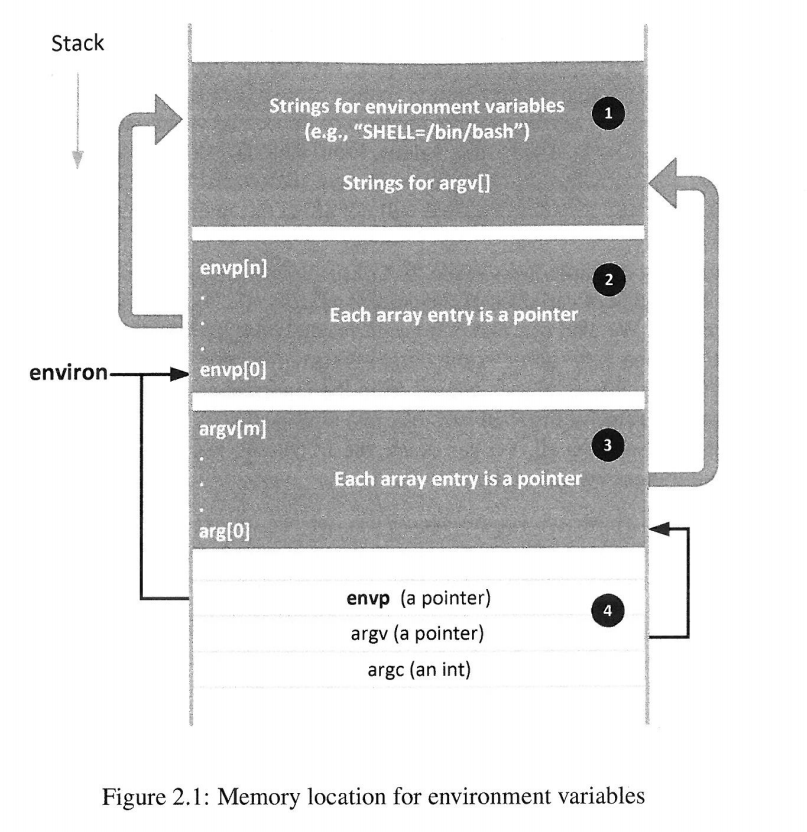
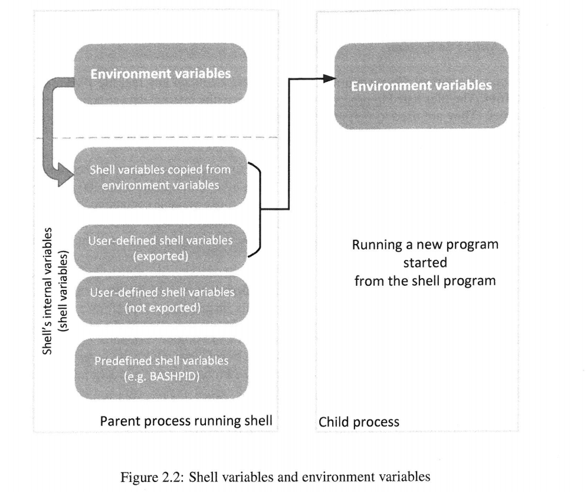
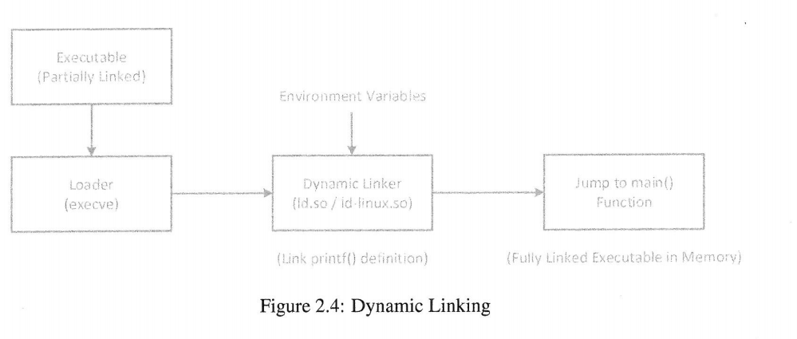
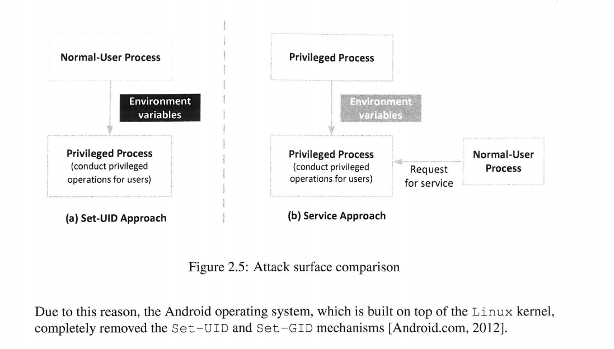

来源：《Computer Security》A Hands-on Approach   --- Wenliang Du

**Chapter02 Attacks Through Environment Variables**

书上的内容是很好的。这里仅仅做个学习笔记。

我把这些整体放在一章。如果对要点进行详细说明，可能得好几篇文章才能搞定，比较花时间。而现在网上的文章已经很多，比较旧的知识点应该大体都有不错的整理。故而，简略写之。

当然，还有自身能力的原因。比如动态库那里。书上的动态库那样写有它的原因。但我比较喜欢的库写法还是 头文件+编译参数 来实现。但是我有写过几次库呢？

---

[toc]

# 摘要&&总结

这章是对上一章的补充。

讲述**环境变量对特权程序的影响。**

一般是普通用户，执行特权程序。而特权程序一般是非特权程序(eg:bash)的子进程。

这导致**特权程序的环境变量来自普通用户**。这具有一定的危险性。

从安全的角度，来看本章，并没有很多知识点。

但是本章提供的背景知识还是不错的。

要点：

* 环境变量、shell变量、环境变量与shell变量的关系、环境变量在进程中的位置、shell变量对子进程的影响
* 静态库、动态库、增加自定义的库
* `getenv()`与 `secure_getenv()`
* Set-UID方法和Service方法
* built-in命令

<br>

<br>

# 环境变量对特权程序的影响

在开始本章之前，我们得先热身下：linux中环境变量的设置。

我随意从网上搜了两篇文章。

[linux 环境变量设置（临时 + 永久）](https://blog.csdn.net/yi412/article/details/11523525)
[Linux /etc/profile文件详解](https://www.cnblogs.com/lh03061238/p/9952659.html)

## 环境变量与shell变量

[Linux 环境变量&&进程](https://creaink.github.io/post/Computer/Linux/Linux-env.html) :star: （这篇链接文章是很好的。）

~~（记得当年这内容相关的讨论课是我讲滴。但是当时我肯定是不懂的）~~

我这里仅仅做下总结性的描述，不用实验进行验证。详细内容见书上+链接文章。

(1) 环境变量是name-value pairs ,存储在进程的内存中。

(2) 在程序中，存储位置是`**environ`全局变量。可以通过`putenv()` 、`unsetenv()` 、`setenv()`、 `getenv(）`进行环境的增删该查。

```c
//打印所有环境变量
//strings /proc/$$/environ
#include <stdio.h>
#include <unistd.h>

extern char** environ;

void main(int argc,char *agrv[],char *envp[]){
    int i=0;
    while (environ[i]!=NULL){
        printf("%s\n",envp[i]);
        i++;
    }
    
}

/*******************************************/
//环境变量&&execve()
/*我们现在要构建一个函数
 * ./switch_show_env x
 * 
 * 当参数是1：不传递环境变量
 * 当参数是2：传递自定义的环境变量
 * 当参数是3：传递所有的环境变量
 * 
 * 之后打印所有变量
 * 很漂亮的程序，演示execve的使用，展示了三种不同情况下的环境变量的传递
 */

#include <stdio.h>
#include <unistd.h>

extern char **environ;

void main(int argc,char *argv[],char *envp[]){

    char *v[2];
    char *new_envp[3];

    if(argc<2)
        return;
    
    v[0] = "/usr/bin/env";
    v[1] = NULL;

    new_envp[0] = "name=dacao";
    new_envp[1] = "Tel=173";
    new_envp[2] = NULL;

    switch (argv[1][0])
    {
    case '1':
        execve(v[0],v,NULL);
        break;
    case '2':
        execve(v[0],v,new_envp);
        break;
    case '3':
        execve(v[0],v,environ);
    default:
        printf("enter the correct argv");
        break;
    }

}
```


(3)环境变量在内存给中的位置



(4)shell变量是由shell程序来维护。

(5)环境变量的设置，可以见之前的参考文章。

(6)shell程序(eg:bash)会拷贝环境变量到shell变量中。

(7)书上说，shell变量，也能增添到环境变量中。我尝试了下：export并不能增添进程自身的环境变量，但可以增添环境变量到子进程。

```she
$ export Tong=haha

$ echo Tong
haha

$ strings /proc/$$/environ | grep Tong 
#(进程自身)输出空

$ env | grep Tong
Tong=haha
#env不是内置命令，所以作为(bash)的子进程。子进程中，有增添的环境变量
```

(8)子进程的环境变量



(9) **<font color=red>当环境变量和predefined shell 变量 名称相同时，会发生什么？</font>**

比如说：在~/.bashrc中，定义export BASHPID=1000 ；而bash启动的时候，会随机有个pid。

首先我们有观点:

* 后面的会覆盖前面的。或者说是后面的起作用。
* BASHPID被修改对程序暂时没有什么影响。就像我们修改PWD之后，并不代表我们的工作目录是指被改动。这些变量记录“现象”，但本质没有改动。

好，我们来验证下。

```shell
#打开一个bash
#查看当前的pid
$ echo $$ (echo $BASHPID)
15812
#修改 ~/.bashrc,在末尾增加 export BASHPID=1000
$ vim ~/.bashrc 
$ cat ~/.bashrc | grep BASHPID
export BASHPID=1000

$ source ~/.bashrc
$ echo $$ (echo $BASHPID)
15812

#关闭shell重开
echo $$ (echo $BASHPID)
不是1000

#直接修改BASHPID，被自动修正
$ BASHPID=1000
$ echo $BASHPID
20040
```

实验至此结束。实验结果未知。

<br>

## 静态库&&动态库

[C++静态库与动态库](https://www.cnblogs.com/skynet/p/3372855.html)

[elf文件格式](http://cxd2014.github.io/2015/12/02/elf/)

以前，编译程序的时候，报错缺少库。缺少的库名+这个库默认的查找路径+增添自定义的库路径

这一套下来，大体能把问题解决了。参考：

[查看一个可执行文件或者库的依赖库](https://blog.csdn.net/fickyou/article/details/51355783)

[Linux 共享库LD_PRELOAD环境变量](https://blog.csdn.net/htf15/article/details/8689973)

[正确使用环境变量LD_LIBRARY_PATH](https://blog.csdn.net/fengxinze/article/details/6940241)

静态程序链接的时候，把库中对应的函数，拷贝过去。这面临的两个问题是：程序加载进入内存，比较费内存；当库更新的时候，已编译的程序没有更新。

动态库，在链接的时候，.interp记录动态链接器(ld)的位置生成可执行文件；可执行文件被加载进内存；在.interp中查找连接器的位置；通过链接器找到共享库函数；进入main函数；



特权程序链接的时候，我目前感觉没有什么风险。因为：

在特权程序中，当使用到动态链接的时候，与链接有关的变量的使用，必须要求用户ID和有效ID相同。

感觉这挺安全的。

<br>

<br>

## 其他

### getenv() 和 secure_getenv()

我们在特权程序中，一般不会用getenv(),因为获取的环境变量来自普通用户，这并不安全。

另一个要注意的是，我们可能会使用execve()，来唤醒另一个程序。

这被唤醒的程序，可能是普通程序。这个普通程序中，也不要用getenv()。

**可以用secure_getenv()，代替。**当检测到有效ID和实际ID不同的时候，其返回NULL。即：

**特权程序中，无法正常使用secure_getenv()。**

如果要使用secure_getenv()，在程序的开头加上`#define _GNU_SOURCE` (原因见man getenv)

<br>

### built-in命令

参考：

[什么是bash shell的内建（build in）命令](https://blog.csdn.net/trochiluses/article/details/9094517) 

[Shell 的内置（builtin）命令是什么，常常傻傻分不清](http://tinylab.org/shell-builtin-command/)

> 另外一种 Shell 支持的命令即本文要重点总结的 builtin（“内置”） 命令，builtin 命令是 shell （譬如  bash）里自带的命令，由于其作为 shell 程序（进程）的一部分常驻在内存中，所以和一个普通命令相比起来， builtin  命令的执行速度要快得多。具体的原因很简单，就是因为在 Shell 中执行普通命令即运行程序，要先 `fork()`，然后是 `exec()`，经历创建 子 Shell 进程以及从磁盘上调入程序覆盖原进程的完整过程，而调用一个 builtin 命令本质上只是执行 bash 进程中的一个常驻内存的函数，其速度绝对不可同日而语。

> 由于各种 Shell 所支持的 builtin 命令各不相同，对于有些常用的命令，为避免用户当前所使用的 Shell 不支持，系统会提供同名的程序文件。譬如 `echo`，既是 bash 的 builtin 命令也是一个独立的命令程序。根据 bash 中执行命令的优先级，对于同名的命令，内置命令会优先被执行，所以当我们在 bash 中直接输入 `echo` 命令时执行的是 bash 的 buildin 命令，如果要执行独立的命令程序 `echo`，则需要输入全路径 `/bin/echo`。

### Set-UID方法和Service方法

Set-UID方法，没有Service方法安全。但Set-UID方法，节省内存，不需要常驻的后台服务。



# 参考文章

[Linux 环境变量&&进程](https://creaink.github.io/post/Computer/Linux/Linux-env.html)  ---> 未读完

[C++静态库与动态库](https://www.cnblogs.com/skynet/p/3372855.html)

[elf文件格式](http://cxd2014.github.io/2015/12/02/elf/)

[查看一个可执行文件或者库的依赖库](https://blog.csdn.net/fickyou/article/details/51355783)

[Linux 共享库LD_PRELOAD环境变量](https://blog.csdn.net/htf15/article/details/8689973)

[正确使用环境变量LD_LIBRARY_PATH](https://blog.csdn.net/fengxinze/article/details/6940241)

[c库函数getenv引起的core dumped](https://reborncodinglife.com/2016/09/24/c-lib-func-getenv-core-dumped/)

[Shell 的内置（builtin）命令是什么，常常傻傻分不清](http://tinylab.org/shell-builtin-command/)