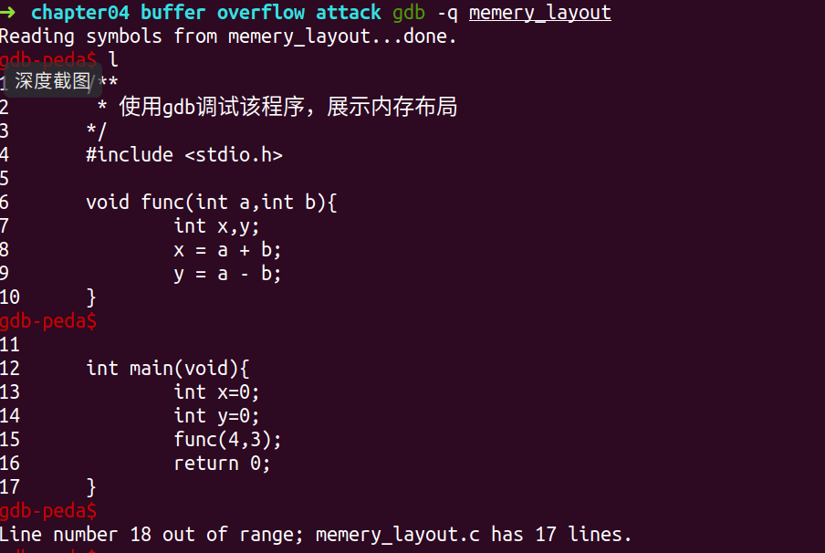
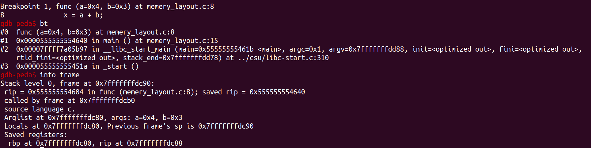
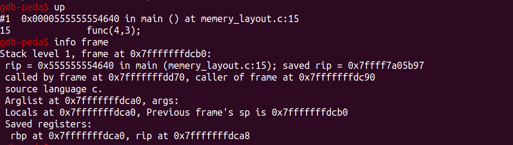
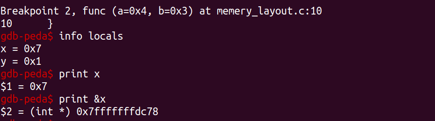
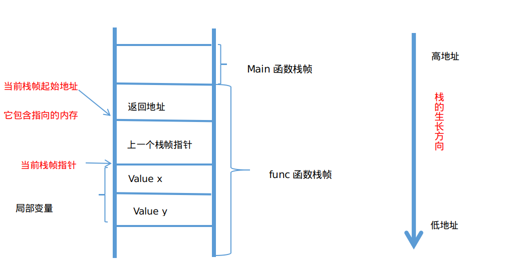
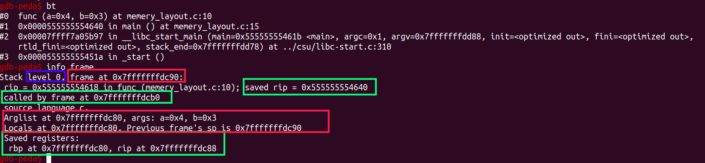
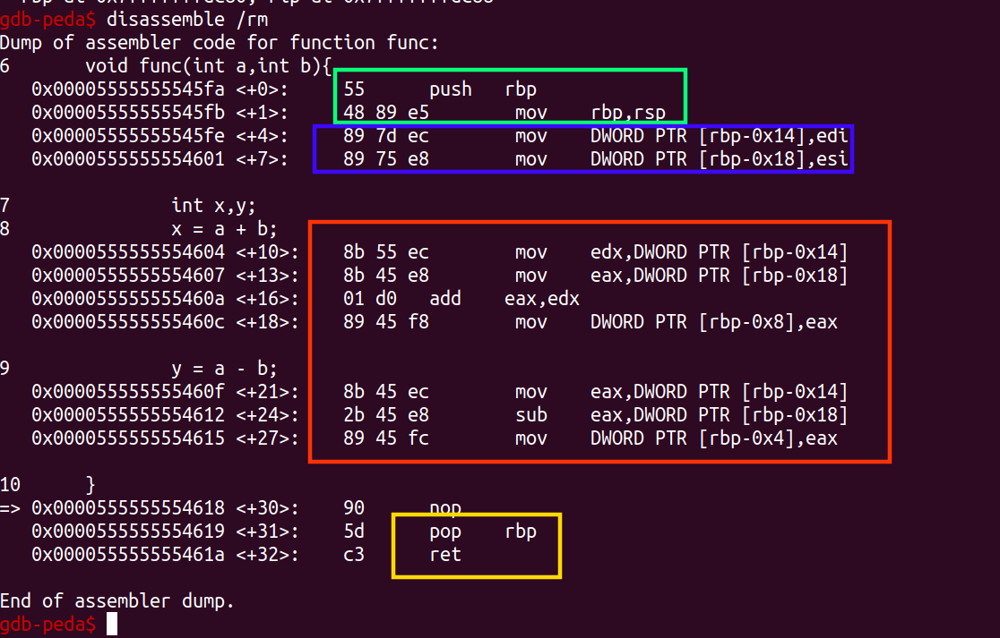
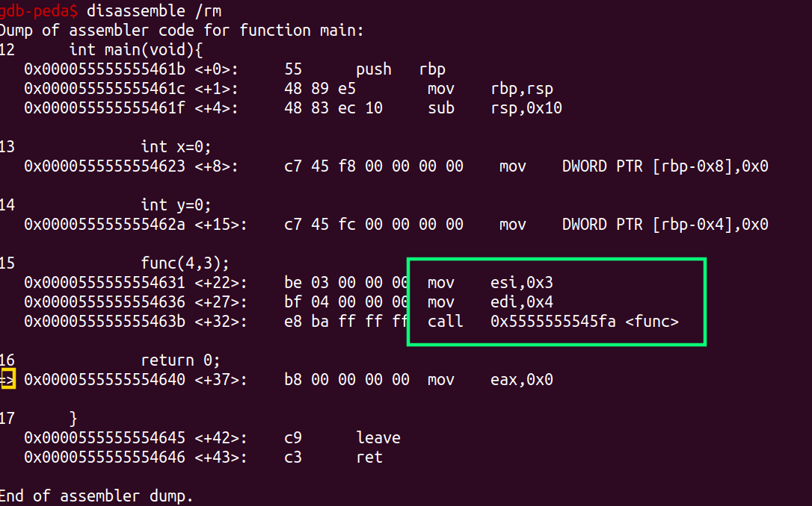
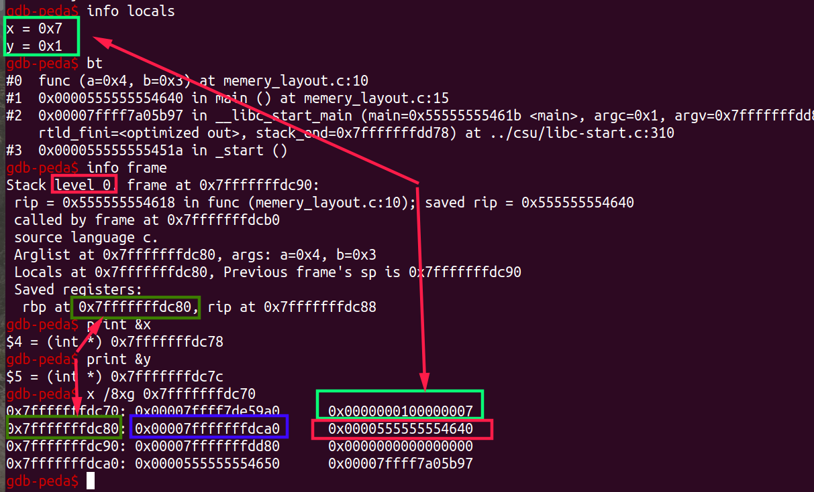

## 前言

这篇文章，是为了介绍缓冲区溢出攻击做准备。

在开始之前，我们希望具备以下背景知识。

（gdb我用的比较少，只会简单的，还没熟练。我们的界面或许会有些不一样，因为插件的缘故，但不影响）

看起来，略微有些复杂，需要自己调试一遍。

* 虚拟内存的概念
* [程序在内存中的布局](https://blog.csdn.net/sinat_38816924/article/details/106081193)
* 简单的gdb使用：[100个gdb小技巧](https://wizardforcel.gitbooks.io/100-gdb-tips/)
* 简单的汇编语言

---

[toc]

## 摘要和总结

我们先给出gdb的调试方法。

然后结合栈帧信息和汇编代码，分析函数调用过程中的栈(栈帧)变化情况。

<br>

<br>

## 调试过程

### 调试的代码

```c
//我们用一个最简单的程序:memery_layout.c
/**
 * 使用gdb调试该程序，展示内存布局
*/
#include <stdio.h>
void func(int a,int b){
	int x,y;
	x = a + b;
	y = a - b;
}
int main(void){
	int x=0;
	int y=0;
	func(4,3);
	return 0;
}
```

### 调试过程

1. 在开始调试之前，我们先进行编译：`gcc -g -o memery_layout memery_layout.c`

2. 开始调试：`gdb -q memery_layout`

3. 显示程序：`l` 

   

4. 打断点：`break func` 、`break 10`

5. 运行到断点：`run`

6. 显示程序的调用栈信息：`bt` (backtrace)

7. 显示当前栈帧的详细信息：`info frame`（关于这个栈帧信息的解读，我们放在后面）

   

8. 跳转到上一个栈帧：`up`

9. 显示当前栈帧的详细信息：`info frame`

   

10. 跳转到下一个栈栈：`down`

11. 继续运行到下一个断点：`c`

12. 查看全部局部变量信息：`info locals`

13. 查看x变量内容、地址：`print x` 、`print &x`

    

14. 查看寄存器内容：`info registers`
15. 查看指定寄存器(rbp)内容：`print $rbp`

16. 查看汇编代码：`disassemble /rm` 

17. 查看内存内容(0x7fffffffdc70地址，5个单元/16十六进制格式显示/g表示八字节)：`x /5xg 0x7fffffffdc70`

    

<br>

<br>

## 栈帧信息分析

### 栈帧结构

关于调试过程上面已经介绍，下面便不再赘述。

参考文章：[x86_64架构下的函数调用及栈帧原理](https://zhuanlan.zhihu.com/p/107455887)

因为调试的现象和它的不一样。所以我在下面画出我的栈帧图片。

**因为参数只有两个，通过寄存器传参，所以没有画参数压栈的情况。**

我按照`info frame`　的信息划分栈帧。

我们先看下栈帧的基本结构。



### 寄存器介绍

*  %rax ：通常存储函数调用的返回结果，也被用在`idiv` （除法）和`imul`（乘法）命令中。

* %rsp ：堆栈指针寄存器，指向栈顶位置。pop操作通过增大rsp的值实现出栈，push操作通过减小rsp的值实现入栈。

* %rbp ：栈帧指针。~~标识当前栈帧的起始位置。~~　。并不是当前栈帧开始的地方

* %rdi, %rsi, %rdx, %rcx,%r8, %r9 ：六个寄存器，当参数少于7个时， 参数从左到右放入寄存器: rdi, rsi, rdx,  rcx, r8, r9；当参数为7个以上时，前 6 个与前面一样， 但后面的依次从 “右向左” 放入栈中，即和32位汇编一样。

<br>

### 栈帧信息分析



1. 蓝色方框：标明我们现在在第０层。

2. 绿色方框，是上一个栈帧的信息，保存在当前栈帧。 
   * `called by frame at 0x7fffffffdcb0` ：由`0x7fffffffdcb0` 位置开始的栈帧调用
   * `saved rip = 0x555555554640` ：当前栈帧要保存上一个栈帧将要执行的地址`0x555555554640`
   * `rip at 0x7fffffffdc88` ：返回地址(上一个栈帧将要执行的地址),保存在`0x7fffffffdc88`
   * `rbp at 0x7fffffffdc80`：上一个栈帧指针内容保存在`0x7fffffffdc80`
   * `Previous frame's sp is 0x7fffffffdc90` ：上一个栈帧的栈顶指针。（这我画成红框，框错了。。）

3. 红色方框是当前栈帧信息
   * `frame at 0x7fffffffdc90` ：当前栈帧的起始地址`0x7fffffffdc90`
   * `Locals at 0x7fffffffdc80`：局部变量从`0x7fffffffdc80` 开始。

<br>

<br>

## 代码分析

**那么当前的rbp值是什么？局部变量为甚从上面 0x7fffffffdc80的地方开始？**

仅从栈帧的信息，是无法验证。这时候，我们来看看它的汇编代码。



<br>

补充下压栈：push指令可以分解为＝%rsp栈顶指下移＋mov 源数据

1. 绿色方框
   * 通过压栈方式，保存上一个栈帧指针。由上一节，我们知道，它被保存在`0x7fffffffdc80`
   * 将当前栈顶，保存在rbp中。即，设置栈帧指针。所以如上面结构图所示，**当前栈帧位置，是保存上一个栈帧的内存位置。**

2. 蓝色方框

   **从寄存器中取出参数**，放入内存。

3. 红色方框

   进行计算，**计算的结果放入局部变量局部变量的起始地址，从rbp指向的内存的下面开始。**

4. 还原
   * 将上一个栈帧地址，还原到rbp中
   * ret 返回调用(下面介绍)

<bt>

### 函数的调用与返回

这里，我们仅仅着重看下`call` 和`ret`

我们也看下`main`函数的汇编代码。



我们可以看到，两个参数，从右向左，传递给寄存器。

然后，调用`0x5555555545fa`位置的`func` 函数。

通过上一张图，我们能看出`0x5555555545fa`是func函数的起始位置。

**`call` 还干了一件事，把下一条要执行的地址，压入栈中。我们可以通过内存查看。**



1. 绿色方框　--->   两个局部变量的值

2. 蓝色方框　--->   上一个栈帧的值

3. 红色方框　--->   返回地址

<br>

### 栈帧指针-不是栈帧开始的地方

<font color=red>栈帧寄存器存储的不是栈帧开始的地方。</font>

我们用第０层的栈帧来看：`frame at 0x7fffffffdc90` + `Saved registers: rbp at 0x7fffffffdc80`

当前栈帧开始的地方是`0x7fffffffdc90`，而栈帧寄存器里面的值是` 0x7fffffffdc80`

而且，<font color=red>我倾向与将返回地址，划分在当前栈帧，而不是上一个栈帧。</font>

<font color=red>`0x7fffffffdc90` 这个内存中的内容，我不知道代表什么。不是寄存器的值</font>

我们可以看出`0x7fffffffdc98`里面是两个int 0，是上一个栈帧的内容。

**我们可以通过，`frame 0x7fffffffdc90` 跳转到当前栈帧。**

[How to interpret GDB “info frame” output?](https://stackoverflow.com/questions/5144727/how-to-interpret-gdb-info-frame-output)

[info frame command](https://visualgdb.com/gdbreference/commands/info_frame)

