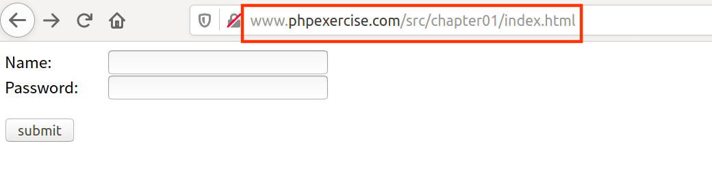
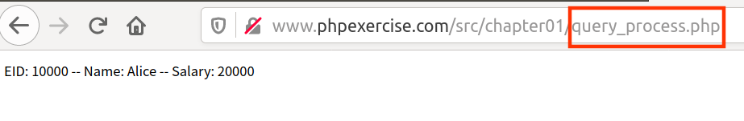
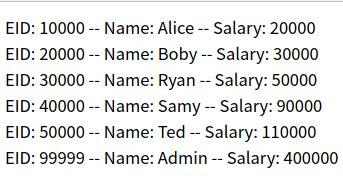
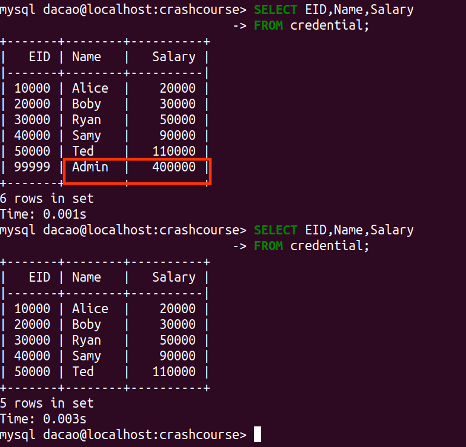

[toc]

## 0. 前言

1. 什么是SQL注入？

   [SQL注入 -- wiki](https://zh.wikipedia.org/wiki/SQL%E6%B3%A8%E5%85%A5) 

   > 在输入的字符串之中注入SQL指令，在设计不良的程序计算机程序)当中忽略了字符检查，那么这些注入进去的恶意指令就会被数据库误认为是正常的SQL指令而运行，因此遭到破坏或是入侵。
   
   **概念比较简单，实践才是重点。**当然，这篇只是入门介绍，下面关于sql注入的内容，无难点。

2. 实验环境的搭建 -- LAMP

   以前搭建过LNMP，所以这次，在本地环境搭建LAMP，顺带作为PHP练习环境。

   搭建过程见：[LAMP的搭建](https://github.com/da1234cao/programming-language-entry-record/blob/master/PHP/%E6%96%87%E6%A1%A3/%E7%8E%AF%E5%A2%83%E5%87%86%E5%A4%87.md)

3. 背景知识

   数据库：恰好前段时间我[看了](https://blog.csdn.net/sinat_38816924/category_8699476.html)《mysql必知必会》。

   <font color=red>PHP：不会</font>，所以临时去看了《php和mysql web开发》第一章 -- PHP快速入门。

4. 数据库中的数据填充

   ```shell
   # 为了避免自家创建表，我们把虚拟机数据库中的表导出，再导入到本机的数据库中
   # 数据库中的表导出
   mysqldump  -uroot -pseedubuntu Users credential > /tmp/credential.bak; 
   # 登录数据库，将表导入
   mysql> source  /tmp/credential.bak;
   
   mysql> SELECT * FROM credential;
   +------+--------+-------+----------+---------+----------+---------------+-----------+---------+------------+------------------------------------------+
   |   ID | Name   |   EID |   Salary | birth   |      SSN | PhoneNumber   | Address   | Email   | NickName   | Password                                 |
   |------+--------+-------+----------+---------+----------+---------------+-----------+---------+------------+------------------------------------------|
   |    1 | Alice  | 10000 |    20000 | 9/20    | 10211002 |               |           |         |            | fdbe918bdae83000aa54747fc95fe0470fff4976 |
   |    2 | Boby   | 20000 |    30000 | 4/20    | 10213352 |               |           |         |            | b78ed97677c161c1c82c142906674ad15242b2d4 |
   |    3 | Ryan   | 30000 |    50000 | 4/10    | 98993524 |               |           |         |            | a3c50276cb120637cca669eb38fb9928b017e9ef |
   |    4 | Samy   | 40000 |    90000 | 1/11    | 32193525 |               |           |         |            | 995b8b8c183f349b3cab0ae7fccd39133508d2af |
   |    5 | Ted    | 50000 |   110000 | 11/3    | 32111111 |               |           |         |            | 99343bff28a7bb51cb6f22cb20a618701a2c2f58 |
   |    6 | Admin  | 99999 |   400000 | 3/5     | 43254314 |               |           |         |            | a5bdf35a1df4ea895905f6f6618e83951a6effc0 |
   +------+--------+-------+----------+---------+----------+---------------+-----------+---------+------------+------------------------------------------+
   ```

<br>

## 1. 实验

### 1.1 代码准备

```html
<!--index.html,前端页面，作为输入攻击点-->
<!DOCTYPE html>
<html>
    <head>
        <meta charset="utf-8">
        <style>
            span {width:100px; display:block; float:left;font-size: 15px;}
        </style>
        <script>
            window.onload = function(){

                var oButton = document.getElementById('button');

                oButton.onclick = function(){
                    var oName = document.getElementById('name');
                    var oPassword = document.getElementById('password');
                    var content = notEmpty(oName.value) && notEmpty(oPassword.value);
                    if(!content)
                        alert('输入为空');
                    return content;
                }

                function notEmpty(val) {
                    var str = val.replace(/(^\s*)|(\s*$)/g, '');//去除空格;
                    if (str == '' || str == undefined || str == null) {
                        // console.log('空');
                        return false;
                    } else {
                        // console.log('非空');
                        return true;
                    }
                }
            }
        </script>
    </head>

    <body>
        <!-- 这里直接用form对的不怎么齐，可以在里面镶一个table -->
        <form action="query_process.php" method="POST">
            <span>Name:</span>
            <input id='name' type="text" name='name'><br>
            <span>Password:</span>
            <input id='password' type="text" name='password'><br><br>
            <input id='button' type="submit" value="submit"><br>
        </form>
    </body>
</html>
```



```php+HTML
<!--query_process.php,后台脚本-->
<?php
    $name = $_POST['name'];
    $password = $_POST['password'];

    function getDB() {
        $dbhost = 'localhost';
        $dbuser = 'dacao';
        $dbpassword = '11111111';
        $dbname = 'crashcourse';

        $conn = new mysqli($dbhost,$dbuser,$dbpassword,$dbname);
        if($conn->connect_error){
            die("connect failed ".$conn->connect_error." \n");
        }
        return $conn;
    }

?>

<!DOCTYPE html>
<html>
    <head></head>
    <body>
        <?php
            // $name = "Alice'#";
            // $password = "anything";
            // echo "name:".$name."password:".$password."\n";

            $conn = getDB();
            $sql = "SELECT EID,Name,Salary
                    FROM credential
                    WHERE Name='$name' AND Password=sha1('$password')";
            
            $result = $conn->query($sql);
            if($result){
                while($row = $result->fetch_assoc()){
                    printf("EID: %s -- Name: %s -- Salary: %s<br>",
                            $row['EID'],$row['Name'],$row['Salary']);
                }else{
                echo "<h1>SQL语句执行失败</h1>";
            }
                $result->free();
            }
            $conn->close();
        ?>
    </body>
</html>
```



### 1.2 糟糕的写法

```php
$result = $conn->query($sql);  --执行一条SQL语句
```

当我们输入的信息为，`Name:Alice' OR 1=1#    Password:anything` 。

我们会查询出所有信息。



但这不是最坏的情况。因为主体是查询select语句，已经定下，不会有删库该表等情况发生。

### 1.3 最糟糕的写法

```php
$result = $conn->multi_query($sql);  --可以执行多条SQL语句
```

最糟糕的在于，`multi_query`可以执行多条SQL语句。

如果输入的信息为，`Alice' OR 1=1;DELETE FROM credential WHERE Name='Admin';#    Password:anything `。Admin用户信息将被删除。



### 1.4 一般糟糕写法

> 在将用户提供的数据与代码混合之前，我们可以检查数据，并过滤掉可能解释为代码的任何字符。 例如，character(') 通常在SQL Injection攻击中使用，因此，如果我们可以摆脱撇号或对其进行编码，则可以防止解析器将其视为代码。 对特殊字符进行编码会告诉解析器将编码后的字符视为数据而不是代码。 

> **mysqli_real_escape_string** - 根据当前连接的字符集，对于 SQL 语句中的特殊字符进行转义

```php
            $conn = getDB();
            $name = $conn->real_escape_string($name);
            $password = $conn->real_escape_string($password);
            $sql = "SELECT EID,Name,Salary
                    FROM credential
                    WHERE Name='$name' AND Password=sha1('$password')";
```

但仍然是代码和数据混合在一起。

### 1.5 好的写法

SQL statement template --- SQL语句模板；

```php
	  <?php
            $conn = getDB();
            // $name = $conn->real_escape_string($name);
            // $password = $conn->real_escape_string($password);
            $sql = "SELECT EID,Name,Salary
                    FROM credential
                    WHERE Name=? AND Password=sha1(?)";

            if($stmt = $conn->prepare($sql)){
                $stmt->bind_param("ss",$name,$password);
                $stmt->execute();
            }

            $stmt->bind_result($Eid,$Name,$Salary);
            while($stmt->fetch()){
                echo "$Eid -- $Name -- $Salary <br>";
            }
            $conn->close();
	?>
```

